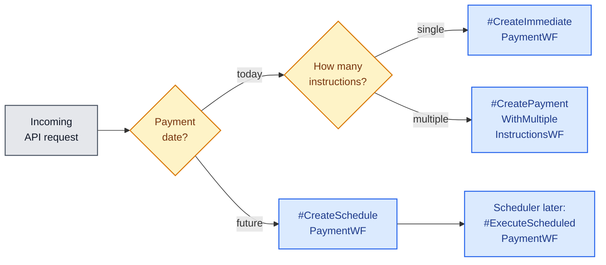
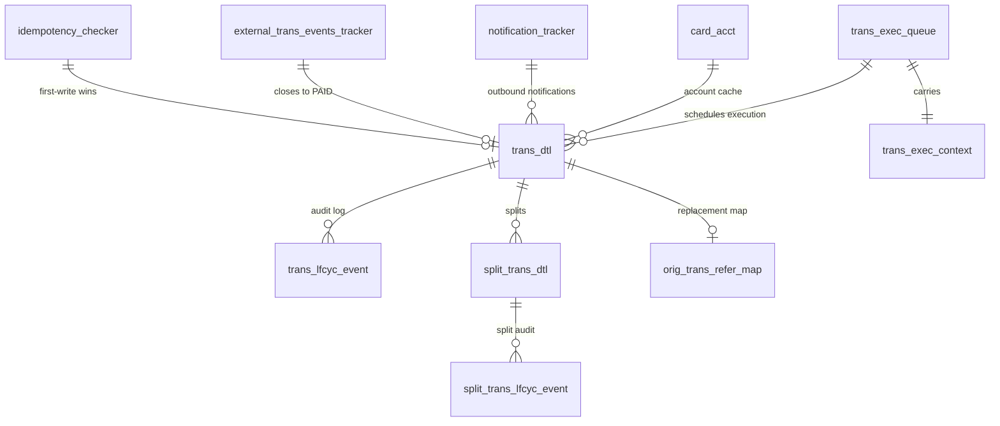

# Components in Detail

## One-Data Functions

These are the **public contracts** consumed by upstream systems. Each One-Data
function maps to one or more Billpay Core APIs.

| Function | Type | Maps to |
| --- | --- | --- |
| `CreatePayment.v3` | Core | `POST /payments` |
| `UpdatePayment.v1` | Core | `PUT /payments/{payment-id}` |
| `DeletePayment.v1` | Core | `DELETE /payments/{payment-id}` |
| `ReadPayments.v1` | Core | `GET /payments/account/{account-id}` |
| `ReadPaymentEventsById.v1` | Core | `GET /payments/{payment-id}` |
| `CreateCreditBalanceRefund.v1` | Core | `POST /refunds` |
| `CreatePaymentInstallment.v1` | Composite | `POST /paymentInstallments` (which fans out to Core) |

## Billpay Core APIs

| Method & Path | Purpose |
| --- | --- |
| `POST /payments` | Create an immediate or scheduled payment (single or multi-instruction) |
| `PUT /payments/{payment-id}` | Update an existing scheduled payment |
| `DELETE /payments/{payment-id}` | Cancel a scheduled or accepted payment |
| `POST /payments/returns` | Record a return (from Money Movement events) |
| `POST /payments/inbound` | Record an inbound payment from upstream |
| `POST /refunds` | Initiate a credit-balance refund |
| `GET /payments/account/{account-id}` | List payments for an account |
| `GET /payments/{payment-id}` | Read a single payment + lifecycle events |
| `POST /paymentInstallments` | Composite — create payment **and** installments together |

## Billpay Router

The router runs as part of the API layer and decides which workflow to invoke.

Routing inputs include `payment-date`, the **number of instructions**, the
account kind (`Consumer` vs `Corporate`), and the **clearing level**
(`Full` vs `Split`).

## Temporal Workers

Billpay deploys **two worker pools**, each polling its own Temporal task queue. Splitting them — rather than running one pool for everything — is deliberate.

- **Realtime Worker** runs workflows on the request path; the caller blocks until the workflow returns a deterministic outcome (`SCHEDULED`, `ACCEPTED`, `DECLINED`, …). Optimised for **low latency** — small per-worker concurrency, tight activity timeouts, fast retry budgets.
- **Batch Worker** runs workflows triggered asynchronously — by Temporal Schedules, by event handlers, or as child workflows. Optimised for **throughput** — wider concurrency per worker, longer activity windows, back-pressure friendly.

**Why split them?**

1. **Isolation of failure domains.** A surge of batch workflows (e.g. the *Corporate Allocations Processor* draining a backlog, or a settlement sweep) must never starve the realtime worker serving a customer click. Separate task queues + separate worker processes means CPU contention and queue depth on one side cannot degrade the other.
2. **Different tuning shapes.** Realtime cares about **p99 latency** — fewer in-flight workflows per worker, faster polling, tight per-activity timeouts. Batch cares about **throughput per unit cost** — many in-flight workflows, larger payloads, longer activity windows. A single pool cannot be tuned for both at once.
3. **Independent scaling and deployment.** We scale realtime workers up during peak hours and scale batch workers during overnight settlement sweeps, without rolling the other. We can also ship a batch-only fix without touching the realtime fleet.
4. **Blast radius on deploys.** A bad batch deploy does not take down realtime, and vice versa.

## External systems Billpay talks to

Billpay is a **net consumer** of upstream systems for validation, lookup and money-movement, and a **net producer** of state-change events. We group integrations by the type of service they back — mirroring the service categories under [Payment Services](../design/services.md).

### Validation & lookup services

Consulted on the way in, before a workflow accepts or schedules the payment.

| System | Purpose |
| --- | --- |
| **Instruments** | Retrieves the cardmember's payment instruments (funding accounts) on file |
| **Plans** | Validates installment plans / autopay rules |
| **Mandates** | Validates direct-debit / pull-payment mandates the cardmember has authorised |
| **Payment-Options** | Returns the market-specific payment options available for the account |
| **Customer 360** | Customer profile lookup — flags, eligibility, fraud signals |
| **Account Verification Service (AVS)** | Verifies the funding account is real, owned, and in good standing |
| **Allocations** | For **corporate** payments — returns the split breakdown across underlying accounts |

### Payment Execution

The legacy integrations the platform is actively modernising (see the [Product Vision speed-problem section](../vision/product.md#the-speed-problem-were-solving)).

| System | Purpose |
| --- | --- |
| **Clearing** | Transmits the payment for inter-bank settlement |
| **Authorizations** | Increases open-to-buy when a payment is accepted |
| **Accounts Receivable (GAR)** | Decrements the cardholder's balance |

### Fulfillment & notification

| System | Purpose |
| --- | --- |
| **Accounting** | Receives ledger entries on fulfillment |
| **Balance & Control** | Reconciles balances post-fulfillment |
| **Communications** | Sends notifications (push, email, SMS) to the cardholder |

## Storage surface

