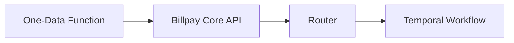

# One-Data Functions

One-Data functions are the **public, versioned contracts** that external
systems integrate against. They are thin: each delegates to a Billpay Core API.

## Core

| Function | Purpose | Explorer |
| --- | --- | --- |
| **CreatePayment.v3** | Create an immediate or scheduled payment | [explorer.aexp.com](https://explorer.aexp.com/functions/CreatePayment.v3?method=post) |
| **UpdatePayment.v1** | Update a scheduled payment (cancel + recreate semantics) | [explorer.aexp.com](https://explorer.aexp.com/functions/UpdatePayment.v1?method=post) |
| **DeletePayment.v1** | Cancel a scheduled or accepted payment | [explorer.aexp.com](https://explorer.aexp.com/functions/DeletePayment.v1?method=post) |
| **ReadPayments.v1** | Read payments for an account | [explorer.aexp.com](https://explorer.aexp.com/functions/ReadPayments.v1) |
| **ReadPaymentEventsById.v1** | Read lifecycle events for a payment | [explorer.aexp.com](https://explorer.aexp.com/functions/ReadPaymentEventsById.v1) |
| **CreateCreditBalanceRefund.v1** | Initiate a credit-balance refund | [explorer.aexp.com](https://explorer.aexp.com/functions/CreateCreditBalanceRefund.v1?method=post) |

## Composite

| Function | Purpose | Explorer |
| --- | --- | --- |
| **CreatePaymentInstallment.v1** | Create a payment **and** its installment plan in one call (optionally toggling autopay) | [explorer.aexp.com](https://explorer.aexp.com/functions/CreatePaymentInstallment.v1) |

:::tip
Composite functions guarantee **transactional consistency across multiple
Billpay Core operations**. Use them when more than one resource must be
created together.
:::

## How they fit

The next page — [Billpay APIs](billpay-core.md) — describes the Core APIs
that each function targets.
