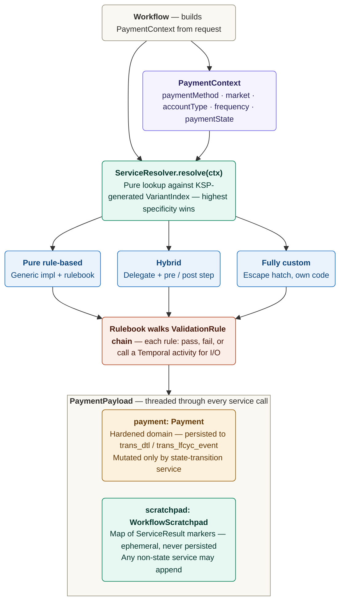
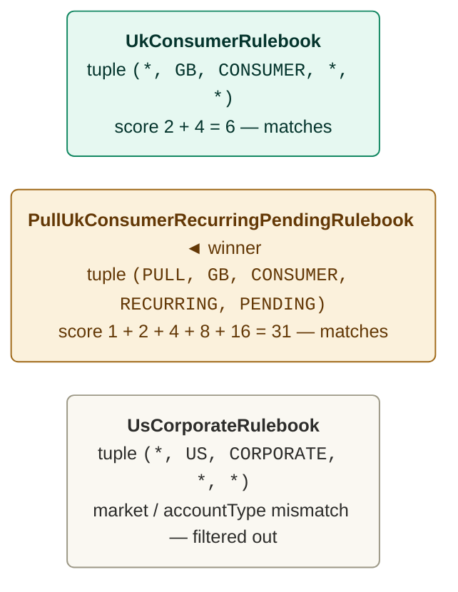
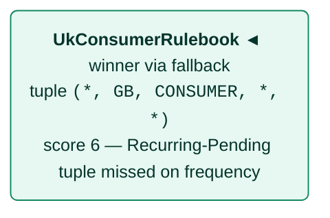
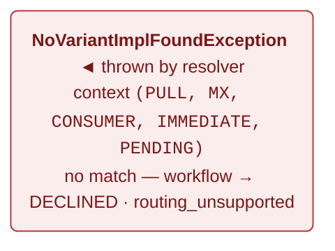

# Variant Resolution & Rule Engine — Proposal

:::caution[Status]
**Proposal — not yet adopted.** This group of pages describes a target architecture for how Payment Services should declare their variance, compose business rules, and exchange data across services. Implementation has not started. The existing principles page ([Build › Principles › Payment Services](../../principles/core-build/payment-services.md)) and the [Payment Services design reference](../../../design/services.md) remain canonical until this proposal is approved.
:::

The existing services page lists **22 Payment Services** and notes that *"`ServiceResolver` selects the right implementation at runtime"* — but never specifies *how*. This proposal answers four mechanical questions in one coherent shape: how variance is declared, how routing picks the right implementation, how the business logic inside each service is composed, and how services exchange data without polluting the hardened domain model.

## The four ideas

1. **Variants are declarative.** [`@VariesOn`](./interfaces.md#varieson--declare-the-axes-on-the-interface) on the interface, [`@PaymentVariant`](./interfaces.md#paymentvariant--declare-the-tuple-on-the-implementation) on each impl. [KSP](https://kotlinlang.org/docs/ksp-overview.html) builds a per-interface index at compile time; conflicts fail the build, not the first request in production.
2. **Resolution is bit-weighted specificity.** Weights `paymentMethod=1, market=2, accountType=4, frequency=8, paymentState=16` give a unique total ordering — no tiebreaker needed.
3. **Logic is a rulebook, not an `if`-chain.** Each check is an atomic [`ValidationRule`](./rule-engine.md#the-validationrule-interface) bean; variants compose them via a typed Kotlin DSL; one generic service walks the chain.
4. **Domain Model is separate from workflow scratchpad.** [`PaymentPayload(payment, scratchpad)`](./data-flow.md#the-two-halves-of-paymentpayload). The type system, not convention, prevents folding ephemeral data into persisted state.

## Figure 1 — Runtime flow at a glance

Before unpacking each idea, here is how they fit together at runtime. The workflow builds a [`PaymentContext`](./strategies.md#paymentcontext), hands it to a [`ServiceResolver`](./variant-resolution.md#the-serviceresolver), the resolver does a pure lookup against a KSP-generated index, the chosen impl walks a rulebook, and the resulting payload is threaded forward — but only `PaymentStateTransitionService` ever writes to the persisted domain.



*Runtime flow — context → resolver → impl → rules → payload. Rules read both halves; only `PaymentStateTransitionService` writes the `Payment`.*

## Idea 01 — Declarative variance

The interface advertises which axes are in play; the impl declares its tuple. Both are annotations, so they're machine-readable — and the build, not production traffic, is where contradictions surface.

```kotlin
@VariesOn(PAYMENT_METHOD, MARKET, ACCOUNT_TYPE, FREQUENCY, PAYMENT_STATE)
interface PaymentValidationService { /* … */ }

@PaymentVariant(
    paymentMethod = PULL,
    market        = "GB",
    accountType   = CONSUMER,
    frequency     = RECURRING,
    paymentState  = PENDING,
)
class PaymentValidationServicePullUKConsumerRecurringPending : PaymentValidationService { /* … */ }
```

Five axes today: `paymentMethod`, `market`, `accountType`, `frequency`, `paymentState`. An impl may bind any *subset* of what the interface declares — unbound axes act as wildcards. A single `@PaymentVariant(generic = true)` declared in the `:service-impl-generic` module is the explicit fallback.

Module layout is `:service-impl-<paymentMethod>-<market>` (e.g. `:service-impl-push-gb`, `:service-impl-pull-us`) plus a `:service-impl-generic` module that hosts the generic-market default. That's `2 payment-methods × 28 markets + 1 generic = 57 impl modules` — not per impl class. Per-class would explode the Gradle graph to ~1,232 modules (22 services × 28 markets × 2 payment-methods). Per-`(paymentMethod, market)` matches team ownership cleanly and keeps cross-cutting refactors localised to `:service-api`.

## Idea 02 — Specificity-based resolution

The resolver does a pure lookup against a build-time-generated [`VariantIndex`](./variant-resolution.md#the-ksp-processor). No ArC / CDI scanning, no `if (market == "GB")` in the workflow. Determinism under Temporal replay is automatic because `resolve(ctx)` is a pure function of `ctx` — no clock, no random, no container scan on the hot path.

> The scoring is the key trick: bit weights, not a count. With weights `1, 2, 4, 8, 16`, every subset of bound axes produces a different sum — binary encoding. No tiebreaker code exists or is needed.

**Bit weights — powers of two for unique total ordering**


**Worked resolution — Context `(PULL, GB, CONSUMER, RECURRING, PENDING)`**



**Hierarchical fallback** — if context were `(PULL, GB, CONSUMER, IMMEDIATE, PENDING)`:



**Fail-loud** — if context were `(PULL, MX, CONSUMER, IMMEDIATE, PENDING)` and no generic impl exists:



*Specificity scoring — worked resolution example.*

The build also forbids two impls with identical tuples — [KSP fails with file-pinned diagnostics](./variant-resolution.md#conflict-detection), so the ambiguity can't ship. A missing match doesn't silently fall back to a generic impl unless the deployable explicitly registers one in `:service-impl-generic`: *money movement that silently runs a default validator in an unsupported market is worse than failing loudly.*

## Idea 03 — The rulebook engine

Without this idea, every implementation of `PaymentValidationService` would hand-code the same `if (instrumentValid && amountInRange && mandateValid && …)` chain. The proposal inverts it.

Each business check becomes an atomic `@ApplicationScoped class FooRule : ValidationRule`. A [rulebook](./rule-engine.md#the-rulebook----dsl) is a typed Kotlin DSL — a top-level `val` with a `@Rulebook(...)` annotation:

```kotlin
@Rulebook(service = PaymentValidationService::class, market = "GB", accountType = CONSUMER)
val UkConsumerBaseRulebook = rulebook {
    rule(InstrumentValidRule)                                       // calls InstrumentsClient
    rule(AmountInRangeRule, AmountRange(min = 1.gbp, max = 25_000.gbp))
    rule(PaymentOptionsAllowedRule)                                 // calls PaymentOptionsClient
    rule(ClearingDateInFutureRule)
}
```

A single generic `RuleBasedPaymentValidationService` reads the rulebook for the resolved context and walks the chain. The author surface becomes: drop a new `@Rulebook` `val`. No class. No wiring change. No workflow change.

Three impl shapes coexist behind the same resolver. The resolver picks among them by specificity — it doesn't know or care which shape was chosen.

| Shape | When to pick it | Code per variant |
| --- | --- | --- |
| Pure rule-based | Logic is a flat chain of independent checks | Zero — just the rulebook entry |
| Hybrid | Mostly a chain but needs pre/post (e.g. acquire a customer-snapshot lock first, stamp the token after) | ~20 lines |
| Fully custom | Iterative, branching, or non-chain (e.g. multi-leg installments where any leg failure aborts) | As much as needed |

Cross-service rules are first-class. A rule that reads results from multiple services declares `requires = setOf(...)` — and that declaration is what lets the next idea verify orchestration at build time.

## Idea 04 — Domain Model vs. Scratchpad

This is the most subtle and most important idea. Two failure modes get ruled out by the type system instead of by code review.

### Failure mode A — folding ephemeral state into the persisted Payment

[`ServiceResult`](./data-flow.md#serviceresult--the-scratchpad-marker) (a marker interface) and `Payment` (a sealed hierarchy in `:domain-model`) are different types. So `payload.withScratchpad(validated)` cannot accidentally land on `Payment`. The question *"should this go on Payment?"* is answered by the compiler, not by a reviewer.

### Failure mode B — a rule reading data that no upstream service produced

Each rule declares its prerequisites: `requires = setOf(RepresentmentEligibility::class)`. The workflow declares its service order in an [`@OrchestrationPlan`](./data-flow.md#orchestrationplan--workflow-declares-the-order). At build time, [`OrchestrationLint`](./data-flow.md#orchestrationlint) cross-references every rulebook reachable for every context against the plan. If a rule needs `RepresentmentEligibility` but the plan doesn't run `PaymentRepresentmentEligibilityService` first, the build fails — naming the rulebook, the rule, the missing prerequisite, and the variant.

```
error: rulebook RepresentmentRulebook (PaymentRepresentmentValidationService) requires
       RepresentmentEligibility, but the orchestration plan for variant (US, CORPORATE)
       does not run PaymentRepresentmentEligibilityService before it.
```

The decision rule is asymmetric on purpose: **when in doubt, put it in the scratchpad.** Promoting a scratchpad field to the domain later is a code-reviewed change to `:domain-model` plus a DB migration; demoting a domain field to scratchpad is a breaking change. The asymmetry should bias the call.

## The build-time machinery that holds it together

The KSP processor runs in the deployable module (`:realtime-worker-app`, `:batch-worker-app`) — the only place where every impl is visible at once. It does six things:

1. Reads every `@VariesOn`, `@PaymentVariant`, `@Rulebook`, `@OrchestrationPlan`.
2. Validates each impl's tuple against the interface's allowed axes.
3. Emits `<Service>VariantIndex` and `<Service>RulebookIndex` per service interface.
4. Emits a `ResolverFactory` with `@Produces ServiceResolver<I>` methods for ArC / CDI.
5. Synthesises a unique [`@Identifier`](./variant-resolution.md#identifier--the-ksp-synthesised-handle-arc--cdi-uses-to-address-impls) on each `@PaymentVariant` class so ArC / CDI can address it.
6. Runs `OrchestrationLint`; at release time, a [Coverage gate](./variant-resolution.md#coverage-gate) also verifies every live market has impls (or an explicit generic-fallback marker) for every market-varying service.

Why all this lives at the workflow boundary rather than inside a dispatch activity: routing is a pure data lookup. An activity boundary adds two indirections and an extra event-history entry per call without buying any safety. *Workflows resolve; services run on the workflow thread; activities are called from inside services for I/O.*

:::tip[Net effect]
Adding a variant for an existing `(paymentMethod, market)` is one `@Rulebook` `val` in ~10 lines. Onboarding a new market is two new impl modules (`:service-impl-push-<mkt>`, `:service-impl-pull-<mkt>`) and rulebook entries; routing picks it up automatically; the coverage gate fails the release if anything's missing. No workflow change. No resolver change. No central routing config to update.
:::

## Read in this order

1. [**Interfaces**](./interfaces.md) — how to declare a service interface, an implementation, the module layout, and the new-impl checklist.
2. [**Strategies**](./strategies.md) — how routing happens at runtime, the specificity score, four worked `PaymentValidationService` contexts including the deliberate-fallback case.
3. [**Data Flow**](./data-flow.md) — Domain Model vs `WorkflowScratchpad`, `PaymentPayload`, `@OrchestrationPlan`, the `OrchestrationLint` build check.
4. [**Annotations & KSP Processor**](./annotations.md) — formal reference for `@VariesOn`, `@PaymentVariant`, `@Rulebook`, `@OrchestrationPlan`, `@Identifier`, plus the processor pseudo-code.
5. [**Variant Resolution**](./variant-resolution.md) — deep technical reference for the resolver, the `VariantTuple`, and the recommended vs incremental tooling paths.
6. [**Rule Engine**](./rule-engine.md) — rules, rulebooks, the DSL, three side-by-side impl variations of `PaymentValidationService`, how multiple variants share rule beans, and step interfaces for the other services.
7. [**Tooling Rationale**](./tooling-rationale.md) — per-tool justification: alternatives considered, reasons rejected, why this pick. (Kotlin and Quarkus are project defaults and not re-justified.)
8. [**Design FAQs**](./faqs.md) — answers to the design questions that come up in review: why bit weights, why scoring over pattern matching, why `paymentState` is the most specific axis, what happens when adding a new axis, and more.

## Scope guardrails

- **Documentation only.** No code lands with this proposal.
- The existing [Payment Services principles](../../principles/core-build/payment-services.md) page and the [services design reference](../../../design/services.md) are **not modified** by this proposal.
- Variance axes committed today: **paymentMethod, market, accountType, frequency, paymentState**. The mechanism extends to more axes without rework, but only these five are committed.
