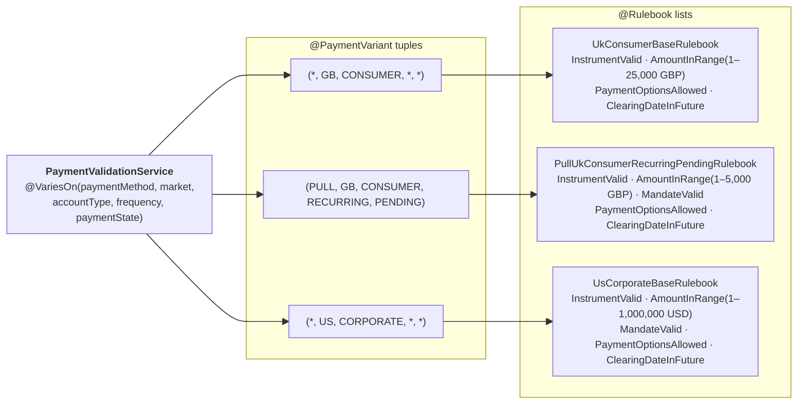

# Rule Engine

**Rules are beans; rulebooks are configuration; the service is generic.** Instead of hand-coding `if (instrumentValid && amountInRange && mandateValid && …)` inside dozens of `PaymentValidationService` implementations, the proposal makes each business check an atomic ArC / CDI bean (`InstrumentValidRule`, `AmountInRangeRule`, …) and lets variants compose them with a type-safe Kotlin DSL. A single generic `RuleBasedPaymentValidationService` reads the rulebook for the current [`PaymentContext`](./strategies.md#paymentcontext) and walks the chain.

The author surface is on [Interfaces](./interfaces.md); the routing is on [Strategies](./strategies.md); the cross-service data plumbing is on [Data Flow](./data-flow.md).

## The `ValidationRule` interface

```kotlin
package com.amex.billpay.variance

interface ValidationRule {
    val id: String                                                    // stable identifier for config + telemetry
    val requires: Set<KClass<out ServiceResult>> get() = emptySet()   // declared prerequisites
    suspend fun evaluate(ctx: PaymentContext, payload: PaymentPayload): RuleResult
}

sealed interface RuleResult {
    object Pass : RuleResult
    data class Fail(val code: String, val message: String) : RuleResult
}
```

Other services have analogous **step interfaces** — `ExecutionStep` for `PaymentExecutionService`, `PostingStep` for `PaymentPostingService`, etc. — with the same anatomy and the same DSL plumbing. The KSP machinery, the resolver, and the per-variant `@…Plan` discovery are reused; only the step interface and the per-service step beans are new. See [The same pattern beyond `ValidationRule`](#the-same-pattern-beyond-validationrule--other-services-other-step-interfaces) below for the catalogue and example plans.

## Writing a rule

A rule is a single `@ApplicationScoped` class. Two patterns:

### Rule that calls a client through an activity

External lookups (Instruments, Mandates, PaymentOptions, Customer360) are wrapped in **clients**, and every client call is dispatched through a Temporal activity so the result lands in the event history and replays deterministically. Clients are deliberately not named `*Service` — that suffix is reserved for the [Payment Services catalogue](../../../design/services.md). See [Data Flow › Reading data inside a service or rule](./data-flow.md#reading-data-inside-a-service-or-rule) for the naming rationale.

```kotlin
@ApplicationScoped
class InstrumentValidRule : ValidationRule {
    override val id = "instrument-valid"
    override suspend fun evaluate(ctx: PaymentContext, payload: PaymentPayload): RuleResult {
        val instruments = Workflow.newActivityStub(
            InstrumentsClientActivity::class.java,
            ActivityOptions.newBuilder().setStartToCloseTimeout(Duration.ofSeconds(2)).build(),
        )
        return if (instruments.isValid(payload.payment.instrumentId)) RuleResult.Pass
               else RuleResult.Fail("INSTRUMENT_INVALID", "Instrument ${payload.payment.instrumentId} not valid")
    }
}
```

The rule runs on the workflow thread (the service that walks the rulebook is invoked by the workflow), so [`Workflow.newActivityStub(...)`](https://docs.temporal.io/develop/java/core-application) is legal here.

### Rule that composes prior service results

A rule can declare `requires = setOf(...)` to depend on a [`ServiceResult`](./data-flow.md#serviceresult--the-scratchpad-marker) produced by an upstream Payment Service. This is rarer under the proposal — external lookups go through clients inside the service that needs them — but it remains the right shape for genuinely cross-service data, e.g. representment eligibility produced by `PaymentRepresentmentEligibilityService` consumed by `PaymentRepresentmentValidationService`:

```kotlin
@ApplicationScoped
class RepresentmentEligibleRule : ValidationRule {
    override val id = "representment-eligible"
    override val requires = setOf(RepresentmentEligibility::class)

    override suspend fun evaluate(ctx: PaymentContext, payload: PaymentPayload): RuleResult {
        val eligibility = payload.require<RepresentmentEligibility>()   // from scratchpad
        return if (eligibility.eligible) RuleResult.Pass
               else RuleResult.Fail(
                   "NOT_REPRESENTABLE",
                   "Return reason ${eligibility.returnReason} is not representable in ${ctx.market}",
               )
    }
}
```

The `requires` set is the contract that lets [`OrchestrationLint`](./data-flow.md#orchestrationlint) check at build time that the workflow runs the prerequisite services first.

### Parameterised rule

When a rule needs different thresholds per variant, accept the parameters in a typed wrapper that the rulebook DSL supplies:

```kotlin
@ApplicationScoped
class AmountInRangeRule : ValidationRule {
    override val id = "amount-in-range"
    suspend fun evaluate(ctx, payload, params: AmountRange): RuleResult =
        if (payload.payment.amount in params.min..params.max) RuleResult.Pass
        else RuleResult.Fail("AMOUNT_OUT_OF_RANGE", "Amount outside [${params.min}, ${params.max}]")

    override suspend fun evaluate(ctx, payload) = error("use parameterised overload via rulebook DSL")
}

data class AmountRange(val min: Money, val max: Money)
```

## How different variants of one service pick different rules

Every Payment Service interface (e.g. [`PaymentValidationService`](./interfaces.md#varieson--declare-the-axes-on-the-interface)) admits many implementations, each tagged with a distinct [`@PaymentVariant`](./annotations.md#paymentvariant) tuple. For the [pure rule-based variation](#variation-1-pure-rule-based) — which covers ~80% of variants — the **implementation is not a new class**. It's a single generic class (`RuleBasedPaymentValidationService`) plus one or more `@Rulebook` `val`s, each pinning a different list of `ValidationRule` beans to a different tuple. The generic impl looks up the [`RulebookIndex`](./variant-resolution.md#the-ksp-processor) for the resolved context and walks the list it gets back.

The variance plays out **at the rule-list level**, not the rule-code level. Rules themselves are atomic and shared across variants — the per-variant variability lives in (a) which rules appear, (b) the order they run, and (c) the parameters passed to each.



Notice how three variants of the **same service** carry **three different rule lists**:

- `UkConsumerBaseRulebook` runs 4 rules with a GBP amount range; no mandate check (consumers don't need mandates).
- `PullUkConsumerRecurringPendingRulebook` runs 5 rules including `MandateValidRule` (recurring PULL needs a mandate) and a tighter `AmountInRange(1–5,000)` cap.
- `UsCorporateBaseRulebook` runs 5 rules with a much larger USD range and a corporate-side mandate check.

`InstrumentValidRule` — one `@ApplicationScoped class` — is reused unchanged across all three. The variant decides whether to invoke it, and when. New variants are just one more `@Rulebook` entry; no new code in the service or the rules themselves.

### What changes per variant

| What | Example | Mechanism |
| --- | --- | --- |
| Which rules run | Recurring PULL adds `MandateValidRule`; one-off PUSH doesn't | Rule appears/doesn't appear in the `rulebook { }` body |
| Rule parameters | UK Consumer max £25k; UK Consumer Recurring max £5k | DSL param passed to a parameterised rule: `rule(AmountInRangeRule, AmountRange(min = 1.gbp, max = 5_000.gbp))` |
| Rule order | Snapshot lock before the amount check; not after | Order of `rule(…)` calls in the `rulebook { }` body |
| Client used | Push-side instrument lookup vs pull-side mandate lookup | Different rule subclasses targeting different `*ClientActivity` |

### What is shared across variants

| What | Reason |
| --- | --- |
| The service interface (`PaymentValidationService`) | One contract, one resolver, one workflow integration point |
| The generic service impl (`RuleBasedPaymentValidationService`) | Walks any rulebook; no per-variant code |
| The individual rule beans (`InstrumentValidRule`, `AmountInRangeRule`, …) | Each rule is a single ArC / CDI bean; the cost of a new rule is one new class — used by any variant that needs it |
| The `rulebook { … }` DSL + `@Rulebook` annotation | Declarative wiring; the same KSP processor indexes every rulebook |

The proposal's leverage is exactly this: **a new variant for an existing `(paymentMethod, market)` is one ~10-line `@Rulebook` `val`**. Compare to the alternative (one full impl class per variant, every class hand-coding its own rule chain), where every new variant duplicates the same `if`-chain skeleton.

## The `rulebook { … }` DSL

A rulebook is a top-level `val` annotated [`@Rulebook(...)`](./annotations.md#rulebook). The annotation supplies the variant tuple; the DSL body lists the rules.

```kotlin
// :service-impl-push-gb  (the same module also hosts pull-gb rulebooks if any)
@Rulebook(
    service     = PaymentValidationService::class,
    market      = "GB",
    accountType = AccountType.CONSUMER,
)
val UkConsumerBaseRulebook = rulebook {
    rule(InstrumentValidRule)                                             // calls InstrumentsClient
    rule(AmountInRangeRule, AmountRange(min = 1.gbp, max = 25_000.gbp))
    rule(PaymentOptionsAllowedRule)                                       // calls PaymentOptionsClient
    rule(ClearingDateInFutureRule)
}

@Rulebook(
    service       = PaymentValidationService::class,
    paymentMethod = PaymentMethod.PUSH,
    market        = "GB",
    accountType   = AccountType.CONSUMER,
    frequency     = Frequency.RECURRING,
    paymentState  = PaymentState.PENDING,
)
val PushUkConsumerRecurringPendingRulebook = rulebook {
    rule(InstrumentValidRule)
    rule(AmountInRangeRule, AmountRange(min = 1.gbp, max = 5_000.gbp))    // tighter cap for recurring
    rule(MandateValidRule)                                                 // calls MandatesClient (recurring-only)
    rule(PaymentOptionsAllowedRule)
    rule(ClearingDateInFutureRule)
}

// :service-impl-push-us  (US Corporate uses both PUSH and PULL; this rulebook covers both via
//                          the unbound paymentMethod axis on the @Rulebook annotation)
@Rulebook(
    service     = PaymentValidationService::class,
    market      = "US",
    accountType = AccountType.CORPORATE,
)
val UsCorporateBaseRulebook = rulebook {
    rule(InstrumentValidRule)
    rule(AmountInRangeRule, AmountRange(min = 1.usd, max = 1_000_000.usd))
    rule(MandateValidRule)                                                 // pull-side mandate check
    rule(PaymentOptionsAllowedRule)
    rule(ClearingDateInFutureRule)
}
```

The annotation values are validated against the interface's `@VariesOn` at build time. The DSL is typed — passing the wrong parameter to a parameterised rule is a compile error.

## The three impl variations

The same service interface can be implemented three ways. The same `ServiceResolver` picks among them by specificity — no special-casing.

### Variation 1: Pure rule-based

*Covers ~80% of variants.* No impl class is written for the variant. The author contributes only a rulebook. The generic `RuleBasedPaymentValidationService` (declared once, in `:service-impl-generic`, with `@PaymentVariant(generic = true)`) reads the rulebook and walks the chain.

```kotlin
// Just a rulebook — see PushUkConsumerRecurringPendingRulebook above. No class. No new wiring.
```

### Variation 2 — Hybrid: delegate to the rule chain with bespoke pre/post

Used when most of the logic is a rule chain but the variant needs a step the DSL can't express — e.g. acquiring a customer-snapshot lock before validation and stamping the lock token into the result so downstream services can refer to it.

```kotlin
@ApplicationScoped
@PaymentVariant(market = "GB", accountType = AccountType.CORPORATE)
class PaymentValidationServiceUKCorporate(
    private val ruleBased: RuleBasedPaymentValidationService,         // delegate to the generic
    private val rulebooks: RulebookIndex<PaymentValidationService>,
) : PaymentValidationService {

    override suspend fun validate(
        ctx: PaymentContext,
        payload: PaymentPayload,
    ): Either<ValidationFailure, ValidatedPaymentResult> = either {
        // Pre-rule: acquire a customer-snapshot lock so all rules see a consistent point-in-time view.
        val customerLock = Workflow.newActivityStub(
            Customer360ClientActivity::class.java,
            ActivityOptions.newBuilder().setStartToCloseTimeout(Duration.ofSeconds(3)).build(),
        )
        val snapshot = customerLock.acquireSnapshot(payload.payment.accountId)   // reads Domain Model

        // Delegate to the generic rule-based service.
        val base = ruleBased.validate(ctx, payload).bind()

        // Post-rule: stamp the snapshot id into the typed result.
        base.copy(customerSnapshotId = snapshot.id)
    }
}
```

Because this impl declares `@PaymentVariant(market = "GB", accountType = CORPORATE)` (specificity 6), it outscores the generic (specificity 0) for `(*, GB, CORPORATE, *, *)` contexts. All `(GB, CORPORATE, *)` rulebooks are still resolved via `rulebooks.lookup(ctx)` *inside* this impl — the hybrid keeps the rulebook fan-out while adding one piece of bespoke per-`(market, accountType)` logic.

### Variation 3 — Fully custom (escape hatch)

Used when the logic genuinely cannot be expressed as a sequential chain — e.g. iterating over installment legs, each with its own client checks, where any leg failure aborts the whole payment.

```kotlin
@ApplicationScoped
@PaymentVariant(market = "MX", accountType = AccountType.CORPORATE)
class PaymentValidationServiceMXCorporate : PaymentValidationService {

    override suspend fun validate(
        ctx: PaymentContext,
        payload: PaymentPayload,
    ): Either<ValidationFailure, ValidatedPaymentResult> = either {
        val legs = (payload.payment as PendingPayment).installmentLegs       // from Domain Model

        ensure(legs.isNotEmpty()) {
            ValidationFailure("legs-required", "EMPTY_INSTALLMENTS",
                              "MX Corporate requires at least one installment leg")
        }

        val instruments = Workflow.newActivityStub(
            InstrumentsClientActivity::class.java,
            ActivityOptions.newBuilder().setStartToCloseTimeout(Duration.ofSeconds(2)).build(),
        )
        val options = Workflow.newActivityStub(
            PaymentOptionsClientActivity::class.java,
            ActivityOptions.newBuilder().setStartToCloseTimeout(Duration.ofSeconds(2)).build(),
        )

        var totalAmount = Money.zero(MXN)
        for ((idx, leg) in legs.withIndex()) {
            ensure(instruments.isValid(leg.instrumentId)) {
                ValidationFailure("leg-$idx-instrument", "LEG_INSTRUMENT_INVALID",
                                  "leg $idx instrument invalid")
            }

            ensure(options.isAllowed(leg.instrumentId, leg.optionCode)) {
                ValidationFailure("leg-$idx-option", "LEG_OPTION_DISALLOWED",
                                  "leg $idx option ${leg.optionCode} not allowed")
            }

            totalAmount += leg.amount
        }

        ValidatedPaymentResult(
            validatedAt = Clock.systemUTC().instant(),
            rulesPassed = listOf("mx-multi-leg-validation"),
            mandateId   = null,
        )
    }
}
```

This impl ignores the rulebook entirely — the variance lives inside its own code. It is still discovered by KSP via `@PaymentVariant`, still picked by the same [`ServiceResolver`](./variant-resolution.md#the-serviceresolver) (specificity 6 beats generic 0), and still receives a `PaymentPayload` produced by the workflow's orchestration plan. The escape hatch costs nothing structural — only the rule-DSL ergonomics are lost for this one impl.

### When to pick which

| Situation | Pick |
| --- | --- |
| The variant's logic is a sequential chain of independent checks | **Variation 1**. Zero new code. |
| Most logic is a chain but the variant needs a pre-step (snapshot, lock, enrichment) or a post-step (stamping, side-effect) | **Variation 2**. ~20 lines per variant. |
| The variant's flow is iterative, branching, or otherwise not a flat chain | **Variation 3**. As much code as it takes. |

The build-time machinery is identical for all three. The resolver doesn't care which form was chosen — specificity wins.

## Worked example

Same scenario as [Data Flow › Workflow walkthrough](./data-flow.md#workflow-walkthrough): context `(PUSH, US, CORPORATE, IMMEDIATE, PENDING)`, payment amount `$6,200`. The resolver picks `UsCorporateBaseRulebook` (specificity 6). The generic service walks the chain:

| # | Rule | Inputs read | Outcome |
| --- | --- | --- | --- |
| 1 | `InstrumentValidRule` | `InstrumentsClientActivity.isValid(instrumentId)` | Pass |
| 2 | `AmountInRangeRule` (1 – 1,000,000 USD) | `payload.payment.amount` ($6,200) — Domain | Pass |
| 3 | `MandateValidRule` | `MandatesClientActivity.isActive(instrumentId)` | Pass |
| 4 | `PaymentOptionsAllowedRule` | `PaymentOptionsClientActivity.isAllowed(instrumentId, optionCode)` | Pass |
| 5 | `ClearingDateInFutureRule` | `payload.payment.clearingDate` — Domain | Pass |

Returns `Right(ValidatedPaymentResult(rulesPassed = [5 rule ids]))`. Workflow continues to the state transition.

### Counter-trace — same context, but `InstrumentsClient.isValid(...)` returns false

Rule 1 fails immediately: `RuleResult.Fail("INSTRUMENT_INVALID", …)`. The generic service short-circuits, raises `ValidationFailure(rule = "instrument-valid", code = "INSTRUMENT_INVALID", …)`, and the workflow transitions the payment to `DECLINED` with that reason. Rules 2–5 never run — the chain is short-circuit-on-first-fail. The remaining client calls (Mandates, PaymentOptions) are never made, saving the round trips. This is what every client-backed rule should look like under failure: one client fails, the rule chain ends, the workflow declines with a specific reason.

### Counter-trace — orchestration order broken

A developer adds `RepresentmentEligibleRule` (which `requires = setOf(RepresentmentEligibility::class)`) to `UsCorporateBaseRulebook` without remembering that `#CreateImmediatePaymentWF` does not run `PaymentRepresentmentEligibilityService` — that service only appears in `#ProcessRepresentmentWF`. The KSP `OrchestrationLint` fails the build:

```
error: rulebook UsCorporateBaseRulebook (PaymentValidationService) requires RepresentmentEligibility,
       but the orchestration plan for workflow CreateImmediatePaymentWFImpl with variant
       (US, CORPORATE) does not run PaymentRepresentmentEligibilityService before
       PaymentValidationService.
       Either add it to CreateImmediatePaymentOrchestration.planFor((US, CORPORATE)) or
       remove the rule from the rulebook.
```

The error names the rulebook, the rule, the missing prerequisite, the workflow, and the variant — enough to fix without grep.

## Why the rule engine scales

- **Dozens of hand-written impl classes → 1 generic impl + a flat catalogue of rulebook entries.** Each rulebook is ~10 lines of DSL.
- **Adding a rule** is one new `@ApplicationScoped class FooRule : ValidationRule`. Available to every rulebook immediately.
- **Changing a parameter** (UK Consumer max amount from £25k → £30k) is a one-line diff in one rulebook. No code search-and-replace.
- **Cross-service rules are first-class.** A rule that needs results from multiple services declares `requires = setOf(...)`; `OrchestrationLint` verifies the workflow runs those services first.
- **Telemetry is uniform.** Every rule reports `rule.evaluate.duration{rule.id, ctx.paymentMethod, ctx.market, ctx.accountType, ctx.frequency, ctx.paymentState, result}` — one metric, one dashboard, every service.
- **The pattern extends beyond validation.** Every service that decomposes into a sequential (or parallel-fan-out) chain gets its own step interface + plan DSL — see [The same pattern beyond `ValidationRule`](#the-same-pattern-beyond-validationrule--other-services-other-step-interfaces) below.

## The same pattern beyond `ValidationRule` — other services, other step interfaces

`ValidationRule` is one of several **step interfaces**. Every Payment Service that decomposes naturally into a sequential chain of business steps gets its own step interface and its own `@…Plan`-style annotation — same shape, different name. The KSP machinery, the DSL, and the resolver are reused; the only new code per service-family is the step interface and the per-service step beans.

### The shape every step interface shares

```kotlin
interface XxxStep {                                                   // X = Validation / Execution / Posting / Fulfillment / …
    val id: String                                                    // stable identifier for config + telemetry
    val requires: Set<KClass<out ServiceResult>> get() = emptySet()
    suspend fun run(ctx: PaymentContext, payload: PaymentPayload): StepResult
}

sealed interface StepResult {
    object Ok : StepResult
    data class Fail(val code: String, val message: String) : StepResult
}
```

`ValidationRule` is `XxxStep` with `evaluate(...)` instead of `run(...)` and `RuleResult` instead of `StepResult` — same anatomy. The naming differs to keep telemetry, error codes, and stack traces readable per service-family.

### Catalogue of step interfaces

| Payment Service | Step interface | Plan annotation | What each step does | Example steps |
| --- | --- | --- | --- | --- |
| [`PaymentValidationService`](../../../design/services.md) | `ValidationRule` | `@Rulebook` | Pass / fail check against domain + scratchpad + client | `InstrumentValidRule`, `AmountInRangeRule`, `MandateValidRule`, `ClearingDateInFutureRule` |
| `PaymentExecutionService` | `ExecutionStep` | `@ExecutionPlan` | Side-effect dispatch + result accumulation (clearing send, AR debit, OTB increase) | `SendToClearingStep`, `DebitArStep`, `IncreaseOtbStep` |
| `PaymentPostingService` | `PostingStep` | `@PostingPlan` | AR / OTB updates only (no clearing send) — used by inbound flows | `PostToArStep`, `RefreshOtbStep` |
| `PaymentFulfillmentService` | `FulfillmentStep` | `@FulfillmentPlan` | Downstream notification (Accounting, B&C, Communications) | `NotifyAccountingStep`, `NotifyBcStep`, `NotifyCommsStep` |
| `PaymentClearingService` | `ClearingStep` | `@ClearingPlan` | Per-market clearing-network protocol | `Bacs.SubmitStep` (GB), `Ach.SubmitStep` (US), … |
| `PaymentRepresentmentValidationService` | `ValidationRule` *(reused)* | `@Rulebook` *(reused)* | Same validation shape — different rulebooks per market | `RepresentmentEligibleRule`, `ReturnReasonRecognisedRule` |
| `EventNotificationService` | `NotificationStep` | `@NotificationPlan` | Channel routing per `(market, accountType, workflowType, paymentState)` | `EmailStep`, `PushStep`, `SmsStep` |

### Example — `PaymentExecutionService` with three variants

The execution flow on `ACCEPTED → PROCESSING` differs per market, account-type, and payment-method:

- **UK Consumer (Push)**: AR debit + OTB increase in parallel + Bacs clearing submission.
- **US Corporate (Push)**: ACH clearing + corporate AR ledger update.
- **MX Consumer (Pull)**: SPEI clearing + consumer AR debit; no OTB (Mexico AR product doesn't track OTB).

Each variant is a different `@ExecutionPlan` `val`, **not** a new service class:

```kotlin
// :service-impl-push-gb
@ExecutionPlan(
    service     = PaymentExecutionService::class,
    paymentMethod = PaymentMethod.PUSH,
    market        = "GB",
    accountType   = AccountType.CONSUMER,
)
val UkConsumerPushExecutionPlan = executionPlan {
    parallel {
        step(BacsSubmitStep)
        step(DebitArStep)
        step(IncreaseOtbStep)
    }
    step(StampExecutionResultStep)               // produces ExecutionResult into scratchpad
}

// :service-impl-push-us
@ExecutionPlan(
    service     = PaymentExecutionService::class,
    paymentMethod = PaymentMethod.PUSH,
    market        = "US",
    accountType   = AccountType.CORPORATE,
)
val UsCorporatePushExecutionPlan = executionPlan {
    parallel {
        step(AchSubmitStep)
        step(DebitCorporateArStep)
    }
    step(StampExecutionResultStep)
}

// :service-impl-pull-mx
@ExecutionPlan(
    service     = PaymentExecutionService::class,
    paymentMethod = PaymentMethod.PULL,
    market        = "MX",
    accountType   = AccountType.CONSUMER,
)
val MxConsumerPullExecutionPlan = executionPlan {
    parallel {
        step(SpeiSubmitStep)
        step(DebitArStep)
    }
    step(StampExecutionResultStep)
}
```

A single generic `StepBasedPaymentExecutionService` (with `@PaymentVariant(generic = true)`) walks whichever plan the resolver returns for the current context. The `parallel { }` block is the only DSL extension over `rulebook { }`'s sequential semantics — execution can fan out side-effects in parallel; validation always short-circuits sequentially.

### Example — `PaymentFulfillmentService` with the same shape

Fulfillment on `PROCESSING → PROCESSED` notifies downstream systems. Each variant decides which channels fire:

```kotlin
@FulfillmentPlan(
    service     = PaymentFulfillmentService::class,
    market      = "GB",
    accountType = AccountType.CONSUMER,
)
val UkConsumerFulfillmentPlan = fulfillmentPlan {
    parallel {
        step(NotifyAccountingStep)
        step(NotifyBcStep)
        step(NotifyCommsStep, params = CommsParams(template = "uk_consumer_paid"))
    }
}

@FulfillmentPlan(
    service     = PaymentFulfillmentService::class,
    market      = "US",
    accountType = AccountType.CORPORATE,
)
val UsCorporateFulfillmentPlan = fulfillmentPlan {
    parallel {
        step(NotifyAccountingStep)
        step(NotifyBcStep)
        // No NotifyCommsStep — US Corporate gets its notifications via the
        // corporate portal pull, not push notifications.
        step(EmitCorporatePortalEventStep)
    }
}
```

Same anatomy: declarative plan, per-variant content, shared step beans. `NotifyAccountingStep` is one bean; both variants use it.

### What this means for adding a new service-family

Adding a new Payment Service that decomposes naturally into steps takes three things:

1. **A new step interface** in `:variance-core` (e.g. `PostingStep`).
2. **A new plan annotation + DSL builder** mirroring `@Rulebook` + `rulebook { }`. The KSP processor's symbol-collection pass picks them up via the existing `@…Plan` discovery.
3. **A generic `Step-Based<Service>` impl** annotated `@PaymentVariant(generic = true)` that walks the plan for the resolved context.

After that, every per-variant variant is just one more `@…Plan` `val`. The resolver, the [`OrchestrationLint`](./data-flow.md#orchestrationlint) cross-service-`requires` check, the `@Identifier` synthesis, and the per-variant gradient diagrams all keep working unchanged.

## Catalogue of common rules

Starter set for `ValidationRule`. Add more as the variants demand them; aim for atomic, single-responsibility checks. Where a rule needs external data, it goes through a client — never directly against an upstream service or database.

| Rule | Service(s) it applies to | Source |
| --- | --- | --- |
| `InstrumentValidRule` | Validation | `InstrumentsClientActivity` |
| `AmountInRangeRule` | Validation | parameterised; Domain only |
| `MandateValidRule` | Validation (recurring push, pull) | `MandatesClientActivity` |
| `PaymentOptionsAllowedRule` | Validation | `PaymentOptionsClientActivity` |
| `ClearingDateInFutureRule` | Validation, OnScheduling | Domain only |
| `MarketCutoffRule` | Validation, OnScheduling, OnExecution | activity call (per-market cutoff service) |
| `SameDayWindowRule` | Validation (immediate) | Domain only |
| `ReturnReasonRecognisedRule` | ReturnValidation | Domain only |
| `RepresentmentEligibleRule` | RepresentmentValidation | `requires = setOf(RepresentmentEligibility::class)` |

These are illustrative, not exhaustive. Each row is one `@ApplicationScoped class`. The catalogue lives next to the rule beans in `:validation-rules`.
