# Sequence Diagrams

End-to-end traces from a caller's perspective. Each diagram covers a complete
Billpay flow — **One-Data function → Core API → Router → Workflows →
Payment Services**.

Most diagrams show two groups at the top:

- **Caller** — the caller side (soft slate)
- **Billpay Platform** — everything past the contract: Core API, Router, Workflows, and named Payment Services (light blue)

Internal reconciliation flows (event handlers + schedules) show only the Billpay Platform group.

Inside the body:

- **Blue-tinted rectangles** wrap the messages that belong to a single workflow (the workflow name is labeled at the top of the block).
- **Amber-tinted rectangles** mark async work that happens *after* the client has been responded to.
- **Fuchsia/pink-tinted rectangles** pop out **state transitions** — moments where the payment moves from one lifecycle state to another (`PENDING → ACCEPTED`, `PROCESSING → PROCESSED`, etc.).

Each Payment Service appears as its **own participant**. To keep diagrams readable, the participant label drops the redundant `Payment` prefix and `Service` suffix — e.g., `Execution` represents `PaymentExecutionService`. Participants whose label hints at a *role* (`Idempotency Check`, `Validation (Schedule)`, `Decline Notify`, …) all resolve to the same underlying service — `IdempotencyService`, `PaymentValidationService`, or `EventNotificationService` — selected by variant. External systems and infrastructure (clearing, AR, OTB, accounting, database, event bus) are intentionally omitted — they're internal implementation details of the services that own them.

## 1. Immediate payment — single instruction

`CreatePayment.v3` → `POST /payments` (today, single instruction) →
`#CreateImmediatePaymentWF`.

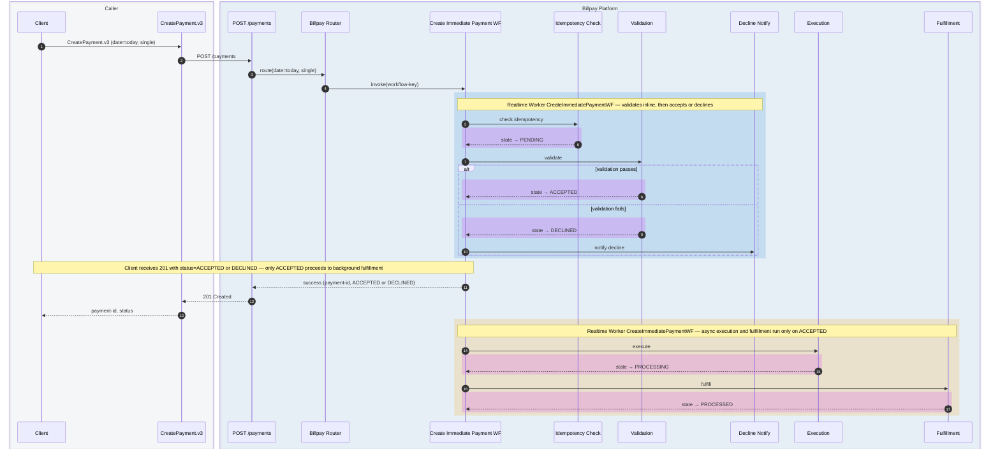

## 2. Scheduled payment — created today, executed later

`CreatePayment.v3` → `POST /payments` (future date) →
`#CreateSchedulePaymentWF` → later → `#ExecuteScheduledPaymentWF`.

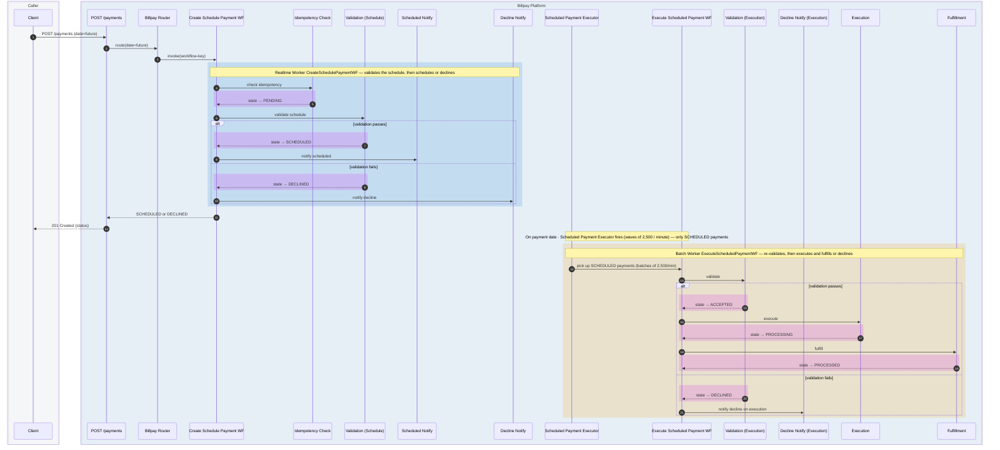

:::note[After PROCESSED]
`PAID` is reached separately by the **Paid Events Processor reconciliation** — see [diagram #10](#10-paid-events-reconciliation).
:::

## 3. Immediate Corporate Payment

`POST /payments` with `payment-date = today` and a corporate marker →
`#CreateImmediatePaymentWF`. On `ACCEPTED`, the parent fans out to
`#GetCorporatePaymentAllocationsWF` for the split breakdown, then
`#ExecuteSplitPaymentWF` runs per split.

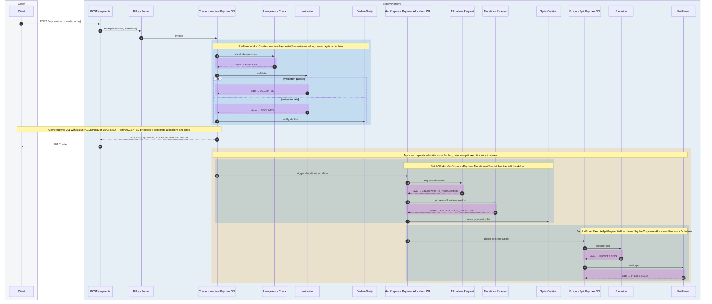

## 4. Scheduled Corporate Payment

`POST /payments` with `payment-date = future` and a corporate marker →
`#CreateSchedulePaymentWF`. On `SCHEDULED`, allocations are fetched **up
front** so they're ready on the payment date. When the date arrives,
`#ExecuteScheduledPaymentWF` re-validates (`ALLOCATIONS_RECEIVED → ACCEPTED`)
and `#ExecuteSplitPaymentWF` runs per split.

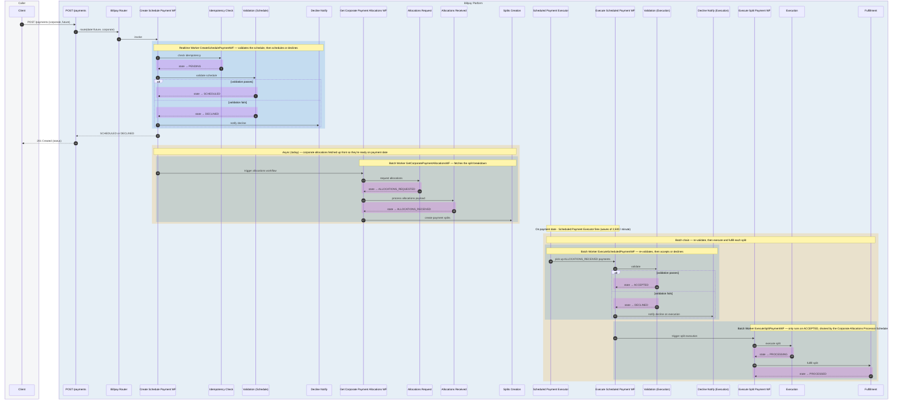

## 5. Update a scheduled payment

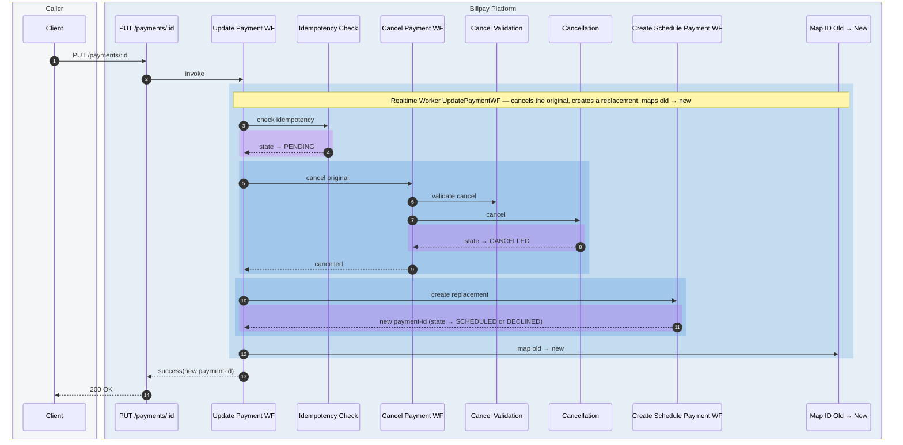

## 6. Cancel a payment

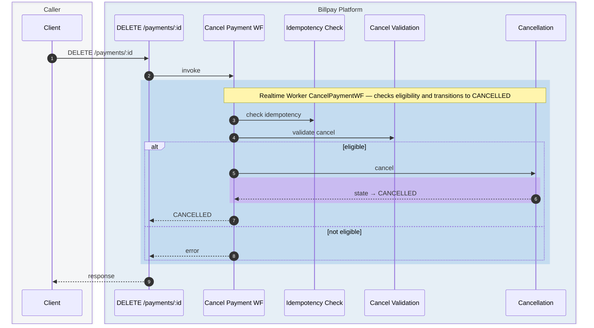

## 7. Return Processing + Representment Eligibility Check

`#ProcessReturnedPaymentWF` — triggered by Money Movement return events.
Validates the return, transitions the payment to `RETURNED`, then checks
representment eligibility. If representable, it transitions to `REPRESENTING`
and hands off to `#ProcessRepresentmentWF` (see [diagram #8](#8-representment-workflow)).

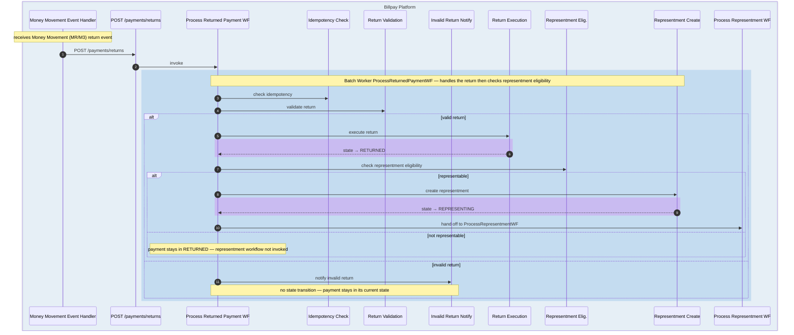

## 8. Representment Workflow

`#ProcessRepresentmentWF` — picked up from the `REPRESENTING` state set by
[diagram #7](#7-return-processing--representment-eligibility-check). Re-clears
the returned transaction on the representment day: if validation passes the
payment moves to `REPRESENTED`, otherwise it falls to `DECLINED`.

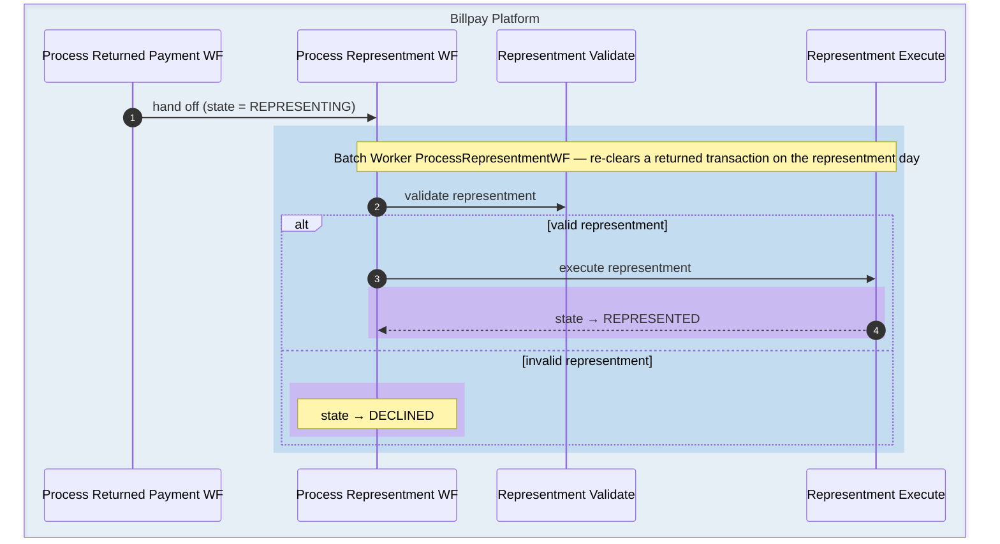

## 9. Inbound payment

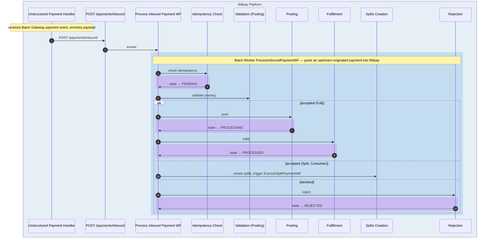

## 10. Paid Events reconciliation

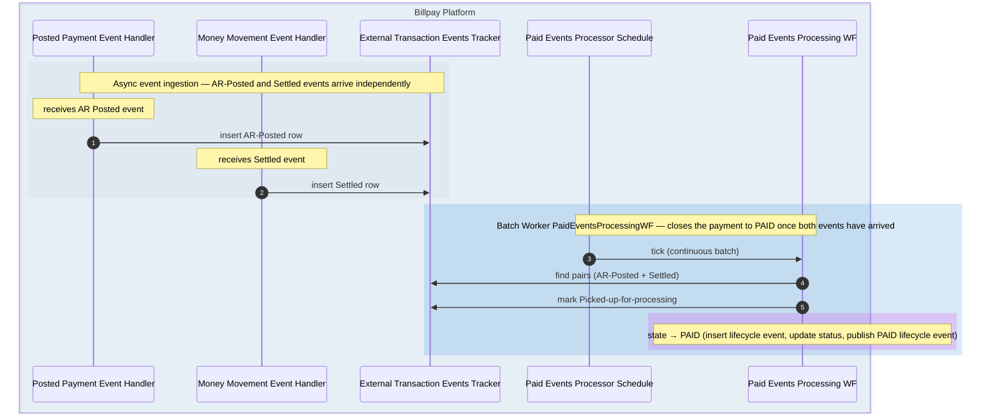

## 11. Missing Paid Events reconciliation

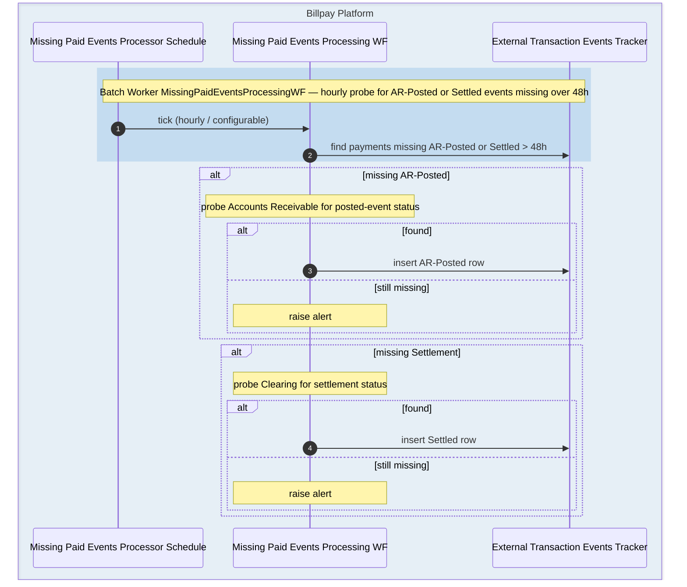

## 12. Create Payment + Installments (composite)

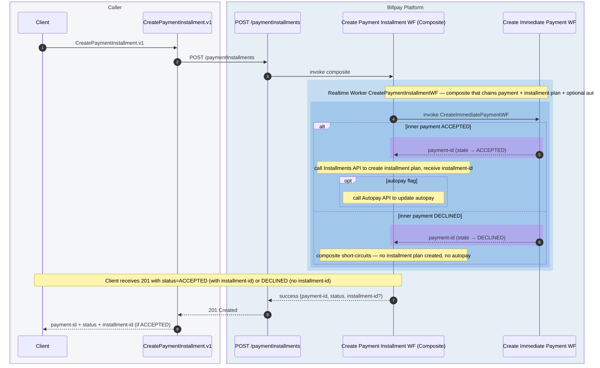
