# State Diagrams

One state diagram per workflow. Each diagram captures every transition the
workflow can perform and which **Payment Service(s)** drive it.

For a single, combined view of the full state model, see
[The Payment State Model](../payment-state-model.md).

## 1. Create Immediate Payment WF

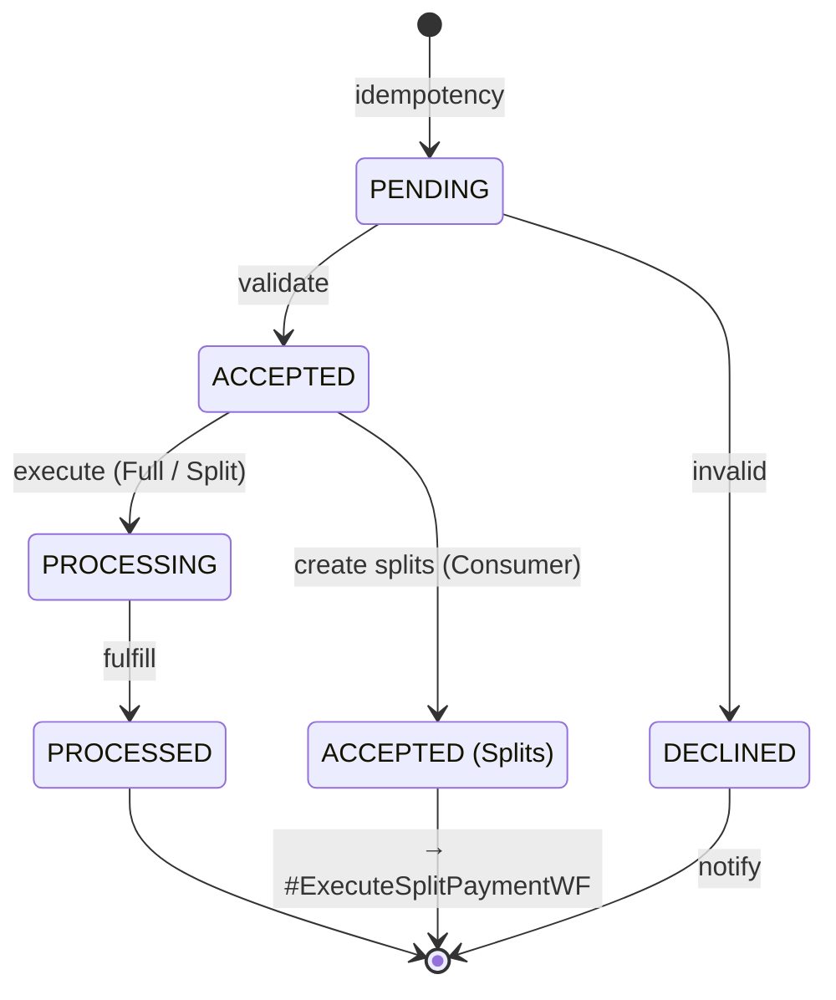

:::note[Service mapping]
- **idempotency** → `IdempotencyService`
- **validate** → `PaymentValidationService` + `PaymentStateTransitionService`
- **execute (Full / Split)** → `PaymentExecutionService` *(Full)* or `PaymentClearingService` *(Split, full-level clearing)*
- **fulfill** → `PaymentFulfillmentService`
- **create splits (Consumer)** → `PaymentSplitsCreationService`
- **notify** (DECLINED) → `EventNotificationService`
:::

## 2. Create Schedule Payment WF

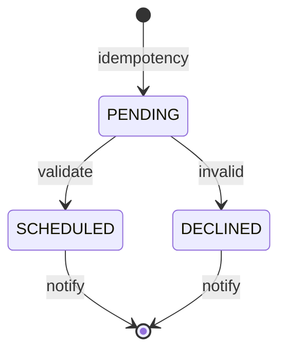

:::note[Service mapping]
- **idempotency** → `IdempotencyService`
- **validate** → `PaymentValidationService` + `PaymentStateTransitionService`
- **notify** (SCHEDULED) → `EventNotificationService` *(Corporate additionally triggers `#GetCorporatePaymentAllocationsWF`)*
- **notify** (DECLINED) → `EventNotificationService`
:::

## 3. Execute Scheduled Payment WF

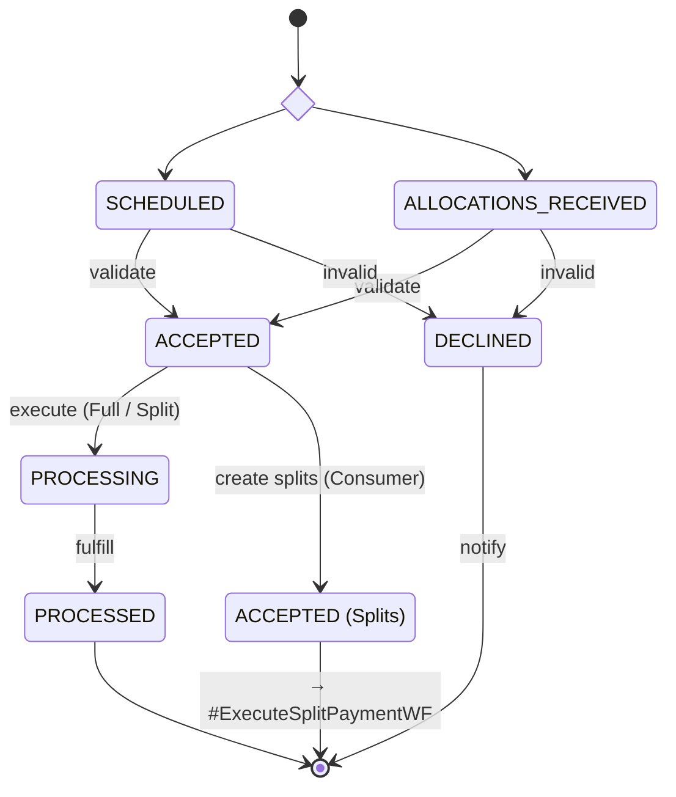

:::note[Service mapping]
- **validate** → `PaymentValidationService` + `PaymentStateTransitionService`
- **execute (Full / Split)** → `PaymentExecutionService` *(Full)* or `PaymentClearingService` *(Split, full-level clearing)*
- **fulfill** → `PaymentFulfillmentService`
- **create splits (Consumer)** → `PaymentSplitsCreationService`
- **notify** (DECLINED) → `EventNotificationService`
:::

## 4. Execute Split Payment WF

Operates at **split level** on `split_trans_dtl`.

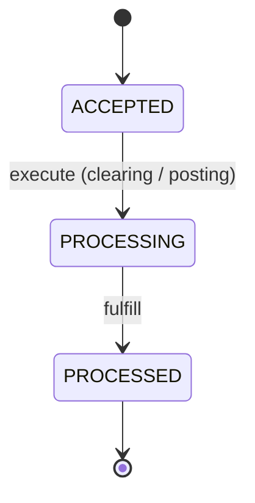

:::note[Service mapping]
- **execute (clearing / posting)** → `PaymentExecutionService` *(split, clearing-at-split)* **or** `PaymentPostingService` *(split)*, both paired with `PaymentSplitStateTransitionService`
- **fulfill** → `PaymentFulfillmentService` *(split)* + `PaymentSplitStateTransitionService`
:::

## 5. Cancel Payment WF

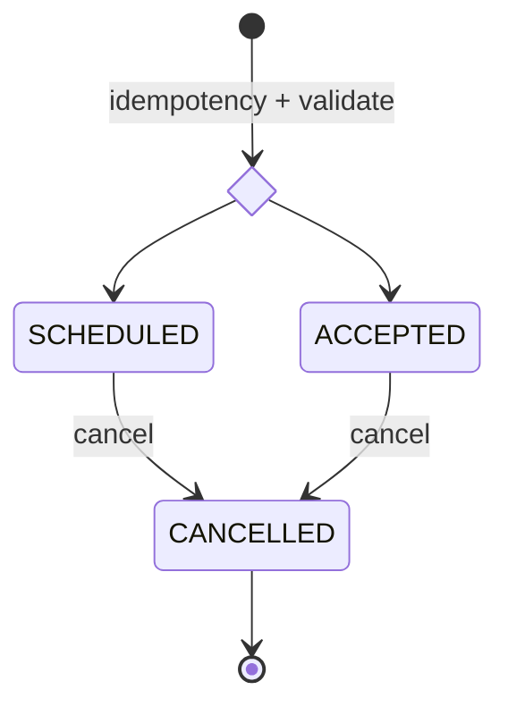

:::note[Service mapping]
- **idempotency + validate** → `IdempotencyService` + `PaymentCancelValidationService`
- **cancel** → `PaymentCancellationService` + `PaymentStateTransitionService`
:::

## 6. Update Payment WF

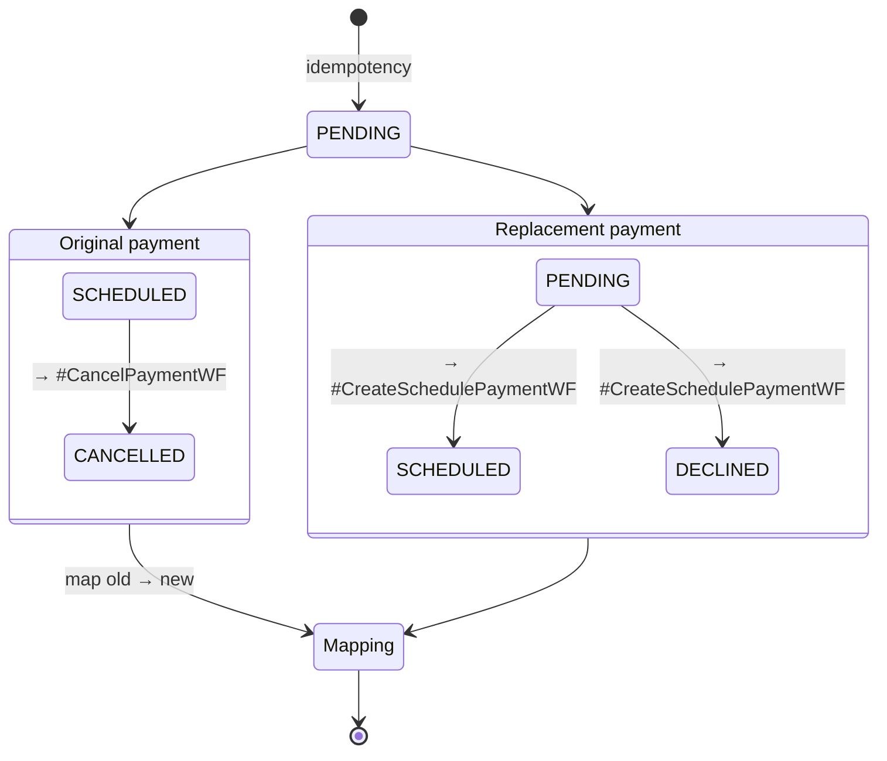

:::note[Service mapping]
- **idempotency** → `IdempotencyService`
- **→ #CancelPaymentWF / → #CreateSchedulePaymentWF** → child workflows
- **map old → new** → `MapNewPaymentIdToPreviousIdService` *(records the relationship in `ORIG_TRANS_REFER_MAP`)*
:::

## 7. Process Returned Payment WF

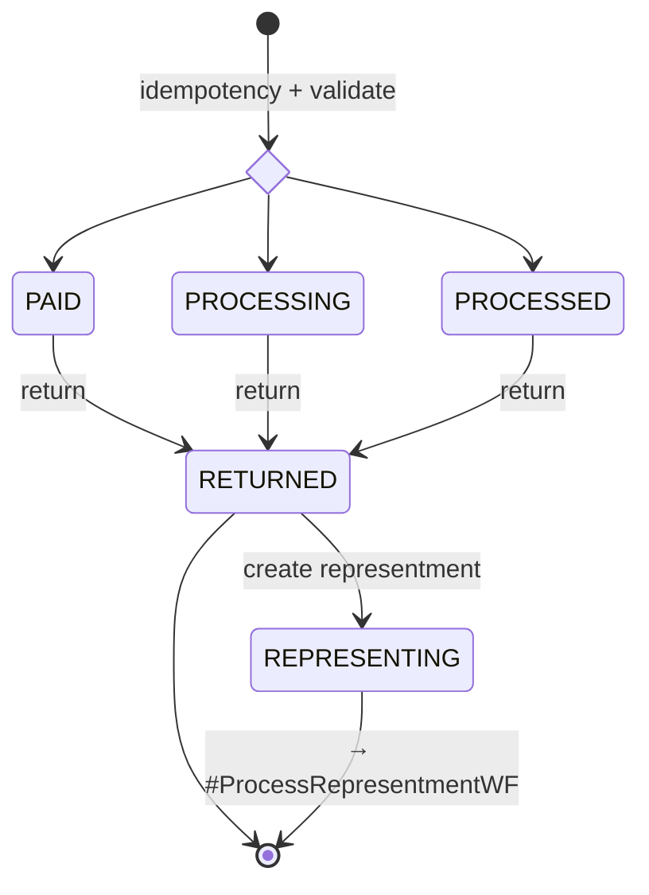

:::note[Service mapping]
- **idempotency + validate** → `IdempotencyService` + `PaymentReturnValidationService`
- **return** → `PaymentReturnExecutionService` + `PaymentStateTransitionService`
- **create representment** → `PaymentRepresentmentEligibilityService` + `PaymentRepresentmentCreationService`
- **invalid return** (no state transition) → `EventNotificationService`
:::

## 8. Process Representment WF

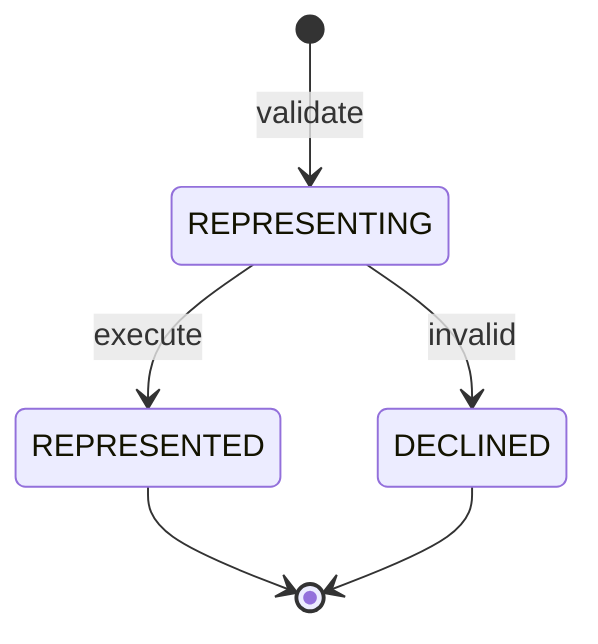

:::note[Service mapping]
- **validate** → `PaymentRepresentmentValidationService`
- **execute** → `PaymentRepresentmentExecutionService` + `PaymentStateTransitionService`
- **invalid** → state transition only via `PaymentStateTransitionService`
:::

## 9. Get Corporate Payment Allocations WF

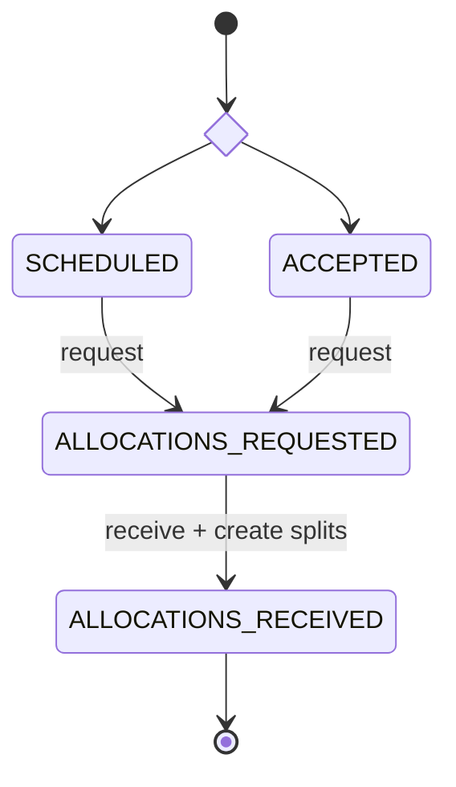

:::note[Service mapping]
- **request** → `AllocationsRequestService` + `PaymentStateTransitionService`
- **receive + create splits** → `AllocationsReceivedService` + `PaymentSplitsCreationService` + `PaymentStateTransitionService`
:::

## 10. Process Inbound Payment WF

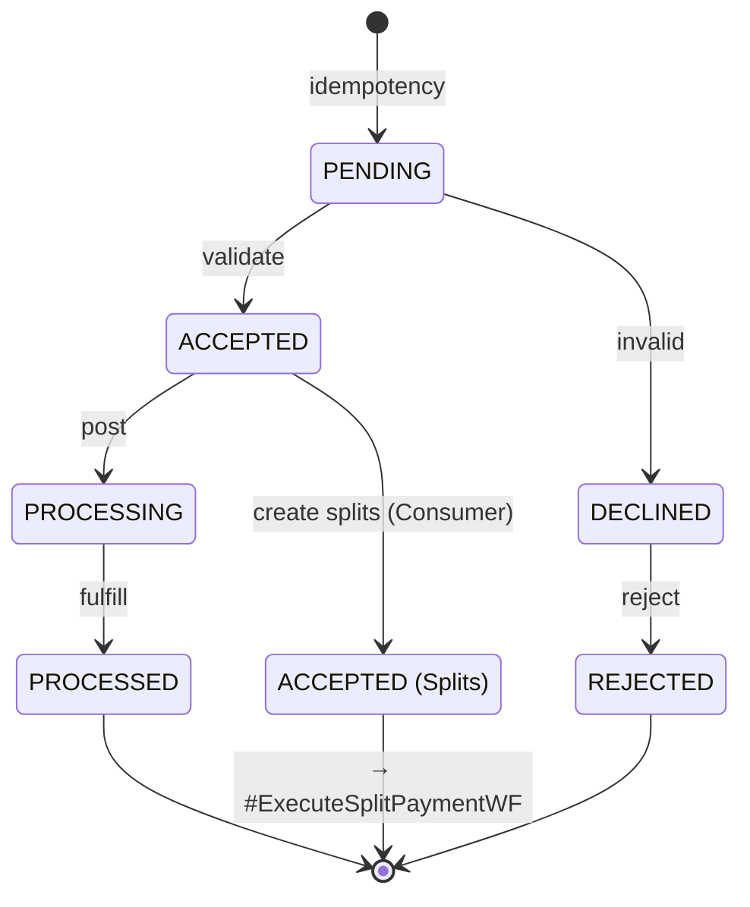

:::note[Service mapping]
- **idempotency** → `IdempotencyService`
- **validate** → `PaymentValidationService` + `PaymentStateTransitionService`
- **post** → `PaymentPostingService` + `PaymentStateTransitionService`
- **fulfill** → `PaymentFulfillmentService` + `PaymentStateTransitionService`
- **create splits (Consumer)** → `PaymentSplitsCreationService`
- **reject** → `PaymentRejectionService` + `PaymentStateTransitionService`
:::

## 11. Create Balance Refund WF

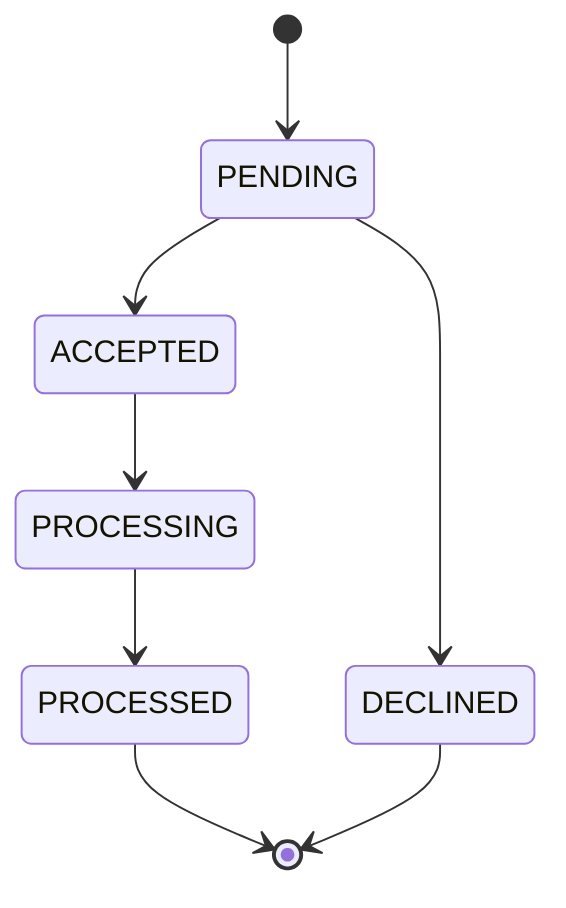

## 12. Paid Events Processing Workflow

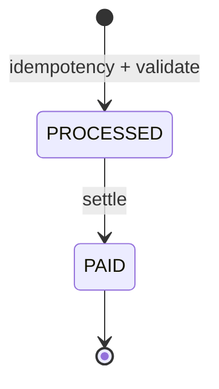

:::note[Service mapping]
- **idempotency + validate** → `IdempotencyService` + `PaidEventValidationService`
- **settle** → `PaymentSettlementService` + `PaymentStateTransitionService`
:::
