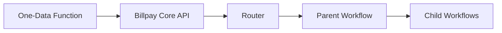
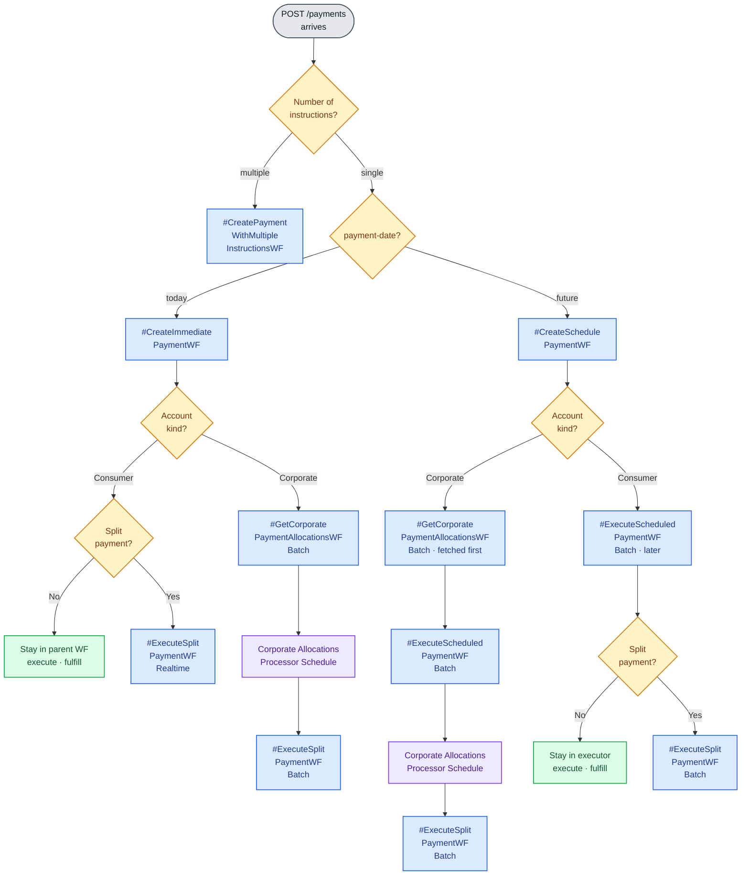

# API → Workflow Mapping

This is the canonical reference for **which workflow handles which API call** —
from One-Data function all the way down to the parent/child workflow tree.

## Mapping table

| One-Data Function | Billpay Core API | Router decisions | Parent Workflow | Child Workflows |
| --- | --- | --- | --- | --- |
| **CreatePayment.v3** | `POST /payments` | `date = today`, single instruction | [`#CreateImmediatePaymentWF`](../workflows/core.md#1-createimmediatepaymentwf) (Realtime) | **Consumer + Split**: [`#ExecuteSplitPaymentWF`](../workflows/core.md#4-executesplitpaymentwf) (Realtime)   **Consumer + Full**: no child   **Corporate**: [`#GetCorporatePaymentAllocationsWF`](../workflows/core.md#9-getcorporatepaymentallocationswf) (Batch) → [`#ExecuteSplitPaymentWF`](../workflows/core.md#4-executesplitpaymentwf) (Batch, via *Corporate Allocations Processor Schedule*) |
| **CreatePayment.v3** | `POST /payments` | `date = today`, **multiple** instructions | [`#CreatePaymentWithMultipleInstructionsWF`](../workflows/composite.md#2-create-payment-with-multiple-instructions) (Realtime) | per-instruction [`#CreateImmediatePaymentWF`](../workflows/core.md#1-createimmediatepaymentwf) |
| **CreatePayment.v3** | `POST /payments` | `date = future`, single instruction | [`#CreateSchedulePaymentWF`](../workflows/core.md#2-createschedulepaymentwf) (Realtime) | **Consumer**: later → [`#ExecuteScheduledPaymentWF`](../workflows/core.md#3-executescheduledpaymentwf) (Batch); if Split → [`#ExecuteSplitPaymentWF`](../workflows/core.md#4-executesplitpaymentwf) (Batch).   **Corporate**: [`#GetCorporatePaymentAllocationsWF`](../workflows/core.md#9-getcorporatepaymentallocationswf) (Batch) **first** → then [`#ExecuteScheduledPaymentWF`](../workflows/core.md#3-executescheduledpaymentwf) (Batch) → [`#ExecuteSplitPaymentWF`](../workflows/core.md#4-executesplitpaymentwf) (Batch, via *Corporate Allocations Processor Schedule*) |
| **UpdatePayment.v1** | `PUT /payments/{id}` | create workflow-key, invoke | [`#UpdatePaymentWF`](../workflows/core.md#6-updatepaymentwf) (Realtime) | [`#CancelPaymentWF`](../workflows/core.md#5-cancelpaymentwf), [`#CreateSchedulePaymentWF`](../workflows/core.md#2-createschedulepaymentwf) |
| **DeletePayment.v1** | `DELETE /payments/{id}` | create workflow-key, invoke | [`#CancelPaymentWF`](../workflows/core.md#5-cancelpaymentwf) (Realtime) | – |
| **MoneyMovementEventListener.v1** | `POST /payments/returns` | create workflow-key, invoke | [`#ProcessReturnedPaymentWF`](../workflows/core.md#7-processreturnedpaymentwf) (Batch) | [`#ProcessRepresentmentWF`](../workflows/core.md#8-processrepresentmentwf) (Batch) |
| **CreateInboundPayment.v1** | `POST /payments/inbound` | create workflow-key, invoke | [`#ProcessInboundPaymentWF`](../workflows/core.md#10-processinboundpaymentwf) (Batch) | – |
| **CreateCreditBalanceRefund.v1** | `POST /refunds` | create workflow-key, invoke | [`#CreateBalanceRefundWF`](../workflows/core.md#11-createbalancerefundwf) | – |
| **CreatePaymentInstallment.v1** | `POST /paymentInstallments` | composite orchestration | [Create Payment & Installments](../workflows/composite.md#1-create-payment--installments) (Realtime) | [`#CreateImmediatePaymentWF`](../workflows/core.md#1-createimmediatepaymentwf), Installments API, Autopay API |

:::tip[Routing rules at a glance]
- **Consumer + Full** stays inside the parent workflow — no split workflow is launched.
- **Consumer + Split** triggers `#ExecuteSplitPaymentWF` (Realtime for immediate, Batch for scheduled).
- **Corporate** always goes through `#GetCorporatePaymentAllocationsWF` first to fetch the allocation breakdown from GPA. Splits are then drained by the **Corporate Allocations Processor Schedule** which triggers `#ExecuteSplitPaymentWF` on the Batch worker in waves.
- **Corporate + Scheduled**: allocations are fetched **before** `#ExecuteScheduledPaymentWF` is invoked — by the time the executor fires, the payment is already in `ALLOCATIONS_RECEIVED`.
:::

## Router decision flow

