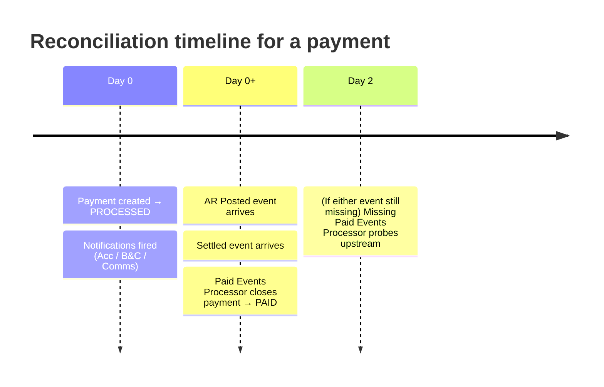

# Schedules → Workflow Mapping

All scheduled workflows run on the **Batch Worker**. The table below is the
canonical map.

| Schedule | Temporal Workflow | What it does |
| --- | --- | --- |
| Schedule Payment Executor Schedule | [`#ExecuteScheduledPaymentWF`](../workflows/core.md#3-executescheduledpaymentwf) | Drains payments in `SCHEDULED` in wave-based batches |
| Corporate Allocations Processor Schedule | [`#ExecuteSplitPaymentWF`](../workflows/core.md#4-executesplitpaymentwf) | Processes splits after corporate allocations are received |
| Paid Events Processor Schedule | [`#PaidEventsProcessingWF`](../workflows/scheduled.md#3-paideventsprocessingwf--paid-events-processor) | Closes payments to `PAID` once both Settled and AR-Posted events have arrived |
| Missing Paid Events Processor Schedule | [`#MissingPaidEventsProcessingWF`](../workflows/scheduled.md#4-missingpaideventsprocessingwf--missing-paid-events-processor) | Reconciles partial-event payments after a 48h window |
| Data Purge Schedule | [`#DataPurgingWF`](../workflows/scheduled.md#5-datapurgingwf--data-purger) | Deletes older records from transactional tables |

## Timing model

The chart below is illustrative — it shows **how often** each schedule fires and
**how long** a single wave takes. Sections are widely spaced so labels don't
collide with the bars.

```mermaid
gantt
  title Schedule cadence — illustrative
  dateFormat  HH:mm
  axisFormat  %H:%M

  section Schedule Payment Executor
  Wave 1 :active, a1, 00:00, 1m
  Wave 2 :active, a2, 00:01, 1m
  Wave 3 :active, a3, 00:02, 1m

  section Corporate Allocations
  Wave 1 :b1, 00:00, 1m
  Wave 2 :b2, 00:01, 1m

  section Paid Events Processor
  Batch close :done, c1, 00:00, 3m

  section Missing Paid Events
  Hourly sweep :crit, d1, 00:00, 5m

  section Data Purger
  Daily run :e1, 00:00, 10m
```

### At-a-glance cadence

| Schedule | Wave duration | Frequency |
| --- | --- | --- |
| **Schedule Payment Executor** | ~1 minute / wave (2,500 payments) | Every minute |
| **Corporate Allocations Processor** | ~1 minute / wave (2,500 allocations) | Every minute |
| **Paid Events Processor** | Continuous, batched | Every few minutes |
| **Missing Paid Events Processor** | ~5 minutes | Hourly *(configurable)* |
| **Data Purger** | ~10 minutes | Daily |

## Reconciliation timeline (per payment)

