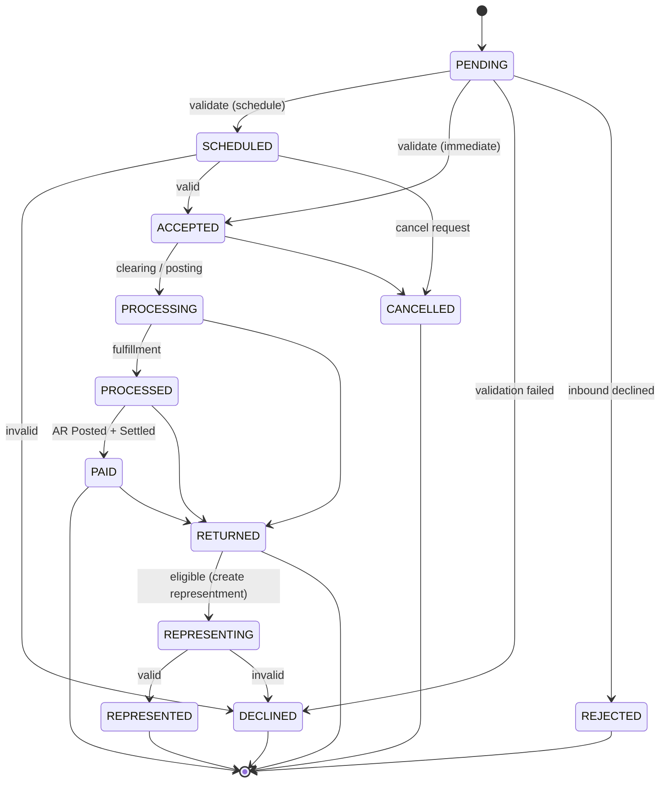
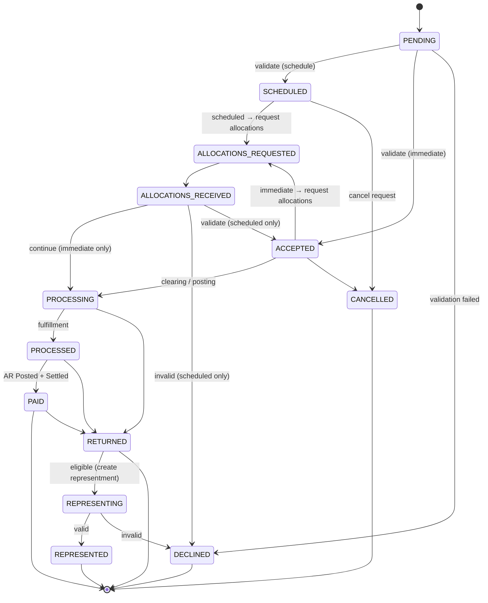

import Tabs from '@theme/Tabs';
import TabItem from '@theme/TabItem';

# The Payment State Model

Every payment in Billpay travels through a state machine. The same machine
serves both payment-level (`trans_dtl`) and split-level
(`split_trans_dtl`) records.

States are colour-coded by **lifecycle position only** — *non-terminal* (the payment is still moving) versus *terminal* (the payment is settled into a final state and will not transition further). The diagrams below are split by **payment type** — Consumer and Corporate share most of the lifecycle but Corporate adds an allocations side-loop.

<Tabs groupId="payment-type">

<TabItem value="consumer" label="Consumer" default>

## The states

| State | Meaning | Terminal? |
| --- | --- | --- |
| PENDING | The payment has been received and is awaiting initial processing. | No |
| SCHEDULED | The payment is set to execute at a future date. | No |
| ACCEPTED | The payment is approved and ready to execute. | No |
| PROCESSING | The payment is currently being executed by notifying the respective systems to debit the funding account and credit the receiving account. | No |
| PROCESSED | The payment has been executed and fulfilled by Billpay by notifying all stakeholders. | No |
| REPRESENTING | A returned payment is scheduled to be re-attempted for settlement. | No |
| PAID | The payment is settled and posted in accounts receivables. | **Yes** |
| RETURNED | The payment did not settle; funds were returned. | **Yes** |
| REPRESENTED | A returned payment was re-attempted and successfully settled. | **Yes** |
| DECLINED | The payment was not approved for execution. | **Yes** |
| CANCELLED | The payment was withdrawn before completion. | **Yes** |
| REJECTED | The payment was not accepted in American Express. | **Yes** |

## The big picture

</TabItem>

<TabItem value="corporate" label="Corporate">

## The states

Corporate payments add two states for the **allocations side-loop** — between the initial validate step and execution, the payment waits for its allocation breakdown.

| State | Meaning | Terminal? |
| --- | --- | --- |
| PENDING | The payment has been received and is awaiting initial processing. | No |
| SCHEDULED | The payment is set to execute at a future date. | No |
| ALLOCATIONS_REQUESTED | The payment is awaiting its allocation breakdown. | No |
| ALLOCATIONS_RECEIVED | The payment's allocation breakdown is available. | No |
| ACCEPTED | The payment is approved and ready to execute. | No |
| PROCESSING | The payment is currently being executed by notifying the respective systems to debit the funding account and credit the receiving account. | No |
| PROCESSED | The payment has been executed and fulfilled by Billpay by notifying all stakeholders. | No |
| REPRESENTING | A returned payment is scheduled to be re-attempted for settlement. | No |
| PAID | The payment is settled and posted in accounts receivables. | **Yes** |
| RETURNED | The payment did not settle; funds were returned. | **Yes** |
| REPRESENTED | A returned payment was re-attempted and successfully settled. | **Yes** |
| DECLINED | The payment was not approved for execution. | **Yes** |
| CANCELLED | The payment was withdrawn before completion. | **Yes** |

## The big picture

:::info[Scheduled vs. immediate]
The path that exits `ALLOCATIONS_RECEIVED` depends on **when the payment was first validated**:

- **Corporate scheduled** → `SCHEDULED` → `ALLOCATIONS_REQUESTED` → `ALLOCATIONS_RECEIVED` → `ACCEPTED` / `DECLINED`.
  The payment was not validated up-front, so it is **validated now** against the received allocations before transitioning to `ACCEPTED`. This is the only path that uses `ALLOCATIONS_RECEIVED → ACCEPTED`.
- **Corporate immediate** → `ACCEPTED` → `ALLOCATIONS_REQUESTED` → `ALLOCATIONS_RECEIVED` → `PROCESSING`.
  The payment was already validated when it became `ACCEPTED`, so it **skips re-validation** and goes straight to `PROCESSING`.

In both cases the splits are executed by `#ExecuteSplitPaymentWF` on the Batch worker.
:::

</TabItem>

</Tabs>

## Lifecycle events

Every state transition emits a **lifecycle event** that is:

1. Appended to `trans_lfcyc_event` (or `split_trans_lfcyc_event` for splits)
2. Published on the lifecycle event topic for downstream subscribers

The contract is enforced by `PaymentStateTransitionService` /
`PaymentSplitStateTransitionService`, which always run **alongside** the
service that triggers the transition.

For the per-workflow state-diagram view, see
[State Diagrams](diagrams/state-diagram.md).
