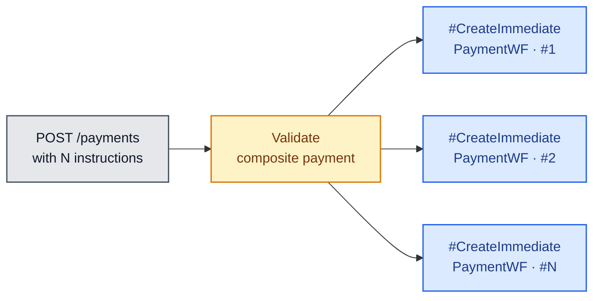

# Composite Workflows

Composite workflows orchestrate **multiple core workflows together** so that a
single business intent (e.g. "create a payment and its installment plan") can
be expressed atomically.

All composite workflows run on the **Realtime Worker**.

## 1. Create Payment & Installments

Triggered by `POST /paymentInstallments`.

**Steps**

1. Execute child `#CreateImmediatePaymentWF`
2. Call the **Installments API** with the resulting payment-id
3. *(optional)* Call the **Update Autopay** API

## 2. Create Payment with Multiple Instructions

Triggered when `POST /payments` carries **multiple instructions** in a single
request — for example, paying different amounts to several accounts in one shot.

**Steps**

1. Validate the composite payment as a whole
2. For each instruction → invoke a separate `#CreateImmediatePaymentWF`

Each child workflow runs independently — partial successes are surfaced back to
the caller per-instruction.
