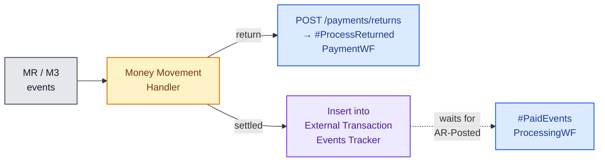
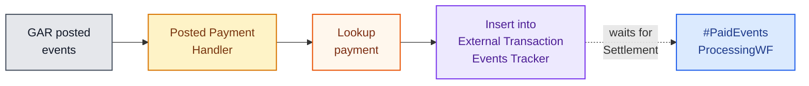
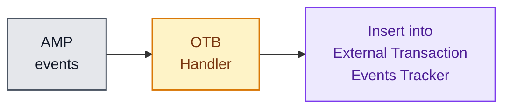
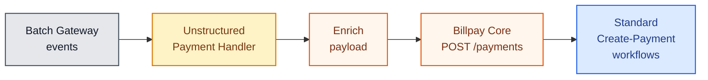

# Event Handlers

Event handlers are **One-Data functions implemented as event consumers**. They
bridge external systems into Billpay's workflows or its
`External Transaction Events Tracker`.

| Handler | Listens to | Effect |
| --- | --- | --- |
| **Money Movement Event Handler** | MR / M3 events | If return → trigger `#ProcessReturnedPaymentWF`; if settled → insert into `External Transaction Events Tracker` |
| **Posted Payment Event Handler** | GAR posted events | Look up the payment; insert into `External Transaction Events Tracker` |
| **Open-To-Buy Update Event Handler** *(TBD)* | AMP events | Insert into `External Transaction Events Tracker` |
| **Unstructured Payment Event Handler** | Batch Gateway events | Enrich the payload; invoke `POST /payments` on Billpay Core |

## Money Movement Event Handler

## Posted Payment Event Handler

## Open-To-Buy Update Handler *(TBD)*

The behaviour is still being finalised — the source spec marks this **TBD**.

## Unstructured Payment Event Handler

The handler is **the bridge** between low-fidelity, upstream events and the
fully-validated Billpay payment lifecycle. Once it has invoked
`POST /payments`, the request follows the same code path as any inbound
API call.
