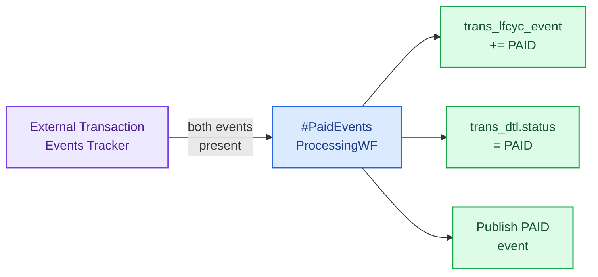

# Scheduled Workflows

Scheduled workflows are fired by **Temporal Schedules** at fixed intervals and
always run on the **Batch Worker**.

| Schedule | Workflow it triggers | Cadence pattern |
| --- | --- | --- |
| Scheduled Payment Executor | `#ExecuteScheduledPaymentWF` | Wave-based, e.g. 2,500 / minute |
| Corporate Allocations Processor | `#ExecuteSplitPaymentWF` | Wave-based, e.g. 2,500 / minute |
| Paid Events Processor | `#PaidEventsProcessingWF` | Continuous batch |
| Missing Paid Events Processor | `#MissingPaidEventsProcessingWF` | Hourly / configurable |
| Data Purger | `#DataPurgingWF` | Daily |

## 1. Scheduled Payment Executor

Picks up payments in `SCHEDULED` and drives them through
`#ExecuteScheduledPaymentWF`. Designed to pace itself so that the downstream
clearing/posting systems are not overwhelmed.

## 2. Corporate Allocations Processor

Picks up corporate payments that reached `ALLOCATIONS_RECEIVED` and pushes the
splits through `#ExecuteSplitPaymentWF` in waves.

## 3. `#PaidEventsProcessingWF` — Paid Events Processor

The reconciliation engine. A payment is only `PAID` once **both** the AR-Posted
and Clearing-Settlement events have arrived.

**Steps**

1. Fetch all payments from `External Transaction Events Tracker` whose AR-Posted **and** Clearing-Settlement events have both arrived
2. Mark them `Picked-up-for-processing` in the tracker
3. Insert into `trans_lfcyc_event` as `PAID`
4. Update `trans_dtl.status = PAID`
5. Publish the `PAID` lifecycle event

## 4. `#MissingPaidEventsProcessingWF` — Missing Paid Events Processor

The safety net. Runs after a grace window (48 hours by default) to detect
payments where one of the two events never arrived.

**Steps**

1. Find payments where AR-Posted *or* Clearing-Settlement (or both) are missing for the last 48 hours
2. Call the relevant upstream system to fetch the latest status
3. If status confirms the missing event → insert it into the tracker (handed off to the Paid Events Processor on the next tick)
4. If still missing → raise alert

## 5. `#DataPurgingWF` — Data Purger

Deletes records past the retention window from the transactional tables.
Decouples operational tables from analytical archives.

**Steps**

1. Fetch older records from the relevant DB tables
2. Delete them

:::caution
The purger is **destructive**. Retention windows are encoded in the workflow
config — change with care and confirm downstream consumers (analytics,
compliance) have already snapshotted.
:::
