import Lead from '@site/src/components/Lead';

# Data Model

<Lead>The domain model lives in <code>com.aexp.billpay.core.domain.transaction</code> and is built around one idea: <strong>make illegal payment states unrepresentable.</strong> Each lifecycle state is its own Kotlin type, every type is immutable, and the only way from one state to the next is a function that the compiler checks. Most bugs a payments system dreads simply don't compile here.</Lead>

## The shape of the model

```mermaid
flowchart TD
  T["Transaction<br/><i>sealed interface — id · account · amount?</i>"]
  P["Payment<br/><i>sealed interface — status · timeline · option · instrument …</i>"]
  S["11 status types<br/><i>PendingPayment · ScheduledPayment · AcceptedPayment · ProcessingPayment ·<br/>ProcessedPayment · PaidPayment · ReturnedPayment · RepresentingPayment ·<br/>RepresentedPayment · CancelledPayment · DeclinedPayment</i>"]
  L["18 concrete data classes<br/><i>&#123;Status&#125;FullPayment / &#123;Status&#125;SplitPayment</i>"]
  D["directives<br/><i>PaymentOption · Instrument — each Reference → Verified</i>"]
  TL["Timeline<br/><i>Initial · Immediate · Scheduled</i>"]
  T --> P --> S --> L
  D --> P
  TL --> P
```

Three patterns repeat everywhere, and once you see them the whole model reads itself:

- **Status × shape.** A payment's lifecycle state (its status type) and its shape (`FullPayment` or `SplitPayment`) are two independent axes; the concrete classes are their cross-product. `AcceptedSplitPayment` is exactly what its name says.
- **The Verified narrowing.** In-flight states (`SCHEDULED` through `REPRESENTED`) are required — by their types — to carry a non-null amount, a `VerifiedPaymentOption`, and a `VerifiedInstrument`. `PENDING`, `CANCELLED`, and `DECLINED` may hold unverified data. Validation isn't a boolean here; it's a type change.
- **Reference → Verified, twice.** Payment options and instruments both arrive as unverified references and are resolved into verified values by the system of record — the same two-phase pattern on both directive families.

Every sealed hierarchy carries a Jackson `"type"` discriminator, so the concrete types survive every serialization boundary — see [Serialization](../principles/tech-stack/serialization.md).

## The pages

- **[Payment](./payment.md)** — `Transaction`, `Payment`, the eleven status types, Full/Split, timelines, and the transition functions that are the state machine.
- **[Payment Options](./payment-options.md)** — the eight option types and their Reference → Verified lifecycle.
- **[Instruments](./instruments.md)** — bank accounts, debit cards, and loyalty as funding instruments, with the international identification schemas.
- **[Database](./database.md)** — the Oracle tables underneath, and how the model maps onto them.

:::note[Still to be modelled]
The code doesn't yet cover everything the [spec's state model](../../design/payment-state-model.md) defines. Known gaps, tracked deliberately rather than papered over:

- No payment types for **`DISALLOWED`** (inbound), or corporate **`ALLOCATING`** / **`ALLOCATED`**.
- No first-class **Allocation** entity — corporate allocations are represented today as `SplitPayment` legs plus `SplitSlice`.
- The four **processing dimensions** (`accountType`, `requiresArPosting`, `requiresRealtimeClearing`, `requiresMandateAuthorization`) live in the payment *context* used for routing, not on these domain types.
- **Idempotency and lifecycle events** are persistence-layer concerns (`idempotency_checker`, `trans_lfcyc_event`) with no domain type of their own.
:::
