import Lead from '@site/src/components/Lead';
import SectionIndex from '@site/src/components/SectionIndex';

# Domain Model

<Lead>The domain model lives in <code>com.aexp.billpay.core.domain.transaction</code> and is built around one idea: <strong>make illegal payment states unrepresentable.</strong> Each lifecycle state is its own Kotlin type, every type is immutable, and the only way from one state to the next is a function the compiler checks. An illegal state change is caught at compile time rather than at runtime.</Lead>

## The type hierarchy

```mermaid
flowchart TD
  T["Transaction<br/><i>sealed interface · id · account · amount?</i>"]
  P["Payment<br/><i>sealed interface · status · timeline · option · instrument …</i>"]
  S["11 status types<br/><i>PendingPayment · ScheduledPayment · AcceptedPayment · ProcessingPayment ·<br/>ProcessedPayment · PaidPayment · ReturnedPayment · RepresentingPayment ·<br/>RepresentedPayment · CancelledPayment · DeclinedPayment</i>"]
  L["18 concrete data classes<br/><i>&#123;Status&#125;FullPayment / &#123;Status&#125;SplitPayment</i>"]
  D["directives<br/><i>PaymentOption · Instrument, each Reference → Verified</i>"]
  TL["Timeline<br/><i>Initial · Immediate · Scheduled</i>"]
  T --> P --> S --> L
  D --> P
  TL --> P
```

Three patterns repeat throughout the model:

- Status and shape are two independent axes. A payment's lifecycle state (its status type) and its shape (`FullPayment` or `SplitPayment`) combine into the concrete classes, so `AcceptedSplitPayment` is exactly what its name says.
- The in-flight states, `SCHEDULED` through `REPRESENTED`, are required by their own types to carry a non-null amount, a `VerifiedPaymentOption`, and a `VerifiedInstrument`. `PENDING`, `CANCELLED`, and `DECLINED` may hold unverified data. Validation here is a change of type, not a boolean flag.
- Payment options and instruments both arrive as unverified references and are resolved into verified values by the system of record. The same two-phase pattern runs on both directive families.

Every sealed hierarchy carries a Jackson `"type"` discriminator, so the concrete types survive every serialization boundary. See [Serialization](../principles/tech-stack/serialization.md).

## In this section

<SectionIndex
  items={[
    {
      term: 'Payment',
      to: '/docs/build/domain-model/payment',
      desc: (
        <>
          covers <code>Transaction</code>, <code>Payment</code>, the eleven status types, Full and
          Split, timelines, and the transition functions that are the state machine.
        </>
      ),
    },
    {
      term: 'Payment Options',
      to: '/docs/build/domain-model/payment-options',
      desc: `covers the eight option types and their Reference to Verified lifecycle.`,
    },
    {
      term: 'Instruments',
      to: '/docs/build/domain-model/instruments',
      desc: `covers bank accounts, debit cards, and loyalty as funding instruments, with the international identification schemas.`,
    },
  ]}
/>

The Oracle tables these types are persisted into, and how the code maps onto them, are on the [Database](../database.md) page.

:::info[Still to be modelled]
The code does not yet cover everything the [spec's state model](../../design/payment-state-model.md) defines. These gaps are tracked deliberately rather than papered over.

- No payment types for **`DISALLOWED`** (inbound), or corporate **`ALLOCATING`** / **`ALLOCATED`**.
- No first-class **Allocation** entity. Corporate allocations are represented today as `SplitPayment` legs plus `SplitSlice`.
- The four **processing behaviors** (`accountType`, `requiresArPosting`, `requiresRealtimeClearing`, `requiresMandateAuthorization`) live in the payment *context* used for routing, not on these domain types.
- **Idempotency and lifecycle events** are persistence-layer concerns (`idempotency_checker`, `trans_lfcyc_event`) with no domain type of their own.
:::
