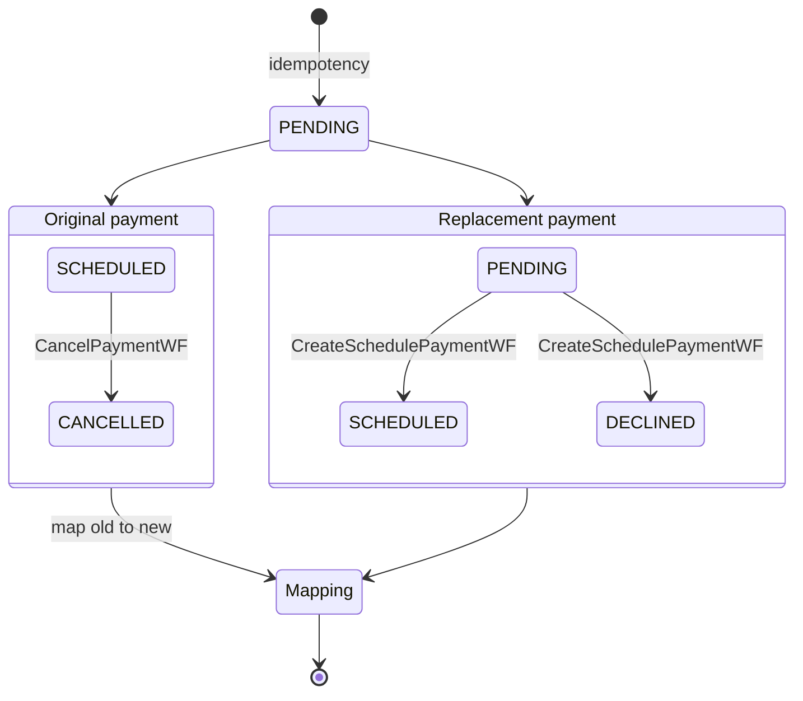

import Lead from '@site/src/components/Lead';
import WorkflowMeta from '@site/src/components/WorkflowMeta';

# Core Workflows

<Lead>The business workflows, one per request type. Each sequences the stages that move a payment through its lifecycle. The row under each heading shows the Temporal worker it runs on and the dimensions that select its stage and activity-group implementations.</Lead>

The steps below follow the workflow logic in the spec. [Stages](../stages.md) explains what each named stage does, the [state model](../../payment-state-model.md) covers the states themselves, and the [sequence diagrams](../../sequence-diagrams.md) trace the same flows across the participants.

## Create Immediate Payment

<WorkflowMeta worker="Online" dimensions="all" />

Runs when a payment is submitted to go out today. It records the request, validates it, replies to the caller as soon as the outcome is known, and then completes the money movement in the background.

1. **InitiatedToPendingStage** turns the input into a `PENDING` payment, persisting it together with its idempotency record.
2. If the request is not idempotent (a duplicate has already been seen), return the existing payment and stop.
3. Validate the pending payment (`PaymentValidationActivityGroup`). If it fails, run **PendingToDeclinedStage** (`PENDING` → `DECLINED`) and return the declined payment.
4. **PendingToAcceptedStage** moves the payment to `ACCEPTED`, and the workflow **returns early to the caller**. Everything below runs in the background.
5. Finish processing, by account type and by whether the payment is full or split.
   - A **corporate** payment runs **AcceptedToProcessingStage** (`ACCEPTED` → `PROCESSING`), triggers Get Corporate Payment Allocations, waits for the *AllocationsReceived* signal, then runs Execute Split Payment for each allocation.
   - A **full consumer** payment runs **AcceptedToProcessingStage**, then **ProcessingToProcessedStage** (`PROCESSING` → `PROCESSED`).
   - A **split consumer** payment creates the split legs in `ACCEPTED` (`PaymentSplitsCreationActivity`), then runs Execute Split Payment for each leg.

## Create Schedule Payment

<WorkflowMeta worker="Online / Offline" dimensions={['accountType', 'requiresArPosting', 'requiresMandateAuthorization']} />

Runs when a payment is booked for a future date. It validates the request now and parks the payment until its run date.

1. **InitiatedToPendingStage** persists the input as a `PENDING` payment with its idempotency record. If it is not idempotent, return the existing payment and stop.
2. Validate the pending payment (`PaymentValidationActivityGroup`).
   - If it is valid, run **PendingToScheduledStage** (`PENDING` → `SCHEDULED`) and return early. A **corporate** payment also triggers Get Corporate Payment Allocations now, so the allocation breakdown is ready before the run date.
   - If it is not, run **PendingToDeclinedStage** (`PENDING` → `DECLINED`).

## Execute Scheduled Payment

<WorkflowMeta worker="Offline" dimensions="all" />

Runs on the payment's execution date, picked up in batches by the Scheduled Payments Executor. It re-checks the payment before moving any money, because time has passed since it was scheduled.

1. Re-validate the scheduled (or already-allocated) payment (`PaymentValidationOnExecutionActivityGroup`).
   - If it is valid, run **ScheduledToAcceptedStage** (`SCHEDULED` → `ACCEPTED`), then finish processing:
     - A **full** payment runs **AcceptedToProcessingStage**, then **ProcessingToProcessedStage**.
     - A **corporate split** runs **AcceptedToProcessingStage**, triggers Get Corporate Payment Allocations, waits for the *AllocationsReceived* signal, then runs Execute Split Payment per split.
     - A **consumer split** creates the split legs (`PaymentSplitsCreationActivity`), then runs Execute Split Payment per leg.
   - If it is not, run **PendingToDeclinedStage** (→ `DECLINED`).

## Execute Split Payment

<WorkflowMeta worker="Online / Offline" dimensions={['accountType', 'requiresArPosting', 'requiresRealtimeClearing']} />

Processes a single leg of a split payment. It runs the same two stages as a full payment, scoped to one allocation.

1. **AcceptedToProcessingStage** (`ACCEPTED` → `PROCESSING`).
2. **ProcessingToProcessedStage** (`PROCESSING` → `PROCESSED`).

The first stage varies by account type. A **corporate** leg only updates balances and Open-To-Buy. A **consumer** leg also clears the payment at the bank.

## Cancel Payment

<WorkflowMeta worker="Online" dimensions={['accountType', 'requiresArPosting']} />

Withdraws a payment that has not yet gone out.

1. Check the request is unique (`IdempotencyCheckActivity`). If not, return the previous response.
2. Validate the cancellation and read the payment's current state (`PaymentCancelValidationActivityGroup`).
3. If the payment is eligible to cancel:
   - A payment currently `SCHEDULED` runs **ScheduledToCancelledStage** (→ `CANCELLED`).
   - A payment currently `ACCEPTED` runs **AcceptedToCancelledStage** (→ `CANCELLED`).

## Update Payment

<WorkflowMeta worker="Online" dimensions="all" />

Changes a scheduled payment. Rather than editing it in place, Billpay cancels the original and creates a replacement, so the history stays clean.

1. Check the request is unique (`IdempotencyCheckActivity`). If not, return the previous response.
2. **ScheduledToCancelledStage** cancels the original payment (`SCHEDULED` → `CANCELLED`). This can be done by invoking Cancel Payment.
3. Build a new pending payment with a new payment id, the **same confirmation number**, and the updated details.
4. Invoke Create Schedule Payment for the replacement, which validates it and then runs **PendingToScheduledStage** (→ `SCHEDULED`) if valid, or **PendingToDeclinedStage** (→ `DECLINED`) if not.
5. Map the new payment to the original in the database for audit (`MapNewPaymentIdToPreviousIdActivity`).

Two payments are in play at once, which is easier to see drawn:

## Process Returned Payment

<WorkflowMeta worker="Offline" dimensions={['accountType']} />

Handles a payment the bank sends back after it was processed, and decides whether it can be re-attempted.

1. Check the request is unique (`IdempotencyCheckActivity`). If not, return the previous response.
2. Validate the return by looking up the payment (full or split) and its current status. The eligible statuses are `PAID`, `PROCESSING`, and `PROCESSED`.
3. If the return is valid:
   - **ToReturnedStage** moves the payment to `RETURNED` (from `PAID`, `PROCESSING`, or `PROCESSED`).
   - Check whether the return can be re-presented (`PaymentRepresentmentEligibilityActivityGroup`).
   - If it is representable, run **ReturnedToRepresentingStage**, which enriches the representment details (such as the next representable date) and creates a new `REPRESENTING` transaction (`PaymentRepresentmentCreationActivityGroup`).

## Process Representment

<WorkflowMeta worker="Offline" dimensions="all" />

Re-attempts a returned payment on its representment date.

1. Validate the representment (`PaymentRepresentmentValidationActivityGroup`).
   - If it is valid, run **RepresentingToRepresentedStage** (`REPRESENTING` → `REPRESENTED`).
   - If it is not, run **RepresentingToDeclinedStage** (`REPRESENTING` → `DECLINED`).

## Get Corporate Payment Allocations

<WorkflowMeta worker="Offline" dimensions="generic" />

Fetches how a corporate payment splits across the accounts it covers, then kicks off the per-allocation execution. It waits on a signal, because the breakdown comes back asynchronously from the allocation-processing system.

1. **ToAllocatingStage** asks the appropriate allocations manager for the breakdown and moves the payment to `ALLOCATING`.
2. Wait for the *AllocationsReady* signal, which the allocations manager sends once the breakdown exists.
3. **AllocatingToAllocatedStage** moves the parent payment to `ALLOCATED`, creates the split legs in `ACCEPTED` (`PaymentSplitsCreationActivity`), and runs Execute Split Payment for each.

There are two signals here, and they are not the same one. *AllocationsReady* comes into this workflow from the allocations manager. *AllocationsReceived* goes out to the parent workflow that started it, which is what Create Immediate Payment and Execute Scheduled Payment wait on.

## Process Inbound Payment

<WorkflowMeta worker="Offline" dimensions={['TBD']} />

Posts a payment that a third party initiated on the customer's behalf into Billpay.

1. **InitiatedToPendingStage** persists the input as a `PENDING` payment with its idempotency record. If it is not idempotent, return the existing payment and stop.
2. Validate the pending payment (`PaymentValidationActivityGroup`).
   - If it is valid, run **PendingToAcceptedStage** (`PENDING` → `ACCEPTED`) and return early, then:
     - A **full** payment runs **AcceptedToProcessingStage**, then **ProcessingToProcessedStage**.
     - A **consumer split** creates the split legs (`PaymentSplitsCreationActivity`), then runs Execute Split Payment per leg.
   - If it is not, run **PendingToDisallowedStage** (`PENDING` → `DISALLOWED`). This is the inbound-only outcome for a payment Amex does not accept.

## Create Payment Intent

<WorkflowMeta worker="Online" dimensions={['accountType', 'instrumentType', 'requiresMandateAuthorization']} />

Registers that a customer means to pay. It becomes a real payment only once the customer's financial institution confirms it. The detailed step logic is still being defined in the spec.

## Create Balance Refund

<WorkflowMeta worker="Online / Offline" dimensions={['TBD']} />

Sends money back to the customer from a credit balance on the card, following the same validate, process and fulfil path as a payment. Its detailed step logic is still being defined in the spec. Which worker runs it depends on where in the journey it is invoked.
