# Sequence Diagrams

End-to-end traces from a caller's perspective. Each diagram follows one complete Billpay flow — **caller → Core API → Billpay Router → Workflows → the ActivityGroups and Activities that do the work**.

Most diagrams show two groups at the top:

- **Caller** — the client and the request contract it calls, e.g. `CreatePayment.v3` (soft slate).
- **Billpay Platform** — everything past the contract: the Core API endpoint, the Billpay Router, the Workflows, and the ActivityGroups/Activities they invoke (light blue).

Internal reconciliation flows (event handlers + schedules) show only the Billpay Platform group.

Inside the body:

- **Blue-tinted rectangles** wrap the messages that belong to a single workflow (the workflow name is labeled at the top of the block).
- **Amber-tinted rectangles** mark async work that happens *after* the caller has been responded to.
- **Fuchsia/pink-tinted rectangles** pop out **state transitions** — moments where the payment moves from one lifecycle state to another (`PENDING → ACCEPTED`, `PROCESSING → PROCESSED`, and so on).

Each ActivityGroup or Activity appears as its **own participant**. To keep the diagrams readable the participant label is short — `Execution` stands for `PaymentExecutionActivityGroup`, `Idempotency` for `IdempotencyCheckActivity`, `Validation` for `PaymentValidationActivityGroup` — and each diagram's intro names the full classes it uses. External systems and infrastructure (clearing, Accounts Receivable, Open-To-Buy, accounting, the database, the event bus) are intentionally omitted — they're internal details of the groups that own them.

## 1. Immediate payment — single instruction

`CreatePayment.v3` → `POST /payments` (today, single instruction) →
`CreateImmediatePaymentWF`. The workflow checks idempotency
(`IdempotencyCheckActivity`) and validates (`PaymentValidationActivityGroup`),
then on `ACCEPTED` runs execution (`PaymentExecutionActivityGroup`) and
fulfillment (`PaymentFulfillmentActivityGroup`) in the background; a failed
validation declines and notifies (`PaymentDeclinedNotificationActivityGroup`).

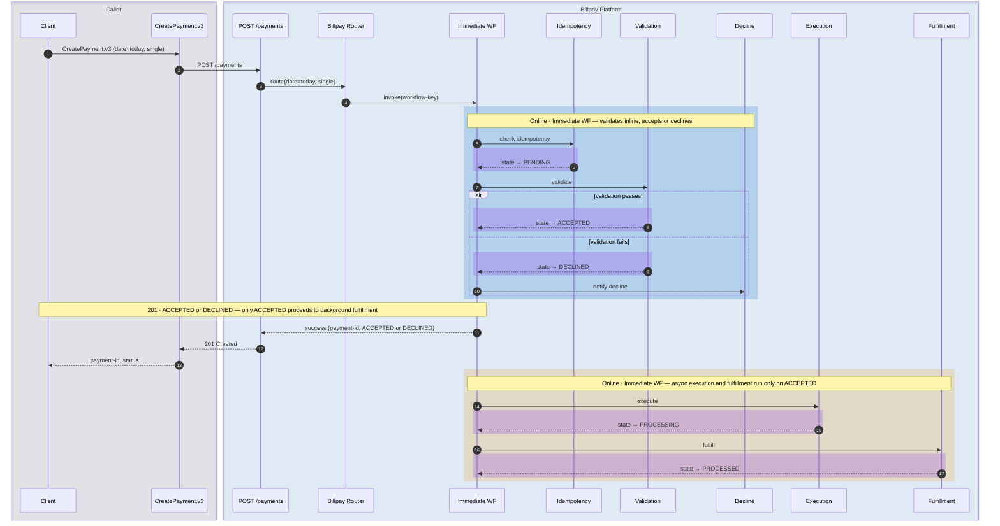

## 2. Scheduled payment — created today, executed later

`CreatePayment.v3` → `POST /payments` (future date) →
`CreateSchedulePaymentWF`, which validates the schedule
(`PaymentValidationActivityGroup`) and notifies on success
(`PaymentScheduledNotificationActivityGroup`). On the payment date the
Scheduled Payment Executor drains `SCHEDULED` payments into
`ExecuteScheduledPaymentWF`, which re-validates on execution
(`PaymentValidationOnExecutionActivityGroup`) before executing and fulfilling.

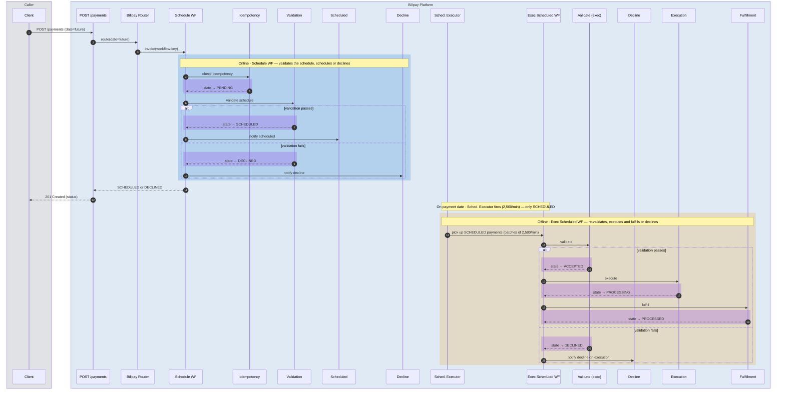

:::note[After PROCESSED]
`PAID` is reached separately by the **Paid Events Processor reconciliation** — see [diagram #10](#10-paid-events-reconciliation).
:::

## 3. Immediate Corporate Payment

`POST /payments` with `payment-date = today` and a corporate marker →
`CreateImmediatePaymentWF`. On `ACCEPTED`, the parent fans out to
`GetCorporatePaymentAllocationsWF`, which requests allocations
(`PaymentAllocatingActivityGroup`), receives them
(`PaymentAllocatedActivityGroup`), and creates the split legs
(`PaymentSplitsCreationActivity`); then `ExecuteSplitPaymentWF` runs per split.

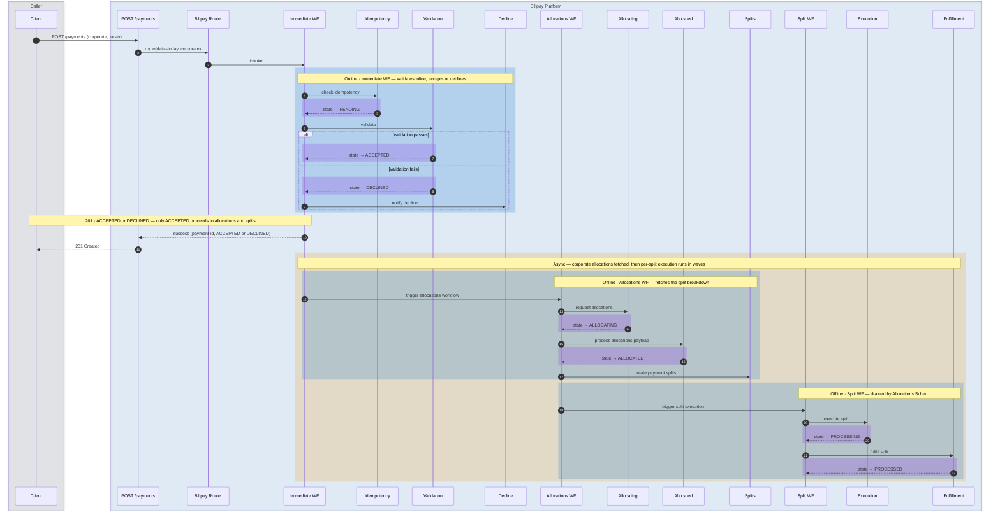

## 4. Scheduled Corporate Payment

`POST /payments` with `payment-date = future` and a corporate marker →
`CreateSchedulePaymentWF`. On `SCHEDULED`, allocations are fetched **up front**
(`GetCorporatePaymentAllocationsWF`) so they're ready on the payment date. When
the date arrives, `ExecuteScheduledPaymentWF` re-validates
(`ALLOCATED → ACCEPTED`) and `ExecuteSplitPaymentWF` runs per split.

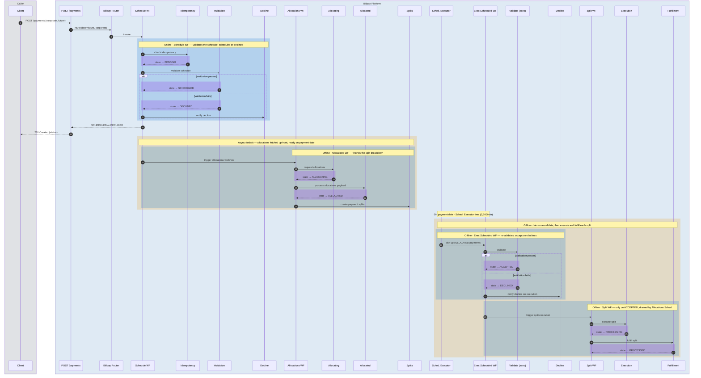

## 5. Update a scheduled payment

`PUT /payments/:id` → `UpdatePaymentWF`. It cancels the original through
`CancelPaymentWF` — cancel-eligibility check
(`PaymentCancelValidationActivityGroup`) then cancellation
(`PaymentCancellationActivityGroup`) — creates a replacement via
`CreateSchedulePaymentWF`, and maps the new payment id back to the original for
the audit trail (`MapNewPaymentIdToPreviousIdActivity`).

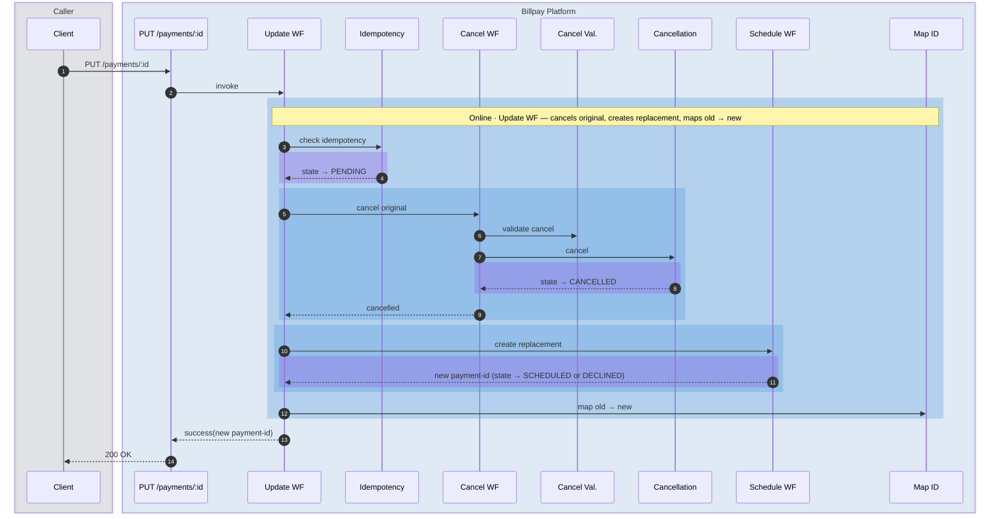

## 6. Cancel a payment

`DELETE /payments/:id` → `CancelPaymentWF`. It checks cancel eligibility
(`PaymentCancelValidationActivityGroup`) and, if eligible, transitions a
`SCHEDULED` or `ACCEPTED` payment to `CANCELLED`
(`PaymentCancellationActivityGroup`).

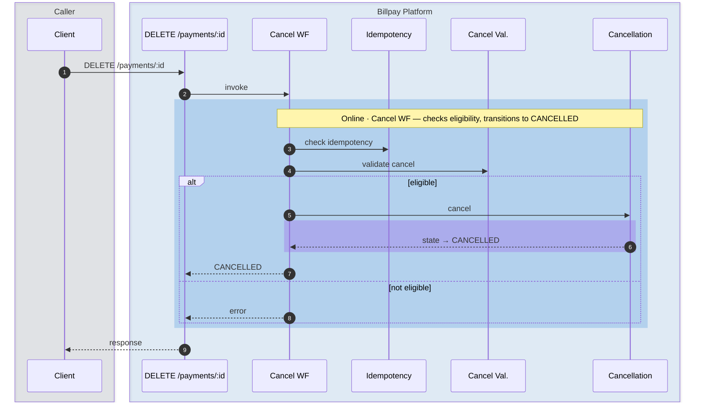

## 7. Return Processing + Representment Eligibility Check

`ProcessReturnedPaymentWF` — triggered by Money Movement return events. It
validates the return (`PaymentReturnValidationActivity`), transitions the
payment to `RETURNED` (`PaymentReturnExecutionActivityGroup`), then checks
representment eligibility (`PaymentRepresentmentEligibilityActivityGroup`). If
representable, it creates the representment and moves to `REPRESENTING`
(`PaymentRepresentmentCreationActivityGroup`), handing off to
`ProcessRepresentmentWF` (see [diagram #8](#8-representment-workflow)); an
invalid return is notified and the payment keeps its state.

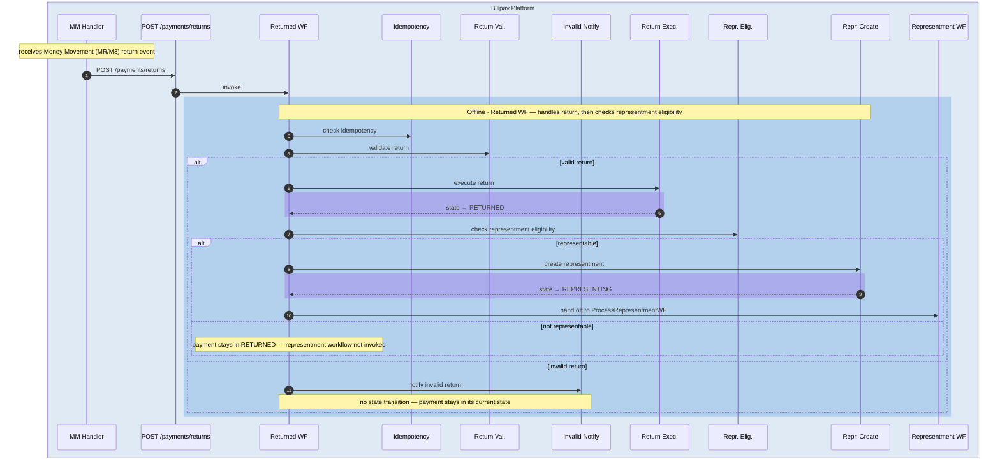

## 8. Representment Workflow

`ProcessRepresentmentWF` — picked up from the `REPRESENTING` state set by
[diagram #7](#7-return-processing--representment-eligibility-check). It
re-checks eligibility on the representment day
(`PaymentRepresentmentValidationActivityGroup`) and, if valid, re-clears the
transaction to `REPRESENTED` (`PaymentRepresentmentExecutionActivityGroup`);
otherwise it falls to `DECLINED`.

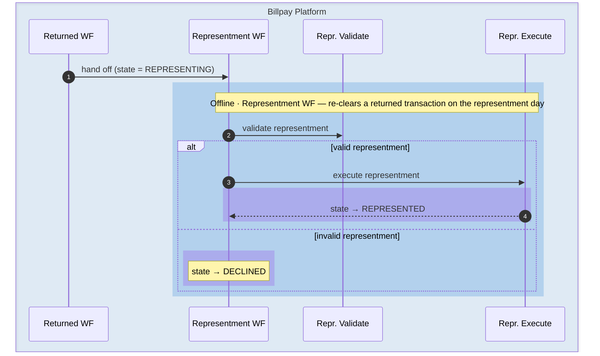

## 9. Inbound payment

`ProcessInboundPaymentWF` — an upstream (third-party) payment enters through
the Unstructured Payment Handler and `POST /payments/inbound`. It checks
idempotency, validates the posting (`PaymentValidationActivityGroup`), then
posts and fulfils (`PaymentExecutionActivityGroup`,
`PaymentFulfillmentActivityGroup`), fans out consumer splits
(`PaymentSplitsCreationActivity`), or — if Amex doesn't accept it — moves the
payment to `DISALLOWED` (`PendingToDisallowedStage`).

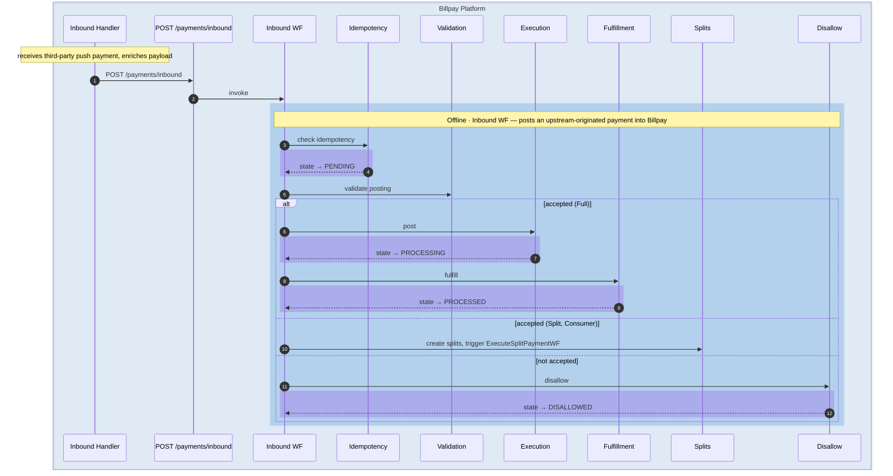

## 10. Paid Events reconciliation

`PaidEventsProcessingWF` — the continuous sweep that closes a payment out.
AR-Posted and Settled events arrive independently and are tracked in the
External Transaction Events Tracker; once both are present for a payment it
moves to `PAID`.

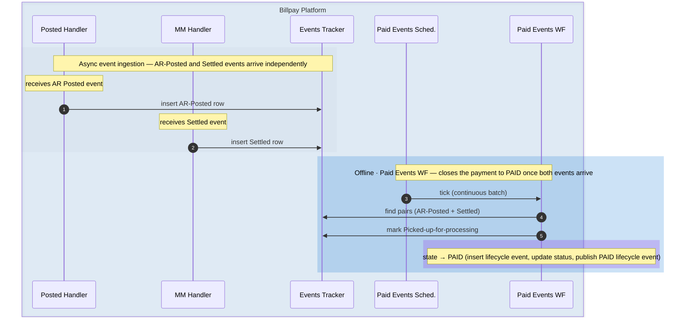

## 11. Missing Paid Events reconciliation

`MissingPaidEventsProcessingWF` — an hourly probe. For payments still missing
an AR-Posted or Settled event after 48 hours, it queries Accounts Receivable or
Clearing directly; if the event is found it is recorded, otherwise it raises an
alert.

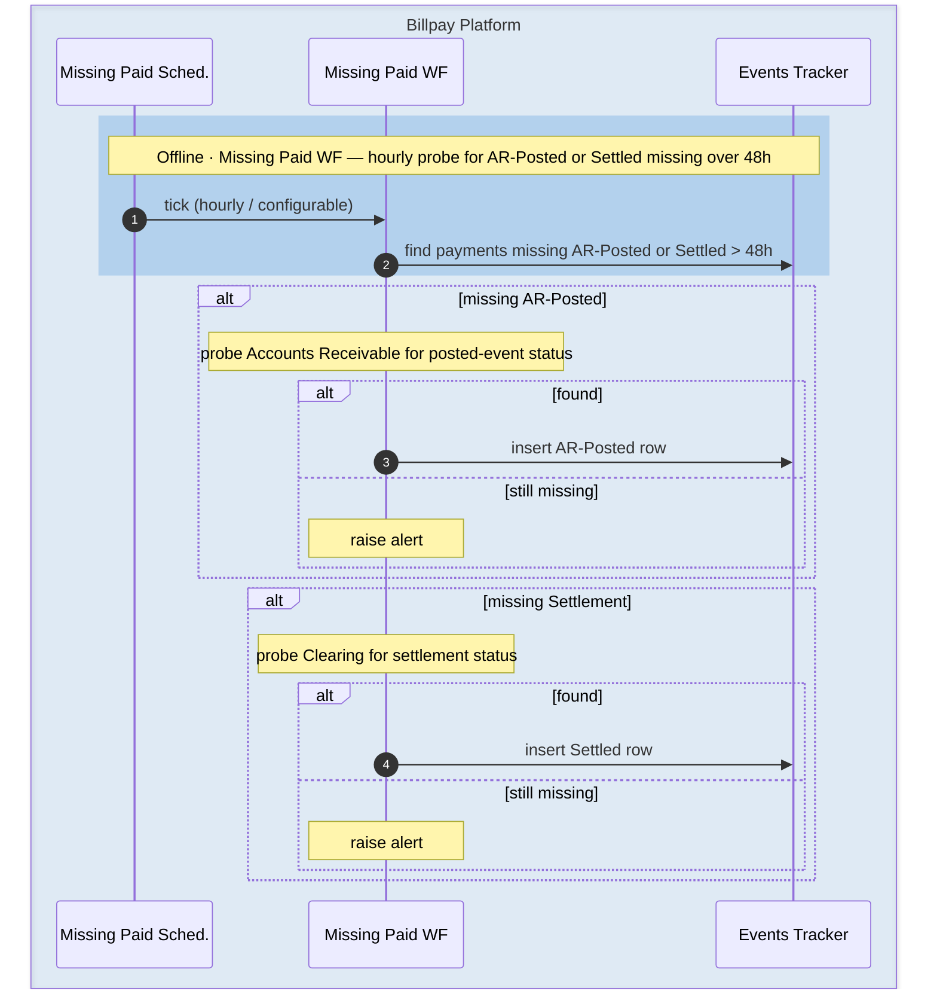

## 12. Create Payment + Installments (composite)

`CreatePaymentInstallmentWF` — a composite. It runs `CreateImmediatePaymentWF`;
on `ACCEPTED` it creates the installment plan and, if the autopay flag is set,
updates autopay. On `DECLINED` it short-circuits — no installment plan, no
autopay.

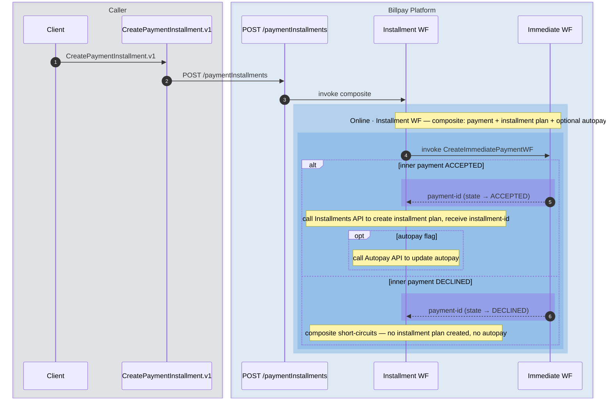
