# State Diagrams

The [payment state model](../payment-state-model.md) shows the whole lifecycle. This page takes it apart one workflow at a time — the states each workflow drives and how it hands off to the next. A `<<choice>>` diamond is a routing decision, not a state.

## Create Immediate Payment · `#CreateImmediatePaymentWF`

Validate, accept, then either run the payment straight through or, for a split, fan it out to `#ExecuteSplitPaymentWF`.

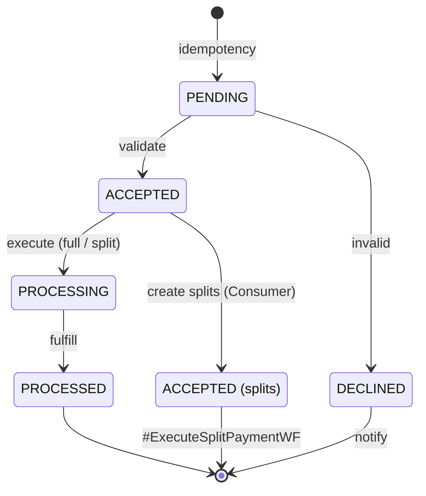

## Create Schedule Payment · `#CreateSchedulePaymentWF`

Validate and park the payment at `SCHEDULED` for its future run date.

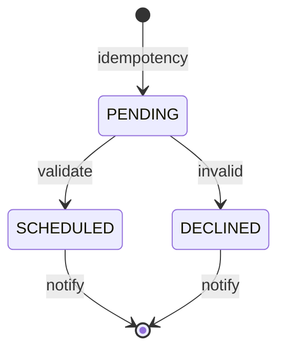

## Execute Scheduled Payment · `#ExecuteScheduledPaymentWF`

Runs on the execution date. It picks up a scheduled payment (or a corporate one that has already been allocated), re-validates, and processes it.

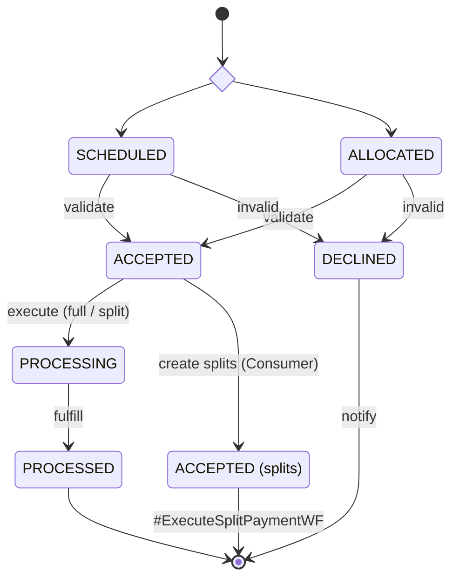

## Execute Split Payment · `#ExecuteSplitPaymentWF`

Processes one split leg — the same clearing, posting, and fulfilment as a full payment, at the leg level.

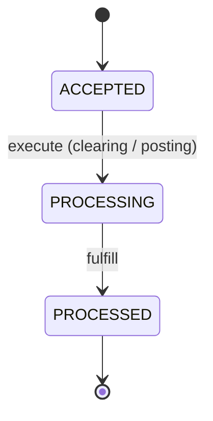

## Cancel Payment · `#CancelPaymentWF`

Cancels a payment that hasn't processed yet — either scheduled or accepted.

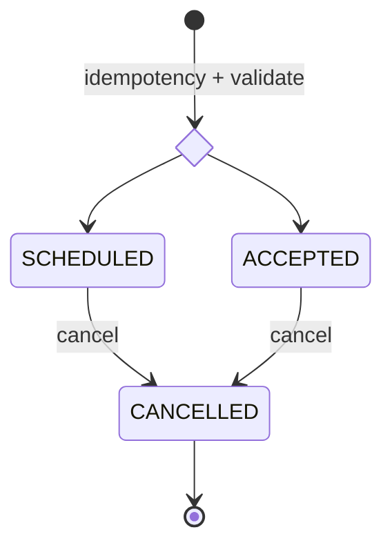

## Update Payment · `#UpdatePaymentWF`

Cancels the original scheduled payment, creates a replacement, and maps the new payment back to the old one for the audit trail.

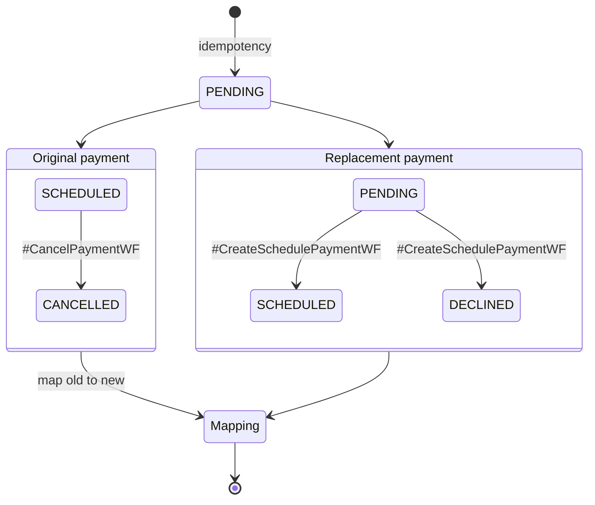

## Process Returned Payment · `#ProcessReturnedPaymentWF`

A payment that has processed, been fulfilled, or been paid can still be returned by the bank. If the return is representable, it spawns a representment.

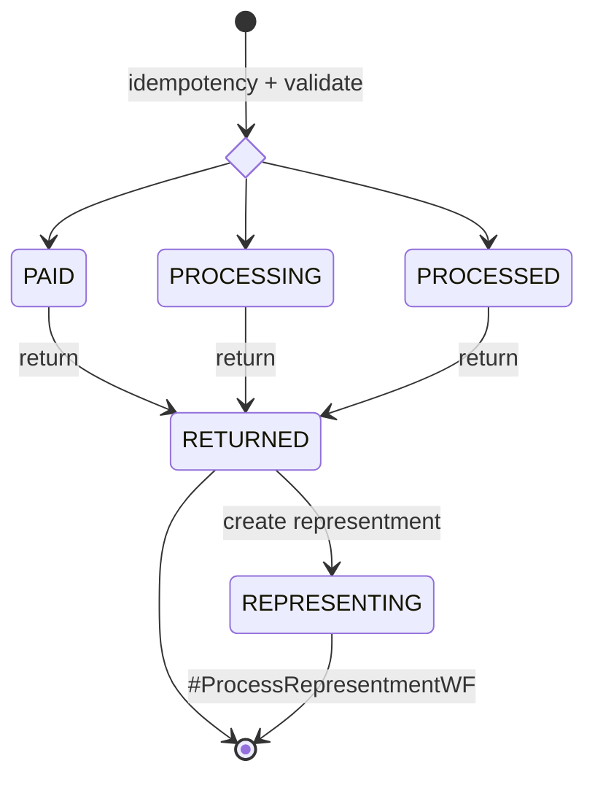

## Process Representment · `#ProcessRepresentmentWF`

Re-attempts a returned payment. It settles as `REPRESENTED`, or fails validation as `DECLINED`.

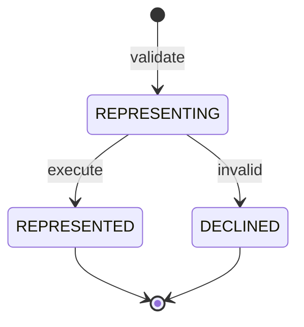

## Get Corporate Payment Allocations · `#GetCorporatePaymentAllocationsWF`

Requests a corporate payment's allocation breakdown, waits for it, creates the split legs, and hands each to `#ExecuteSplitPaymentWF`.

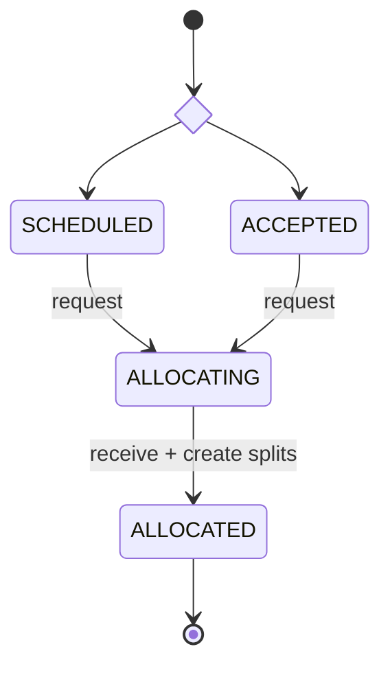

## Process Inbound Payment · `#ProcessInboundPaymentWF`

Handles a payment a third party initiates. If Amex doesn't accept it, the payment is `DISALLOWED`.

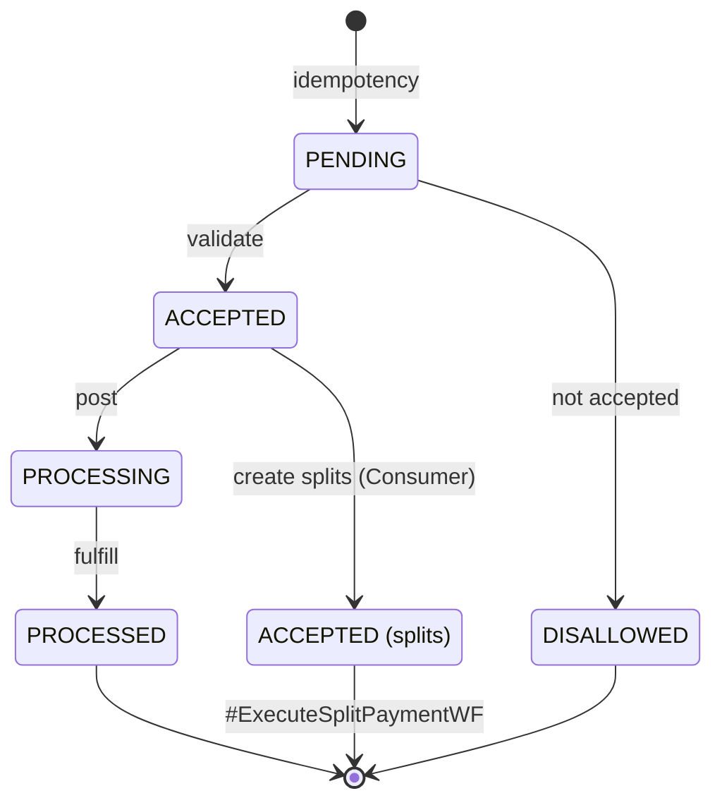

## Create Balance Refund · `#CreateBalanceRefundWF`

Sends money back to the customer from a credit balance, following the same validate-process-fulfil path as a payment.

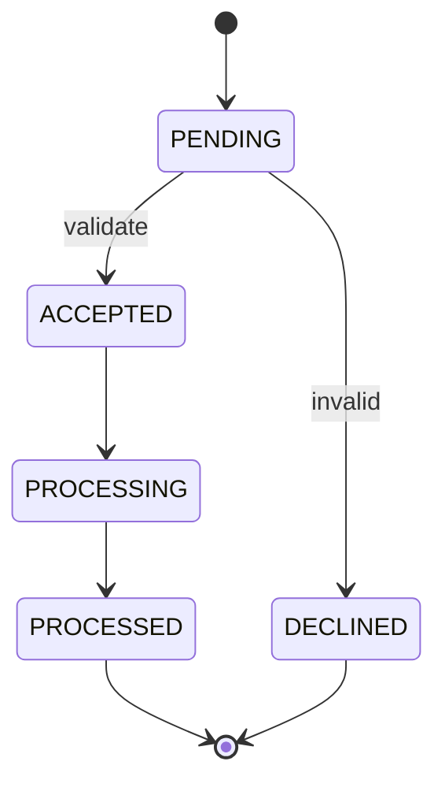

## Paid Events Processing · `#PaidEventsProcessingWF`

The periodic sweep that closes a payment out. A `PROCESSED` payment becomes `PAID` only once both its clearing-settlement and AR-posted events have arrived.

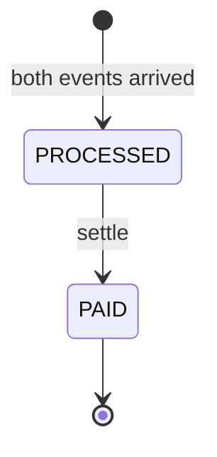
