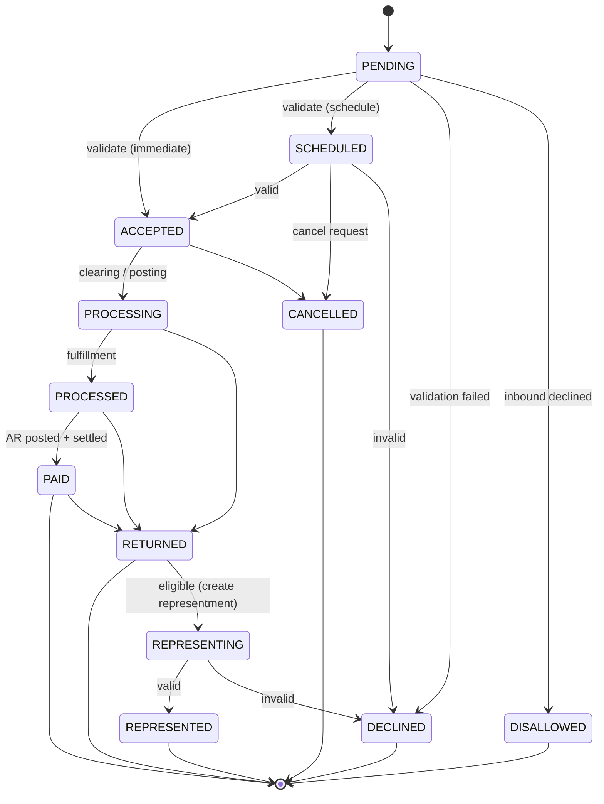
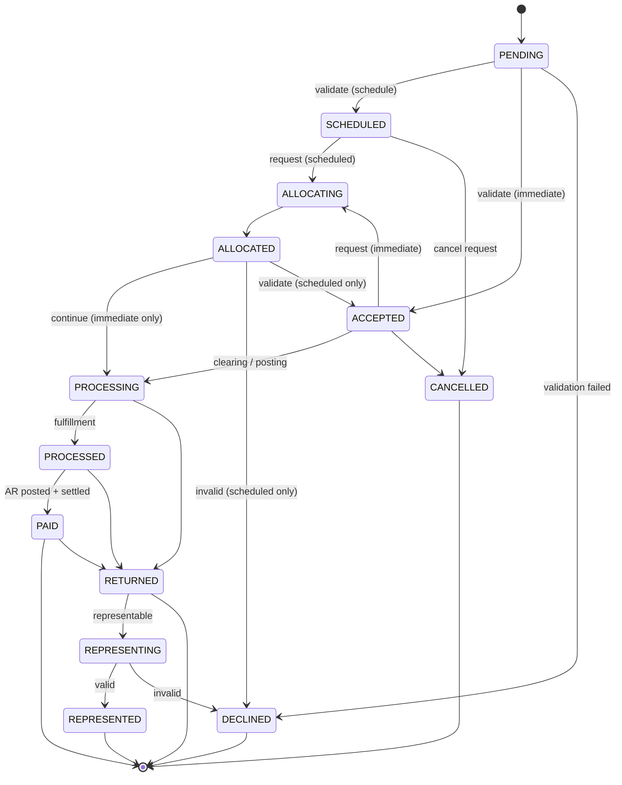

import Lead from '@site/src/components/Lead';
import Tabs from '@theme/Tabs';
import TabItem from '@theme/TabItem';

# Payment State Model

<Lead>Every payment moves through one canonical set of states, whatever its market or account type. Each transition is persisted and published as a lifecycle event, so a payment's history is fully auditable.</Lead>

## The states

| State | Meaning | Terminal? |
| --- | --- | --- |
| `PENDING` | Received in Billpay, awaiting initial validation. | No |
| `SCHEDULED` | Validated and set to run at a future date. | No |
| `ACCEPTED` | Validated and ready to process. | No |
| `PROCESSING` | Executing — debiting the funding account at the bank and crediting the Amex systems (Accounts Receivable, Authorization). | No |
| `PROCESSED` | Executed and fulfilled — accounting, audit, risk, and communications notified. | No |
| `REPRESENTING` | A returned payment being re-attempted. | No |
| `PAID` | Settled and posted in Accounts Receivable. | Yes |
| `RETURNED` | Did not settle; funds were returned from the customer's bank. | Yes |
| `REPRESENTED` | A re-attempted payment that settled. | Yes |
| `DECLINED` | Failed validation. | Yes |
| `CANCELLED` | Withdrawn by the customer or the system before processing. | Yes |
| `DISALLOWED` | An inbound (third-party) payment that Amex did not accept. | Yes |

Corporate payments add two states while their allocation breakdown is fetched:

| State | Meaning | Terminal? |
| --- | --- | --- |
| `ALLOCATING` | Allocations requested from the allocation-processing system, and awaited. | No |
| `ALLOCATED` | All allocations for the payment received. | No |

## The lifecycle

Consumer and corporate payments share the lifecycle. The one difference: corporate inserts an allocations side-loop between validation and execution, so its splits can be worked out before the money moves.

<Tabs groupId="payment-type">
<TabItem value="consumer" label="Consumer" default>

</TabItem>
<TabItem value="corporate" label="Corporate">

:::info[Scheduled vs. immediate]
After `ALLOCATED`, an immediate corporate payment continues straight to `PROCESSING`. A scheduled one is re-validated on its execution date instead — moving to `ACCEPTED` if still valid, or `DECLINED` if not.
:::

</TabItem>
</Tabs>

The [state and sequence diagrams](./diagrams/state-diagram.md) take this apart one workflow at a time.
