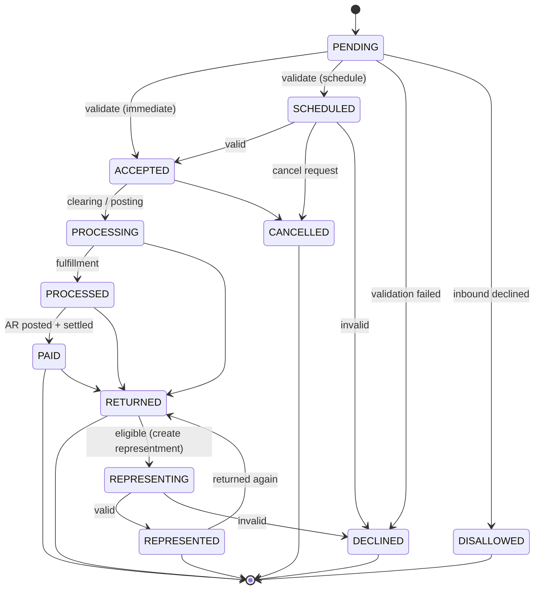
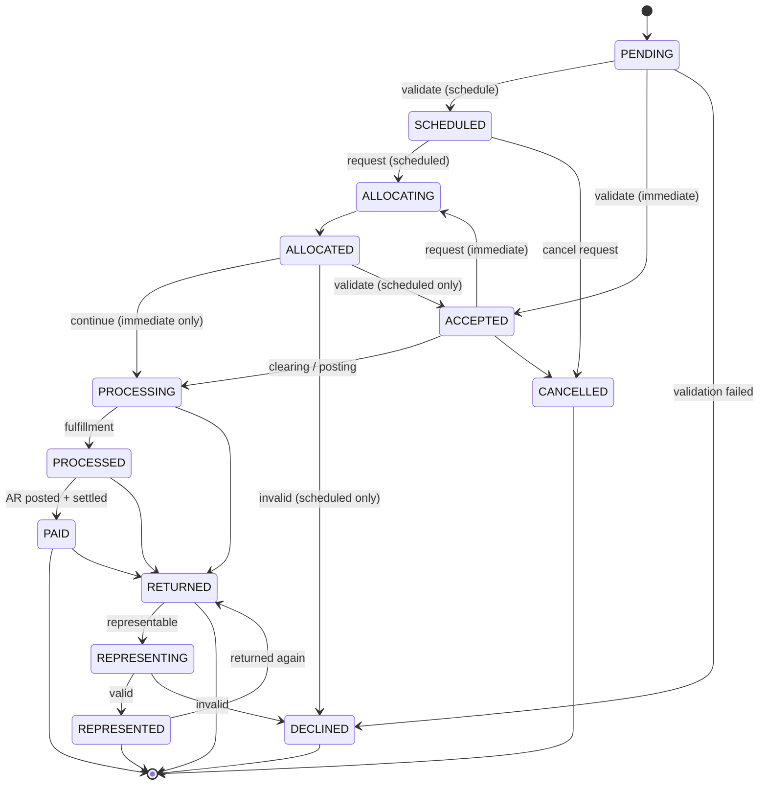

import Lead from '@site/src/components/Lead';
import StateLegend from '@site/src/components/StateLegend';
import Tabs from '@theme/Tabs';
import TabItem from '@theme/TabItem';

# Payment State Model

<Lead>Every payment moves through one canonical set of states, whatever its market or account type. Each transition is persisted and published as a lifecycle event, so a payment's history is fully auditable.</Lead>

## The lifecycle

Consumer and corporate payments share the lifecycle. The one difference: corporate inserts an allocations side-loop between validation and execution, so its splits can be worked out before the money moves.

<Tabs groupId="payment-type">
<TabItem value="consumer" label="Consumer" default>

```mermaid
---
config:
  nodeSpacing: 40
  rankSpacing: 34
---
stateDiagram-v2
  direction TB
  [*] --> PENDING
  PENDING --> ACCEPTED: validate (immediate)  
  PENDING --> SCHEDULED: validate (schedule)
  SCHEDULED --> ACCEPTED: valid
  ACCEPTED --> PROCESSING: clearing / posting
  PROCESSING --> PROCESSED: fulfillment
  PROCESSED --> PAID: AR posted + settled
  PROCESSING --> RETURNED
  PROCESSED --> RETURNED
  PAID --> [*]
  PAID --> RETURNED
  RETURNED --> [*]
  RETURNED --> REPRESENTING: eligible (create representment)
  REPRESENTING --> REPRESENTED: valid
  REPRESENTING --> DECLINED: invalid
  REPRESENTED --> RETURNED: returned again
  PENDING --> DECLINED: validation failed
  PENDING --> DISALLOWED: inbound declined
  SCHEDULED --> CANCELLED: cancel request
  SCHEDULED --> DECLINED: invalid  
  ACCEPTED --> CANCELLED
  REPRESENTED --> [*]
  DECLINED --> [*]
  CANCELLED --> [*]
  DISALLOWED --> [*]
```

<StateLegend />

</TabItem>
<TabItem value="corporate" label="Corporate">

```mermaid
---
config:
  nodeSpacing: 40
  rankSpacing: 34
---
stateDiagram-v2
  direction TB
  [*] --> PENDING
  PENDING --> SCHEDULED: validate (schedule)
  PENDING --> ACCEPTED: validate (immediate)
  SCHEDULED --> ALLOCATING: request (scheduled)
  ACCEPTED --> ALLOCATING: request (immediate)
  ALLOCATING --> ALLOCATED
  ALLOCATED --> PROCESSING: continue (immediate only)
  ALLOCATED --> DECLINED: invalid (scheduled only)
  ALLOCATED --> ACCEPTED: validate (scheduled only)
  ACCEPTED --> PROCESSING: clearing / posting
  PROCESSING --> PROCESSED: fulfillment
  PROCESSED --> PAID: AR posted + settled
  PROCESSING --> RETURNED
  PROCESSED --> RETURNED
  PAID --> [*]  
  PAID --> RETURNED
  RETURNED --> REPRESENTING: representable
  REPRESENTING --> REPRESENTED: valid
  REPRESENTING --> DECLINED: invalid
  REPRESENTED --> RETURNED: returned again
  PENDING --> DECLINED: validation failed
  SCHEDULED --> CANCELLED: cancel request
  ACCEPTED --> CANCELLED
  RETURNED --> [*]
  REPRESENTED --> [*]
  DECLINED --> [*]
  CANCELLED --> [*]
```

<StateLegend />

:::info[Scheduled vs. immediate]
After `ALLOCATED`, an immediate corporate payment continues straight to `PROCESSING`. A scheduled one is re-validated on its execution date instead. It moves to `ACCEPTED` if it is still valid, and `DECLINED` if it is not.
:::

</TabItem>
</Tabs>

A split payment fans out at `ACCEPTED`. Each leg is created as its own `ACCEPTED` record and runs the same `PROCESSING` and `PROCESSED` path through Execute Split Payment, so the states above describe a leg as accurately as they describe a whole payment.

## The states

| State | Meaning | Terminal? |
| --- | --- | --- |
| `PENDING` | Received in Billpay, awaiting initial validation. | No |
| `SCHEDULED` | Validated and set to run at a future date. | No |
| `ACCEPTED` | Validated and ready to process. | No |
| `PROCESSING` | Executing: debiting the funding account at the bank and crediting the Amex systems (Accounts Receivable, Authorization). | No |
| `PROCESSED` | Executed and fulfilled. Accounting, audit, risk, and communications have been told. | No |
| `REPRESENTING` | A returned payment being re-attempted. | No |
| `PAID` | Settled and posted in Accounts Receivable. | Yes |
| `RETURNED` | Did not settle; funds were returned from the customer's bank. | Yes |
| `REPRESENTED` | A re-attempted payment that settled. | Yes |
| `DECLINED` | Failed validation. | Yes |
| `CANCELLED` | Withdrawn by the customer or the system before processing. | Yes |
| `DISALLOWED` | An inbound (third-party) payment that Amex did not accept. | Yes |

Corporate payments add two states while their allocation breakdown is fetched:

| State | Meaning | Terminal? |
| --- | --- | --- |
| `ALLOCATING` | Allocations requested from the allocation-processing system, and awaited. | No |
| `ALLOCATED` | All allocations for the payment received. | No |

For how a single workflow drives these states, see [Core Workflows](./component-model/workflows/core.md), which lists each workflow's steps and the transition each step makes. The [sequence diagrams](./sequence-diagrams.md) trace the same flows across the participants that do the work.
