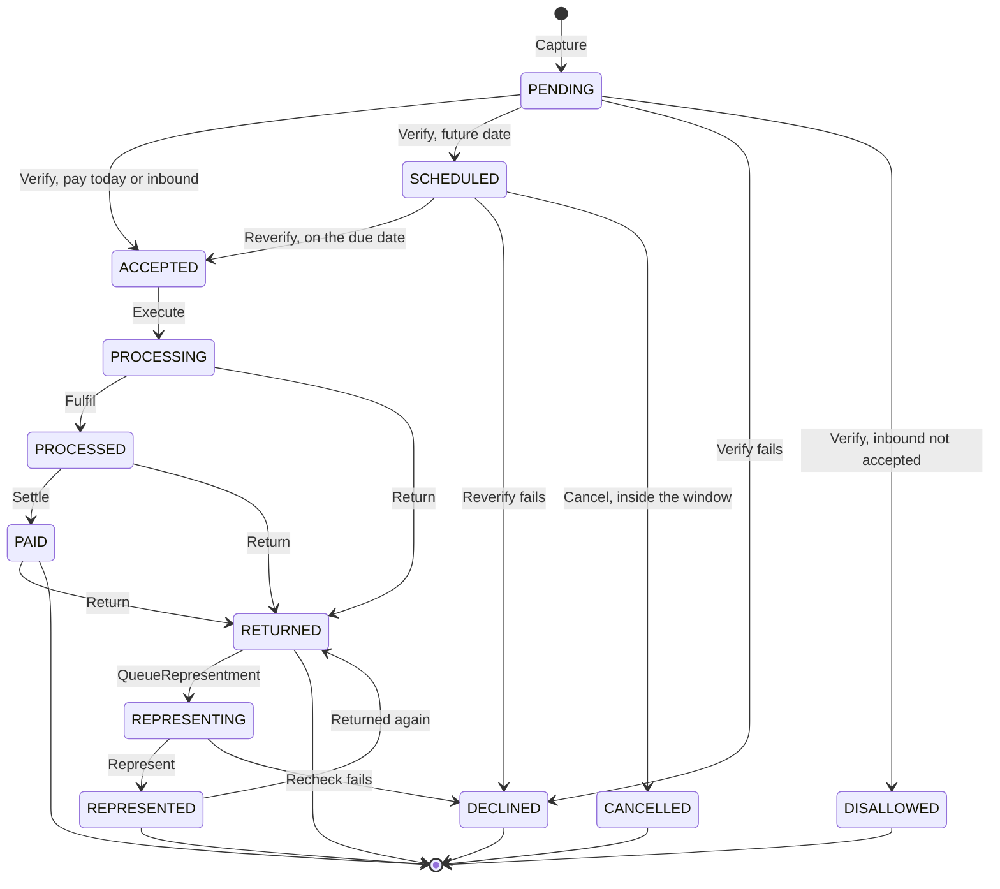
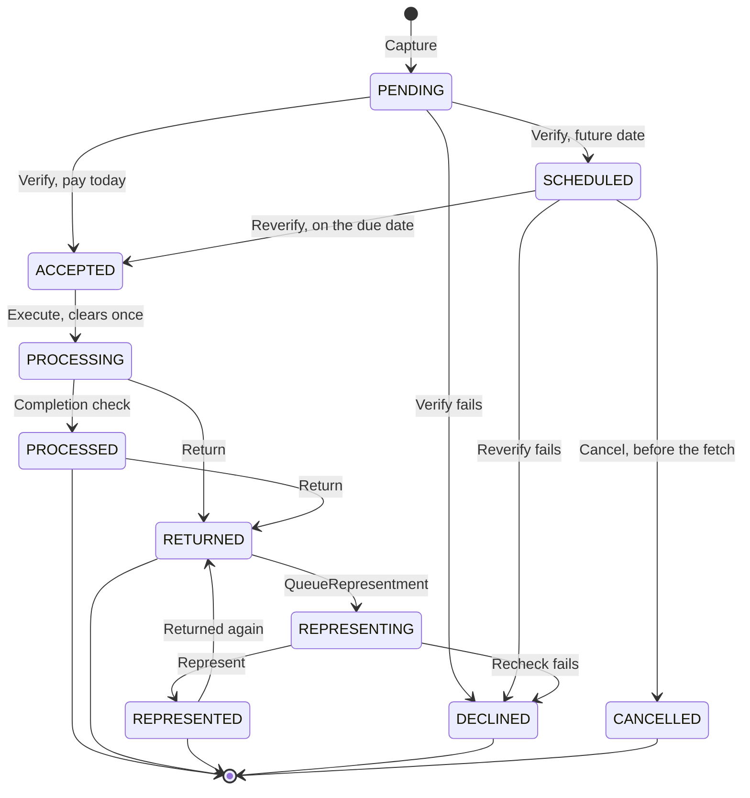
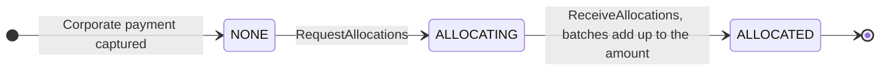

import Tabs from '@theme/Tabs';
import TabItem from '@theme/TabItem';
import Lead from '@site/src/components/Lead';
import StateLegend from '@site/src/components/StateLegend';

# Payment State Model

<Lead>Every payment, consumer or corporate, moves through one set of states, and a status changes only through a guarded update in Oracle. Each state means the same thing in every market, so reporting, operations and downstream systems can read any payment the same way.</Lead>

## The lifecycle

Each arrow is a move one stage makes, and the label names the stage. Consumer and corporate payments share one set of states, and the toggle shows the path each one takes. A payment that waits for a date spends that time as `SCHEDULED`, a row in Oracle with nothing running in Temporal.

<Tabs groupId="payment-type" className="toggle-tabs">
<TabItem value="consumer" label="Consumer" default>


```mermaid
---
config:
  nodeSpacing: 40
  rankSpacing: 34
---
stateDiagram-v2
  direction TB
  [*] --> PENDING: Capture
  PENDING --> ACCEPTED: Verify, pay today or inbound
  PENDING --> SCHEDULED: Verify, future date
  PENDING --> DECLINED: Verify fails
  PENDING --> DISALLOWED: Verify, inbound not accepted
  SCHEDULED --> ACCEPTED: Reverify, on the due date
  SCHEDULED --> DECLINED: Reverify fails
  SCHEDULED --> CANCELLED: Cancel, inside the window
  ACCEPTED --> PROCESSING: Execute
  PROCESSING --> PROCESSED: Fulfil
  PROCESSED --> PAID: Settle
  PROCESSING --> RETURNED: Return
  PROCESSED --> RETURNED: Return
  PAID --> RETURNED: Return
  RETURNED --> REPRESENTING: QueueRepresentment
  REPRESENTING --> REPRESENTED: Represent
  REPRESENTING --> DECLINED: Recheck fails
  REPRESENTED --> RETURNED: Returned again
  PAID --> [*]
  RETURNED --> [*]
  REPRESENTED --> [*]
  DECLINED --> [*]
  CANCELLED --> [*]
  DISALLOWED --> [*]
```

</TabItem>
<TabItem value="corporate" label="Corporate">


```mermaid
---
config:
  nodeSpacing: 40
  rankSpacing: 34
---
stateDiagram-v2
  direction TB
  [*] --> PENDING: Capture
  PENDING --> ACCEPTED: Verify, pay today
  PENDING --> SCHEDULED: Verify, future date
  PENDING --> DECLINED: Verify fails
  SCHEDULED --> ACCEPTED: Reverify, on the due date
  SCHEDULED --> DECLINED: Reverify fails
  SCHEDULED --> CANCELLED: Cancel, before the fetch
  ACCEPTED --> PROCESSING: Execute, clears once
  PROCESSING --> PROCESSED: Completion check
  PROCESSING --> RETURNED: Return
  PROCESSED --> RETURNED: Return
  RETURNED --> REPRESENTING: QueueRepresentment
  REPRESENTING --> REPRESENTED: Represent
  REPRESENTING --> DECLINED: Recheck fails
  REPRESENTED --> RETURNED: Returned again
  PROCESSED --> [*]
  RETURNED --> [*]
  REPRESENTED --> [*]
  DECLINED --> [*]
  CANCELLED --> [*]
```

A corporate parent clears once, for the whole amount. It reaches `PROCESSED` through the leg dispatcher's completion check instead of Fulfil, and stays there: its legs turn `PAID`, never the parent. It can be cancelled only until its allocations are fetched. The legs and the allocation status that run beside it are in [Corporate payments](#corporate-payments) below.

</TabItem>
</Tabs>

<StateLegend />

There is no path from `ACCEPTED` to `CANCELLED`. Once a payment has left `SCHEDULED` it can no longer be cancelled.

## What each state means

| State | Meaning | Terminal? |
| --- | --- | --- |
| `PENDING` | Captured in Billpay, idempotency checked, waiting for validation. | No |
| `SCHEDULED` | Validated and waiting in Oracle for its due date, as a Work Tracker row. | No |
| `ACCEPTED` | Validated (on the day, for a scheduled payment) and ready to move money. | No |
| `PROCESSING` | Being executed: clearing with the bank, the Accounts Receivable (AR) balance reduced, open-to-buy raised. | No |
| `PROCESSED` | Clearing, AR, open-to-buy, accounting, eBNC and risk have all succeeded, and the lifecycle event (RTF) and the customer's message (Raven) have gone out. | No |
| `REPRESENTING` | A returned payment queued for another presentment, on the date the market's rules set. | No |
| `PAID` | Settled with the bank and posted to Accounts Receivable. | Yes, unless a return arrives |
| `RETURNED` | The payment did not settle; the customer's bank sent the funds back. | Yes, unless it is represented |
| `REPRESENTED` | A returned payment that was presented again. | Yes, unless it is returned again |
| `DECLINED` | Failed validation, or a representment failed its recheck. | Yes |
| `CANCELLED` | Withdrawn while `SCHEDULED`, inside the market's cancellation window; a corporate payment only before its allocations are fetched. | Yes |
| `DISALLOWED` | A third-party inbound payment that American Express did not accept. | Yes |

`PROCESSED` is a higher bar than it looks. A payment reaches it only after every must-succeed system has answered and the customer has been told, which is why an outage at RTF or Raven holds payments at `PROCESSING` rather than letting them through with a gap.

## Which stage makes each move

| From | To | By |
| --- | --- | --- |
| Input | `PENDING` | Capture |
| `PENDING` | `ACCEPTED`, `SCHEDULED` or `DECLINED` | Verify |
| `PENDING` (inbound) | `ACCEPTED` or `DISALLOWED` | Verify |
| `SCHEDULED` | `ACCEPTED` or `DECLINED` | Reverify, on the due date |
| `SCHEDULED` | `CANCELLED` | Cancel, inside the cancellation window only; for a corporate payment, only before its allocations are fetched |
| `ACCEPTED` | `PROCESSING` | Execute |
| `PROCESSING` | `PROCESSED` | Fulfil; for a corporate parent, the leg dispatcher's completion check |
| `PROCESSED` | `PAID` | Settle, in `ProcessPaidEventsWorkflow`; for a split payment, each leg, never the parent |
| `PROCESSING`, `PROCESSED` or `PAID` | `RETURNED` | Return |
| `RETURNED` | `REPRESENTING` | QueueRepresentment |
| `REPRESENTING` | `REPRESENTED` or `DECLINED` | Represent |
| `REPRESENTED` | `RETURNED` | Return, when it is returned again |

The [stages](./component-model/stages.md) page says what each stage calls on the way.

## Guarded updates

Two things can try to move the same payment at once, such as a customer's cancel and the payment's execution, right at the edge of the cancellation window. Billpay settles that race in Oracle instead of in code.

Every status change is a conditional update on the current status:

```sql
UPDATE trans_dtl SET status = 'CANCELLED'
 WHERE payment_id = :id AND status = 'SCHEDULED'
```

When two writers race, one updates the row and the other sees zero rows updated. At the edge of the cancellation window either Cancel or Reverify wins, never both. A cancel that loses gets 409, or its earlier answer again if the payment is already `CANCELLED`. The loser backs off, and nothing has to be undone.

A corporate payment adds one more race. Its cancel's guard also requires allocation status `NONE`, and the allocation request's guard requires a payment that isn't `CANCELLED`, so a cancel and the fetch of its allocations can't both win either.

## Split payments

A split payment divides one amount into legs. Each leg is its own record, with the ID `{paymentId}_{seq}`, and it starts at `ACCEPTED`: a leg is only ever made from a parent that Verify has already passed. From there a leg moves through the same states as any payment, `PROCESSING`, `PROCESSED` and on.

`PAID` is set on legs, never on the parent. The bank settles a split payment once, as a whole, while Accounts Receivable posts each leg on its own. So each leg turns `PAID` once its own posting and its parent's settlement are both in, and the parent stays `PROCESSED`. That holds for consumer and corporate splits alike.

The [Domain Model](./domain-model.md) shows how the code models a leg as its own set of classes.

## Corporate payments

A corporate payment uses the same states. What it adds is an **allocation status**, a separate field on the parent that tracks the breakdown into allocations that the allocations manager sends. It sits beside the payment's state and never blocks its clearing.


```mermaid
stateDiagram-v2
  direction LR
  [*] --> NONE: Corporate payment captured
  NONE --> ALLOCATING: RequestAllocations
  ALLOCATING --> ALLOCATED: ReceiveAllocations, batches add up to the amount
  ALLOCATED --> [*]
```

| `allocation_status` | Meaning |
| --- | --- |
| `NONE` | No allocations requested yet |
| `ALLOCATING` | Requested from the allocations manager; batches may be arriving |
| `ALLOCATED` | The batches received add up to the payment amount |

The parent and its legs follow these rules:

- The parent clears once, at payment level, on its due date. It does not wait for its allocations.
- Once its allocations are fetched, the parent can no longer be cancelled or updated: both get 409.
- Legs are written only once the parent is `ACCEPTED`. Until then each batch waits in `allocation_batch`.
- The parent turns `PROCESSED`, by a guarded update, once it has cleared, it is `ALLOCATED`, every batch has its legs, and every leg is `PROCESSED` or `PAID`, and its own RTF event and Raven message have gone out. The leg dispatcher checks this every 60 seconds; there is no Fulfil for a corporate parent.
- Legs turn `PAID` one by one, each once the parent has settled and the leg's own AR posting is in. The parent stays `PROCESSED`.
- If allocations are late, the parent stays `PROCESSING` with allocation status `ALLOCATING`, and an alert fires at the market's alert point.
- A leg whose retries run out goes on the exception list, and its parent stays `PROCESSING` until operations resolve it.
- A declined parent never gets legs: its batches stay stored and are never written.

[Corporate Allocations](./corporate-allocations.md) follows the two tracks in detail. [Core Workflows](./component-model/workflows/core.md) lists which workflow drives each move, and the [sequence diagrams](./sequence-diagrams.md) trace the same flows call by call.
