import Lead from '@site/src/components/Lead';

# Sequence Diagrams

<Lead>**End-to-end traces from a caller's perspective.** Each one follows a single Billpay flow from the caller through the Core API and the Router to the Workflows, and on to the ActivityGroups and Activities that do the work.</Lead>

How to read these diagrams

- The navy group at the top is the caller: the client and the contract it calls, such as `CreatePayment.v3`. The light-blue group is the Billpay Platform, everything past that contract. Reconciliation flows show only the platform group.
- Amex-blue blocks are a workflow on an **online** worker, in the request path with the caller waiting. Electric-blue blocks are a workflow on an **offline** worker: schedules, event handlers, and anything drained in batches.
- Pale-blue blocks are a sub-workflow invoked from inside another.
- Dashed gold marks async work that runs after the caller has been answered.
- Chips such as `state → ACCEPTED` mark a lifecycle transition. They are one colour throughout, because the chip already names the state. The [payment state model](./payment-state-model.md) is where outcomes are colour-coded.
- Each ActivityGroup or Activity is its own participant, labelled short: `Execution` for `PaymentExecutionActivityGroup`, `Capture` for `IdempotencyCheckActivity`, `Validation` for `PaymentValidationActivityGroup`.
- External systems are left out (clearing, Accounts Receivable, Open-To-Buy, accounting, the database, the event bus). Each is internal to the group that owns it.
- Diagrams fit their column. The wider ones carry an expand control in the top right, which opens a full-window view at window width or actual size. Escape closes it.

## 1. Immediate payment, single instruction

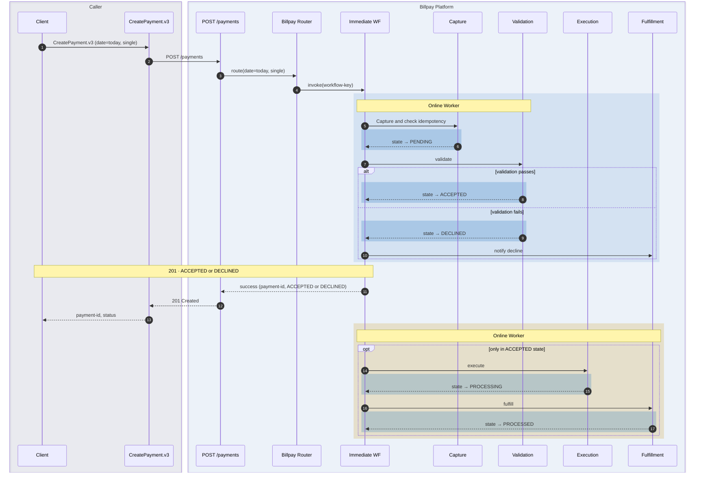

What happens

- `CreatePayment.v3` calls `POST /payments` with today's date and a single instruction, and the Router picks `CreateImmediatePaymentWF`.
- The workflow captures the payment and checks idempotency (`IdempotencyCheckActivity`), then validates (`PaymentValidationActivityGroup`).
- On `ACCEPTED` the caller gets its 201 straight away, and execution (`PaymentExecutionActivityGroup`) and fulfillment (`PaymentFulfillmentActivityGroup`) run in the background.
- A failed validation declines instead, and fulfillment sends the decline notification.

## 2. Scheduled payment, created today and executed later

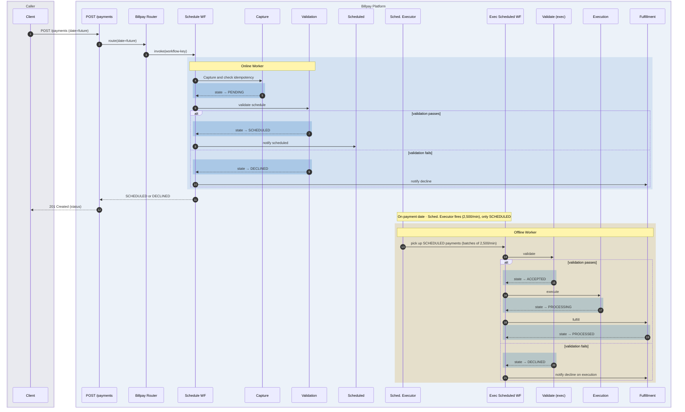

What happens

- `CreatePayment.v3` calls `POST /payments` with a future date, and the Router picks `CreateSchedulePaymentWF`.
- That workflow validates the schedule (`PaymentValidationActivityGroup`) and notifies on success (`PaymentScheduledNotificationActivityGroup`).
- On the payment date the Scheduled Payment Executor drains `SCHEDULED` payments into `ExecuteScheduledPaymentWF`, 2,500 a minute.
- `ExecuteScheduledPaymentWF` re-validates (`PaymentValidationOnExecutionActivityGroup`) before executing and fulfilling.
- Either validation can decline, and fulfillment (`PaymentFulfillmentActivityGroup`) sends the notification both times.
- `PROCESSED` is not the end of it. `PAID` is reached separately by the Paid Events Processor reconciliation, in [diagram #10](#10-paid-events-reconciliation).

## 3. Immediate Corporate Payment

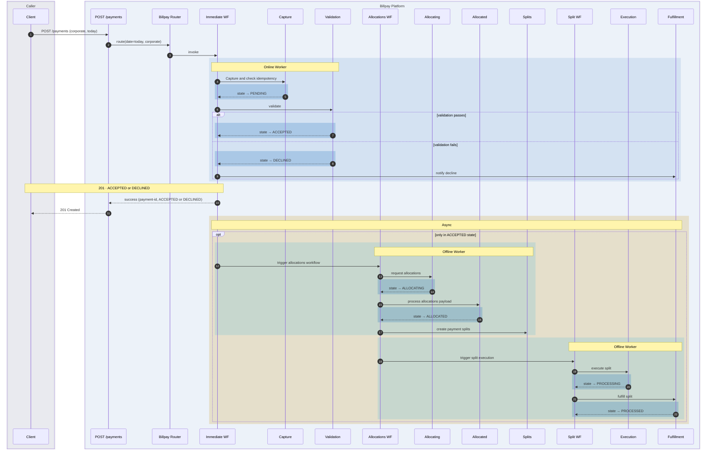

What happens

- `POST /payments` with `payment-date = today` and a corporate marker runs `CreateImmediatePaymentWF`.
- On `ACCEPTED` the parent fans out to `GetCorporatePaymentAllocationsWF`.
- That workflow requests allocations (`PaymentAllocatingActivityGroup`), receives them (`PaymentAllocatedActivityGroup`), and creates the split legs (`PaymentSplitsCreationActivity`).
- `ExecuteSplitPaymentWF` then runs once per split.
- A failed validation declines before any of that, and fulfillment (`PaymentFulfillmentActivityGroup`) sends the notification.

## 4. Scheduled Corporate Payment

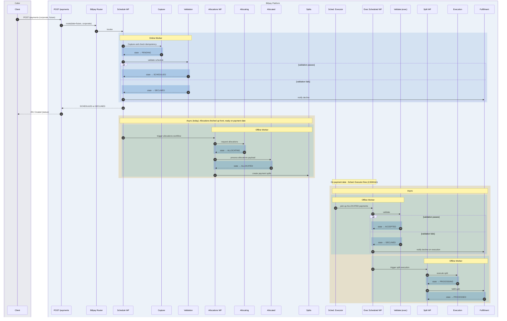

What happens

- `POST /payments` with `payment-date = future` and a corporate marker runs `CreateSchedulePaymentWF`.
- On `SCHEDULED`, allocations are fetched up front (`GetCorporatePaymentAllocationsWF`) so they are ready on the payment date.
- When the date arrives, `ExecuteScheduledPaymentWF` re-validates, taking the payment from `ALLOCATED` to `ACCEPTED`.
- `ExecuteSplitPaymentWF` then runs once per split.
- As with the non-corporate schedule, either validation can decline, and fulfillment (`PaymentFulfillmentActivityGroup`) sends the notification.

## 5. Update a scheduled payment

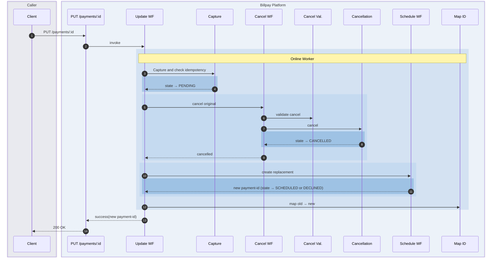

What happens

- `PUT /payments/:id` runs `UpdatePaymentWF`.
- It cancels the original through `CancelPaymentWF`, which runs the eligibility check (`PaymentCancelValidationActivityGroup`) then the cancellation (`PaymentCancellationActivityGroup`).
- It creates the replacement through `CreateSchedulePaymentWF`.
- It maps the new payment id back to the original, so the audit trail survives the swap (`MapNewPaymentIdToPreviousIdActivity`).

## 6. Cancel a payment

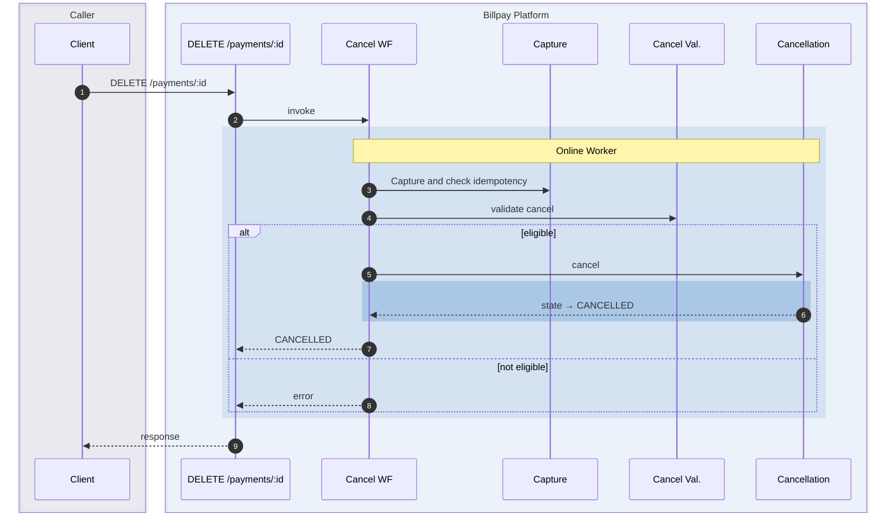

What happens

- `DELETE /payments/:id` runs `CancelPaymentWF`.
- It checks cancel eligibility (`PaymentCancelValidationActivityGroup`).
- If eligible, a `SCHEDULED` or `ACCEPTED` payment moves to `CANCELLED` (`PaymentCancellationActivityGroup`).
- If not, the caller gets an error and the payment keeps its state.

## 7. Return Processing + Representment Eligibility Check

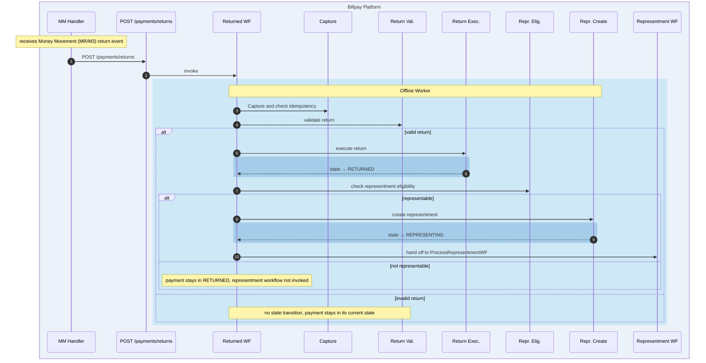

What happens

- Money Movement return events (MR/M3) trigger `ProcessReturnedPaymentWF`.
- It validates the return (`PaymentReturnValidationActivity`), then moves the payment to `RETURNED` (`PaymentReturnExecutionActivityGroup`).
- It checks representment eligibility (`PaymentRepresentmentEligibilityActivityGroup`).
- If representable, it creates the representment, moves to `REPRESENTING` (`PaymentRepresentmentCreationActivityGroup`), and hands off to `ProcessRepresentmentWF` in [diagram #8](#8-representment-workflow).
- If not representable, the payment stays `RETURNED` and the representment workflow is never invoked.
- An invalid return changes nothing. The payment keeps whatever state it had. What the workflow does next is not yet defined in the spec.

## 8. Representment Workflow

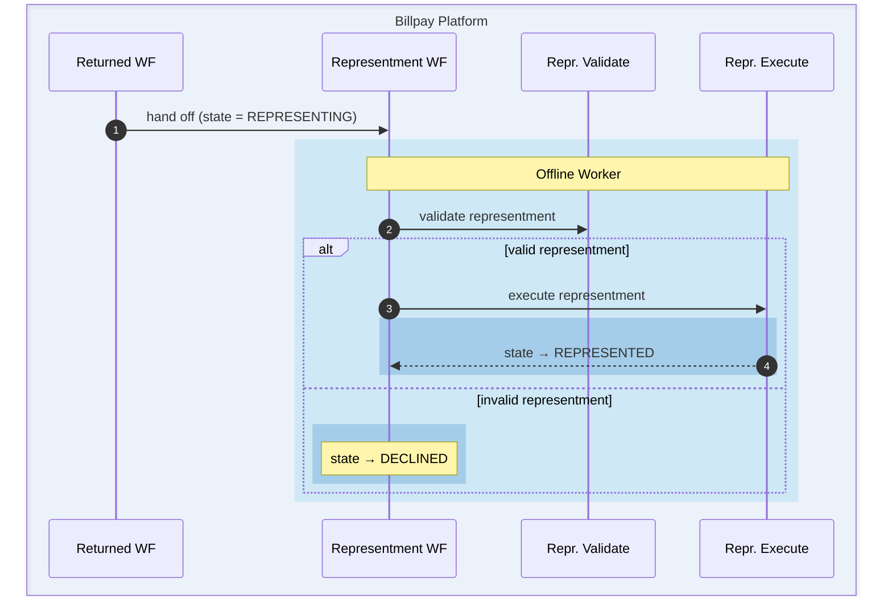

What happens

- `ProcessRepresentmentWF` picks up from the `REPRESENTING` state set in [diagram #7](#7-return-processing--representment-eligibility-check).
- It re-checks eligibility on the representment day (`PaymentRepresentmentValidationActivityGroup`).
- If valid, it re-clears the transaction to `REPRESENTED` (`PaymentRepresentmentExecutionActivityGroup`).
- If not, the payment falls to `DECLINED`.

## 9. Inbound payment

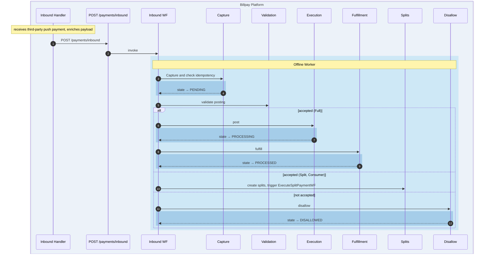

What happens

- An upstream third-party payment arrives through the Unstructured Payment Handler and `POST /payments/inbound`, running `ProcessInboundPaymentWF`.
- It captures the payment and checks idempotency (`IdempotencyCheckActivity`), then validates the posting (`PaymentValidationActivityGroup`).
- A full payment posts and fulfils (`PaymentExecutionActivityGroup`, then `PaymentFulfillmentActivityGroup`).
- A consumer split fans out instead, through `PaymentSplitsCreationActivity` into `ExecuteSplitPaymentWF`.
- If Amex does not accept it, the payment moves to `DISALLOWED` (`PendingToDisallowedStage`).

## 10. Paid Events reconciliation

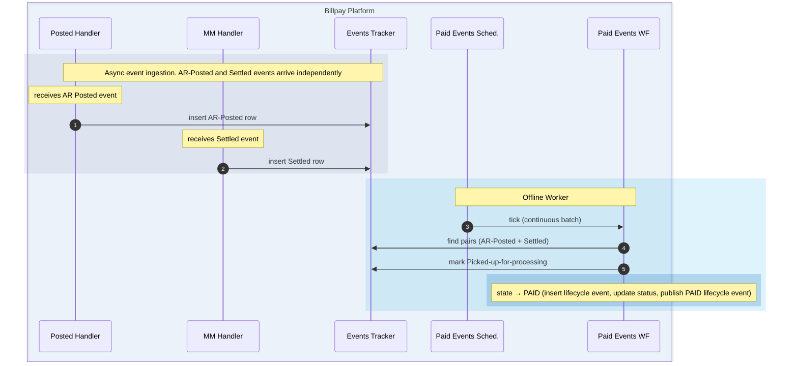

What happens

- `PaidEventsProcessingWF` is the continuous sweep that closes a payment out.
- AR-Posted and Settled events arrive independently and are recorded in the External Transaction Events Tracker.
- The workflow finds pairs, marks them picked up for processing, and once both are present the payment moves to `PAID`.

## 11. Missing Paid Events reconciliation

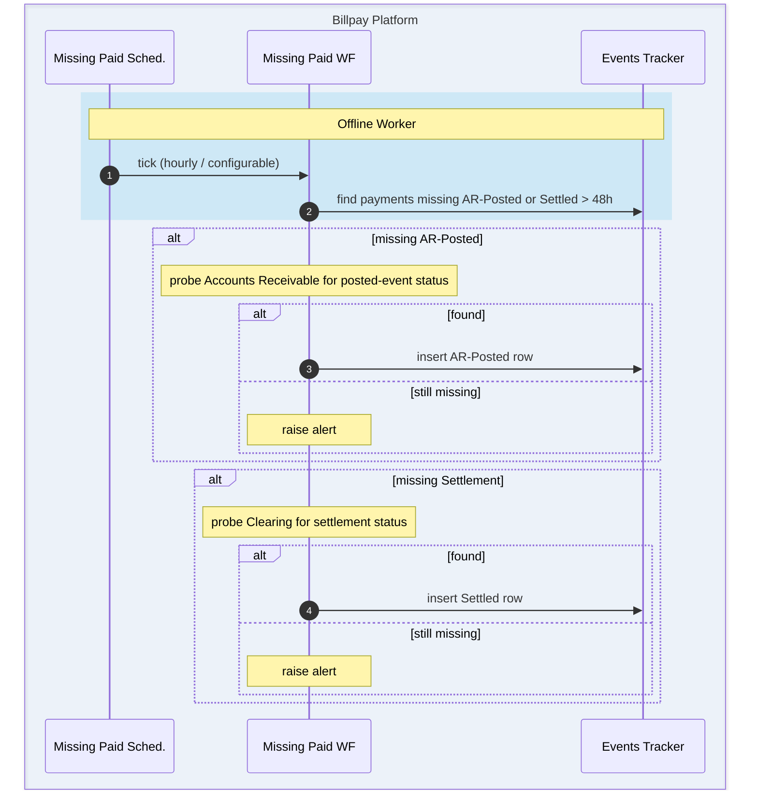

What happens

- `MissingPaidEventsProcessingWF` is an hourly probe, and the interval is configurable.
- It looks for payments still missing an AR-Posted or Settled event after 48 hours.
- It queries Accounts Receivable or Clearing directly for whichever event is missing.
- If the event is found it is recorded. If it is still missing, the probe raises an alert.

## 12. Create Payment + Installments (composite)

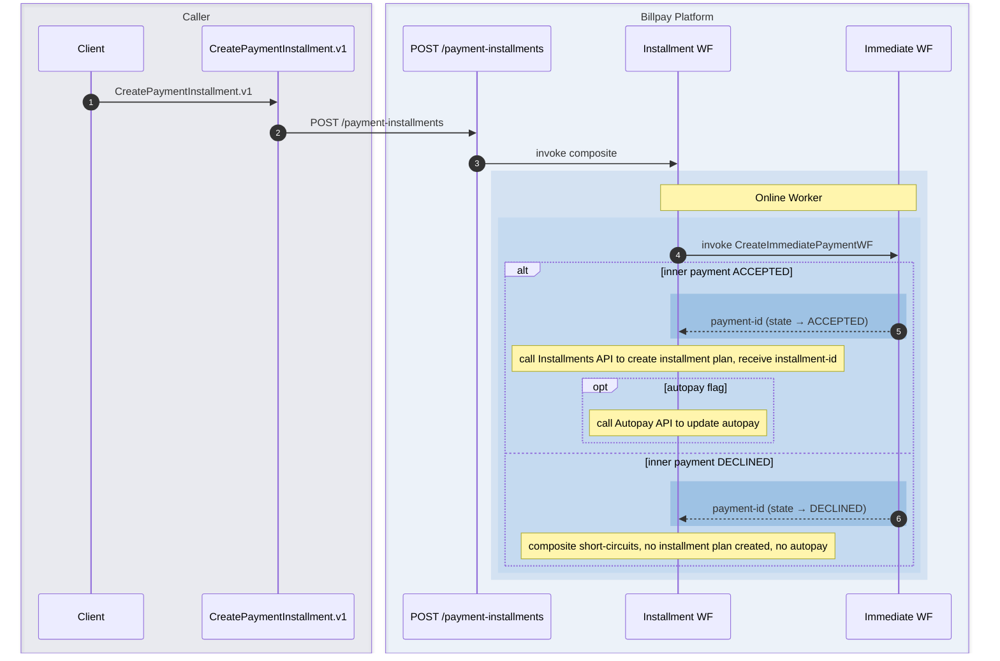

What happens

- Create Payment & Installments is a composite workflow. It runs `CreateImmediatePaymentWF` first.
- On `ACCEPTED` it creates the installment plan through the Installments API, and updates autopay if the flag is set.
- On `DECLINED` it short-circuits. No installment plan is created and autopay is left alone.

